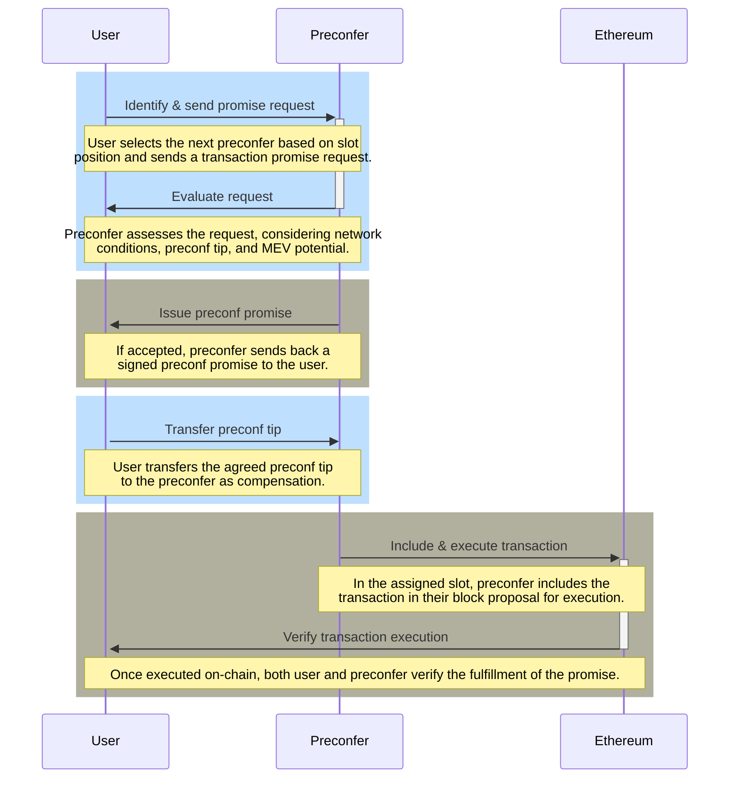

## [Overview](#overview)

Based preconfirmations (preconfs) represent a significant advancement in Ethereum transaction processing, offering users swift and reliable execution. Through a combination of on-chain infrastructure, proposer accountability mechanisms, and flexible promise acquisition processes, preconfs stand to significantly enhance the user experience in Ethereum interactions. This technology not only reduces transaction latency but also introduces a layer of security and efficiency previously unseen in the ecosystem[^1].

## [Construction of Preconfs](#construction-of-preconfs)

Preconfs rely on two foundational on-chain infrastructure components:

- **Proposer Slashing:** Proposers can opt into additional slashing conditions to ensure reliability and accountability. This setup assumes the use of EigenLayer-style restaking for slashing mechanisms.

- **Proposer Forced Inclusions:** Proposers are empowered to forcibly include transactions on the blockchain. This is particularly crucial in scenarios where proposer-builder separation (PBS) makes self-building non-economical. The mechanism assumes the use of inclusion lists to achieve this.

A Layer 1 (L1) proposer becomes a "preconfer" by opting into two specific preconf slashing conditions. Preconfers provide signed preconf promises to users and receive tips for fulfilling these promises. The precedence among preconfers is determined by their slot position, with smaller slot numbers holding higher precedence.

A transaction that has received a preconf promise is eligible for immediate on-chain inclusion and execution by any proposer who precedes the promise's issuer. The primary responsibility of the preconfer is to fulfill all outstanding promises in their slot, leveraging the inclusion list.

There are two categories of promise faults, both subject to slashing:

1. **Liveness Faults:** Occur if a preconfer’s slot is missed and the promised transaction was not included on-chain previously.

2. **Safety Faults:** Arise when the preconfer's slot is not missed, yet the promise contradicts the transactions included on-chain.

To prioritize preconfed transactions, an execution queue for non-preconfed transactions is introduced, ensuring that transactions with preconf promises are executed first.

## [Key Elements of Preconfirmations Acquisition ](#key-elements-of-preconfirmations-acquisition)

*Figure: Promise acquisition process flow. Source: Justin Drake*

For users seeking preconfed transactions, the initial step involves acquiring a promise from the next preconfer in line. The process encompasses various considerations, including:

- **Endpoints:** Preconfers can offer point-to-point API endpoints or utilize peer-to-peer (p2p) gossip channels for receiving and issuing promises, balancing between latency and accessibility.

- **Latency:** Direct connections can achieve preconf latencies as low as 100 milliseconds.

- **Bootstrapping:** A significant percentage of L1 validators must participate as preconfers to ensure at least one preconfer is likely to be in the lookahead.

- **Liveness Fallback:** Users can mitigate the risk of liveness faults by obtaining promises from multiple preconfers.

- **Parallelization:** The system accommodates various promise types, ranging from strict commitments on post-execution state to more flexible, intent-based promises.

- **Replay Protection:** Ensures transactions are protected from replay attacks, vital for maintaining the integrity and security of preconf transactions.

- **Single Secret Leader Election (SSLE):** Facilitates the discreet discovery of preconfers within the lookahead, allowing preconfers to prove their role without compromising their identity.

- **Delegated Preconf:** Offers a solution for proposers with limited bandwidth or computational resources by allowing them to delegate preconf responsibilities, ensuring that promise issuance remains efficient.

- **Fair Exchange:** Addresses the potential issue of unfair tip collection by proposers, suggesting real-time promise broadcasting or trusted relays to ensure equitable exchanges between users and preconfers.

- **Tip Pricing:** Advocates for a dynamic approach to preconf tip negotiations, taking into account the transaction's potential impact on the proposer's expected value from maximal extractable value (MEV) opportunities.

- **Negative Tips:** Introduces the concept of negative tips for transactions that potentially increase a preconfer’s MEV, encouraging proposers to prioritize these transactions.

Each of these elements plays a crucial role in the functionality and efficiency of based preconfirmations, ensuring transactions are not only processed swiftly but also securely and fairly within the Ethereum ecosystem.

## [Preconfirmations Acquisition Process Flow](#preconfirmations-acquisition-process-flow)

*Figure: Promise Acquisition Process Flow*

The promise acquisition process in the context of Ethereum's sequencing and pre-confirmation mechanism is a critical aspect, ensuring transactions receive a preconfirmation or "promise" from a proposer or sequencer. This process involves several steps, each integral to securing a promise that a transaction will be included and executed on the blockchain within a specified time frame. Below is a detailed explanation of the promise acquisition process flow:

**1. User Identifies Next Preconfer**

- **Starting Point:** A user or a smart contract initiates the process by identifying the next available preconfer (a proposer who has opted in to provide preconfirmation services) within the Ethereum network's lookahead window.

- **Selection Criteria:** The selection is based on the proposer's slot position in the proposer lookahead, where proposers have declared their capability and willingness to issue preconfirmations by posting collateral.

**2. Promise Request Sent to Preconfer**

- **Initiation:** The user sends a promise request to the identified preconfer. This request includes details of the transaction for which the preconfirmation is sought, along with any specific conditions or requirements.

- **Communication Channel:** The request can be sent through various off-chain communication channels established by the preconfer, such as a dedicated API endpoint or a peer-to-peer messaging system.

**3. Preconfer Evaluates the Request**

- **Assessment:** Upon receiving the request, the preconfer evaluates it based on several factors, including the current network conditions, the preconf tip amount proposed by the user, and the overall risk of executing the transaction.

- **Decision Making:** The preconfer decides whether to accept or reject the promise request. This decision may involve calculating the potential MEV and assessing whether the transaction aligns with the preconfer's criteria.

**4. Issuance of Preconf Promise**

- **Promise Generation:** If the preconfer decides to accept the request, they generate a signed preconf promise. This promise includes the preconfer's commitment to ensuring the transaction's inclusion and execution within their upcoming slot, adhering to the agreed conditions.

- **Communication of Promise:** The preconf promise is then communicated back to the user, providing them with a guarantee of transaction execution. The communication method used is like that of the initial request, ensuring secure and verifiable delivery.

**5. Payment of Preconf Tip**

- **Tip Transfer:** Upon receipt of the preconf promise, the user transfers the agreed preconf tip to the preconfer. This tip serves as compensation for the service provided and incentivizes the preconfer to honor the commitment.

- **Escrow Mechanisms:** In some implementations, the tip may be held in escrow until the promise is fulfilled, adding an extra layer of security for the user.

**6. Inclusion and Execution of Transaction**

- **On-Chain Fulfillment:** The preconfer includes the preconfirmed transaction in their proposed block during their assigned slot, executing it according to the terms outlined in the preconf promise.

- **Verification of Fulfillment:** Once the transaction is included and executed on-chain, both the preconfer and the user can verify that the promise has been fulfilled, completing the process.

**Additional Considerations:**

- **Fallback Mechanisms:** In case of unexpected issues or if the first preconfer fails to include the transaction, users may have fallback options, such as requesting promises from multiple preconfers in parallel.

- **Dispute Resolution:** The system may include mechanisms for resolving disputes in cases where there's disagreement about whether the promise was adequately fulfilled.

## References
[^1]: https://ethresear.ch/t/based-preconfirmations/17353 
[^2]: https://docs.google.com/presentation/d/1v429N4jdikMIWWkcVwfjMlV2LlOXSawFCMKoBnZVDNU/edit#slide=id.g1f1d94ef56e_0_655
