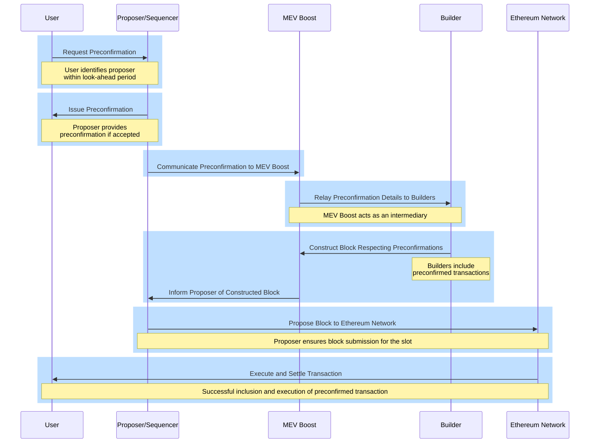

## WORK IN PROGRESS - WIP

## Overview of Based Preconfirmations

Based preconfirmations (preconfs) represent a significant advancement in Ethereum transaction processing, offering users swift and reliable execution. Through a combination of on-chain infrastructure, proposer accountability mechanisms, and flexible promise acquisition processes, preconfs stand to significantly enhance the user experience in Ethereum interactions. This technology not only reduces transaction latency but also introduces a layer of security and efficiency previously unseen in the ecosystem[^1].

## Construction of Preconfs

Preconfs rely on two foundational on-chain infrastructure components:

- **Proposer Slashing:** Proposers can opt into additional slashing conditions to ensure reliability and accountability. This setup assumes the use of EigenLayer-style restaking for slashing mechanisms.

- **Proposer Forced Inclusions:** Proposers are empowered to forcibly include transactions on the blockchain. This is particularly crucial in scenarios where proposer-builder separation (PBS) makes self-building non-economical. The mechanism assumes the use of inclusion lists to achieve this.

A Layer 1 (L1) proposer becomes a "preconfer" by opting into two specific preconf slashing conditions. Preconfers provide signed preconf promises to users and receive tips for fulfilling these promises. The precedence among preconfers is determined by their slot position, with smaller slot numbers holding higher precedence.

A transaction that has received a preconf promise is eligible for immediate on-chain inclusion and execution by any proposer who precedes the promise's issuer. The primary responsibility of the preconfer is to fulfill all outstanding promises in their slot, leveraging the inclusion list.

There are two categories of promise faults, both subject to slashing:

1. **Liveness Faults:** Occur if a preconfer’s slot is missed and the promised transaction was not included on-chain previously.

2. **Safety Faults:** Arise when the preconfer's slot is not missed, yet the promise contradicts the transactions included on-chain.

To prioritize preconfed transactions, an execution queue for non-preconfed transactions is introduced, ensuring that transactions with preconf promises are executed first.

## Promise Acquisition Process

*Figure: Promise acquisition process flow. Source: Justin Drake*

For users seeking preconfed transactions, the initial step involves acquiring a promise from the next preconfer in line. The process encompasses various considerations, including:

- **Endpoints:** Preconfers can offer point-to-point API endpoints or utilize peer-to-peer (p2p) gossip channels for receiving and issuing promises, balancing between latency and accessibility.

- **Latency:** Direct connections can achieve preconf latencies as low as 100 milliseconds.

- **Bootstrapping:** A significant percentage of L1 validators must participate as preconfers to ensure at least one preconfer is likely to be in the lookahead.

- **Liveness Fallback:** Users can mitigate the risk of liveness faults by obtaining promises from multiple preconfers.

- **Parallelization:** The system accommodates various promise types, ranging from strict commitments on post-execution state to more flexible, intent-based promises.

- **Replay Protection:** Ensures transactions are protected from replay attacks, vital for maintaining the integrity and security of preconf transactions.

- **Single Secret Leader Election (SSLE):** Facilitates the discreet discovery of preconfers within the lookahead, allowing preconfers to prove their role without compromising their identity.

- **Delegated Preconf:** Offers a solution for proposers with limited bandwidth or computational resources by allowing them to delegate preconf responsibilities, ensuring that promise issuance remains efficient.

- **Fair Exchange:** Addresses the potential issue of unfair tip collection by proposers, suggesting real-time promise broadcasting or trusted relays to ensure equitable exchanges between users and preconfers.

- **Tip Pricing:** Advocates for a dynamic approach to preconf tip negotiations, taking into account the transaction's potential impact on the proposer's expected value from maximal extractable value (MEV) opportunities.

- **Negative Tips:** Introduces the concept of negative tips for transactions that potentially increase a preconfer’s MEV, encouraging proposers to prioritize these transactions.

Each of these elements plays a crucial role in the functionality and efficiency of based preconfirmations, ensuring transactions are not only processed swiftly but also securely and fairly within the Ethereum ecosystem.

## Ethereum Based Sequencing with Preconfirmations

Ethereum's evolving ecosystem is set to introduce new paradigms for rollups and chain interactions, emphasizing seamless transitions and enhanced user experiences. This section introduces a framework for Ethereum sequencing and pre-confirmations by Justin Drake[^2], a step toward realizing this vision, offering a unified platform for all Ethereum chains and rollups. 

### Context and Motivation

**United Chains of Ethereum**

The vision for Ethereum is not just a network of isolated chains but a cohesive ecosystem where all rollups and chains coexist without friction, termed the "United Chains of Ethereum." This concept envisions a scenario where users can move between different states (rollups) with ease, akin to crossing state lines without the need for passports or the imposition of tariffs. Such an environment would not only enhance user experience but also foster a more integrated and efficient blockchain ecosystem.

**Ethereum's Services for Rollups**

- **Current Services:** Ethereum currently provides two critical services to rollups: settlement and data availability. These services lay the foundation for rollups to operate effectively on Ethereum's decentralized platform.

- **Introduction of Ethereum Sequencing:** Ethereum sequencing, is proposed to complement the existing ones, offering a new resource that rollups can leverage to further optimize their operations. Although sequencing has always been inherent to Ethereum, its potential as a dedicated service for rollups represents an innovative application, akin to the adaptive use of core data for new functionalities.

### Technical Construction

#### Based Sequencing

- **Mechanism:** The proposal for based sequencing involves utilizing the beacon chain's look-ahead period to invite proposers to opt into providing sequencing services by posting collateral. This approach leverages Ethereum's existing structure to introduce a new layer of functionality for rollups.

- **Look-Ahead Period:** By capitalizing on the beacon chain's ability to predict the next set of proposers, the system can prepare and designate specific proposers to take on the additional role of sequencers, ensuring that rollups have predictable and reliable sequencing services.

#### Preconfirm Mechanism

- **User Interaction with Proposers:** Users can identify which proposers within the look-ahead period have opted for based sequencing and request preconfirmations from them. These preconfirmations are akin to promises that the user's transaction will be included and executed in the future, with penalties applied for non-fulfillment.

- **Slashing for Non-Fulfillment:** The system imposes penalties, or slashing, for proposers who fail to fulfill their preconfirmations. This adds a layer of accountability, ensuring that proposers are incentivized to honor their commitments.
- 

#### Communication through MEV Boost

The integration of preconfirmations with MEV Boost represents a critical aspect of the technical construction, facilitating the efficient flow of information between users, proposers, builders, and the Ethereum network. By routing preconfirmation details through MEV Boost, the system ensures that builders are aware of preconfirmed transactions and can construct blocks accordingly. This process not only optimizes the inclusion of transactions but also maintains the integrity and value of the constructed blocks, aligning with the overarching goals of the Ethereum sequencing and pre-confirmation framework.

#### Preconfirmations Flow through MEV Boost

The process of how preconfirmations would flow through MEV Boost within the context of Ethereum's base layer sequencing and pre-confirmations involves several key steps and entities. This mechanism aims to ensure that transactions preconfirmed by proposers (who have opted into providing sequencing services) are communicated effectively to builders and ultimately included in the constructed blocks. Here's a detailed step-by-step explanation of the process:

*Figure: Preconfirmations Flow through MEV Boost*

**1: User Requests Preconfirmation**

- A user identifies proposers within the beacon chain's look-ahead period who have opted into providing based sequencing by posting collateral.

- The user then sends a preconfirmation request to one of these proposers, seeking assurance that their transaction will be included and executed in a future slot.

**2: Proposer Provides Preconfirmation**

- The selected proposer evaluates the request and, if accepted, provides the user with a preconfirmation. This preconfirmation is essentially a promise to include and execute the user's transaction in a specified future slot, subject to certain conditions and penalties for non-fulfillment.

**3: Proposer to MEV Boost Communication**

- Once a proposer issues a preconfirmation, they communicate this information to MEV Boost. MEV Boost acts as an intermediary that facilitates the communication between proposers (now acting as sequencers for their respective slots), builders, and ultimately, the Ethereum network.

**4: MEV Boost Relays Preconfirmations to Builders**

- MEV Boost relays the preconfirmation details to builders, who are responsible for constructing the blocks. Builders receive information about all preconfirmed transactions, which they must consider while building their blocks.

**5: Builders Construct Blocks Considering Preconfirmations**

- With the preconfirmation details at hand, builders construct blocks that honor these preconfirmations. This involves including the preconfirmed transactions in the block for the specified slot and ensuring that the execution conditions promised in the preconfirmations are met.

**6: Blocks Are Proposed to the Network**

- Once builders construct a block that respects all preconfirmations and optimizes for other factors (like MEV), the block is proposed to the Ethereum network. The proposer for the relevant slot, who initially issued the preconfirmation, is responsible for ensuring that this block gets submitted.

**7: Execution and Settlement**

- If the block is successfully included in the blockchain, the preconfirmed transactions are executed as promised, fulfilling the proposer's commitment to the user. If a proposer fails to fulfill the preconfirmation, penalties (slashing) may be applied depending on the nature of the fault (e.g., liveness fault, safety fault).

**Additional Considerations:**

- **Slashing Mechanism:** The process incorporates a slashing mechanism to penalize proposers if they fail to honor their preconfirmations. This ensures a level of accountability and trust in the system.

- **Dynamic Communication:** The flow of information through MEV Boost allows for dynamic adjustments based on real-time conditions, such as changes in transaction priority or network congestion.

## References
[^1]: https://ethresear.ch/t/based-preconfirmations/17353 
[^2]: https://docs.google.com/presentation/d/1v429N4jdikMIWWkcVwfjMlV2LlOXSawFCMKoBnZVDNU/edit#slide=id.g1f1d94ef56e_0_655
