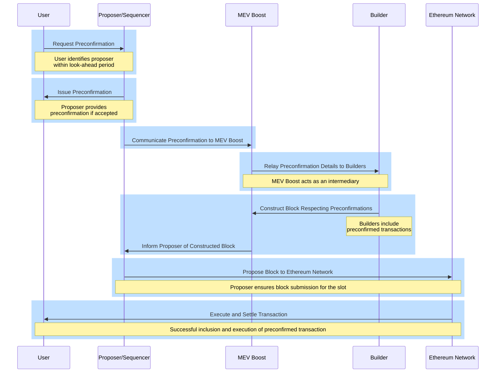

## [Overview](#overview)

Ethereum's evolving ecosystem is set to introduce new paradigms for rollups and chain interactions, emphasizing seamless transitions and enhanced user experiences. This section introduces a framework for Ethereum sequencing and pre-confirmations by Justin Drake[^1][^4], a step toward realizing this vision, offering a unified platform for all Ethereum chains and rollups. 

## [Context and Motivation](#context-and-motivation)

### [United Chains of Ethereum](#united-chains-of-ethereum)

_Figure: United Chains of Ethereum, Credit Justin Drake_

The vision for Ethereum is not just a network of isolated chains but a cohesive ecosystem where all rollups and chains coexist without friction, termed the "United Chains of Ethereum." This concept envisions a scenario where users can move between different states (rollups) with ease, akin to crossing state lines without the need for passports or the imposition of tariffs. Such an environment would not only enhance user experience but also foster a more integrated and efficient blockchain ecosystem.

### [Ethereum's Services for Rollups](#ethereums-services-for-rollups)

- **Current Services:** Ethereum currently provides two critical services to rollups: settlement and data availability. These services lay the foundation for rollups to operate effectively on Ethereum's decentralized platform.

- **Introduction of Ethereum Sequencing:** Ethereum sequencing, is proposed to complement the existing ones, offering a new resource that rollups can leverage to further optimize their operations. Although sequencing has always been inherent to Ethereum, its potential as a dedicated service for rollups represents an innovative application, akin to the adaptive use of core data for new functionalities.

### [Current Sequencing Options](#current-sequencing-options)

_Figure: Different Sequencing Options and their Problem Space, Credit Justin Drake_

#### [Decentralized Sequencing](#decentralized-sequencing)

**Overview:** Decentralized sequencing distributes the responsibility of transaction ordering among multiple nodes rather than a single central authority. This method enhances security and resistance to censorship, as no single node can dictate the transaction order by itself.

**Problems and Challenges:**
- **Complexity in Coordination:** Since multiple nodes are involved in transaction ordering, achieving consensus can be challenging and complex, particularly when the nodes have varying incentives.
- **Network Integrity Maintenance:** Ensuring that all participating nodes follow the protocol without any malicious behavior can be difficult to enforce.
- **Front-Running and MEV:** Miners or validators might exploit their ability to order transactions to extract maximal extractable value (MEV), which can lead to unfair transaction processing and a negative user experience.
- **Resilience to Censorship:** Although decentralized sequencing makes censorship more difficult, it doesn't eliminate the possibility, especially if a collusion of nodes occurs.

#### [Shared Sequencing](#shared-sequencing)

**Concept:** Shared sequencing is a form of decentralized sequencing where the task of ordering transactions is shared among several entities, typically across different layers or platforms. This approach is designed to further decentralize the process and reduce the influence any single participant might have over the sequence of transactions.

**Application:** In Ethereum, shared sequencing could involve various rollups solutions that coordinate to manage transaction order. This coordination can help ensure that transactions are processed efficiently and fairly, reducing the potential for bottlenecks or biased sequencing practices.

**Benefits:** Shared sequencing aims to promote scalability by distributing the load of transaction processing and enhancing the network’s throughput. It also strives for neutrality and fairness in transaction handling, critical for maintaining trust in a decentralized ecosystem.

**Problems and Challenges:**
- **MEV Sharing:** Coordinating MEV sharing, like the approach Espresso is investigating, requires sophisticated mechanisms to fairly distribute MEV across participating rollups and chains[^5].
- **Deposits Sharing:** Solutions like zkSync's deposit sharing are innovative but require widespread adoption and trust among different rollups to function effectively, potentially leading to centralization of trust[^6].
- **Execution Sharing:** Implementation of execution sharing strategies, such as Polygon's aggregation layer, requires standardization and integration across different rollups to ensure compatibility and trustless atomicity[^7].

**Based Sequencing:**

**Concept:** A specialized form of decentralized sequencing that uses the base layer of a Ethereum, Beacon chain, to manage transaction ordering. This method leverages the security and consensus mechanisms of the Beacon chain to ensure that transactions are sequenced in a trustless manner.

**Focus:** Based sequencing aims to integrate the robust security features of the Beacon chain into transaction sequencing, reducing dependency on external sequencers or centralized systems. It aligns with Ethereum's decentralized principles by using the existing Ethereum infrastructure to secure transaction order.

**Integration with Shared Sequencing:** Based sequencing can be a pivotal part of a larger shared sequencing strategy, providing a reliable, secure foundation that other layers or rollups can build upon. It ensures that at least one layer of the transaction ordering process is closely tied to the highly secure, well-tested consensus mechanisms of the Ethereum blockchain.

**Problems and Challenges:**
- **Proposer Responsibility:** Proposers must opt into based sequencing by posting collateral, adding financial risk and responsibility to their role.
- **Inclusion List Management:** The concept of inclusion lists must be maintained and managed carefully to ensure fair transaction inclusion.
- **Consensus Mechanism Dependence:** Based sequencing is inherently tied to the underlying consensus mechanism, which means any issues with the consensus could directly affect transaction sequencing.
- **Preconfirm Complexity:** Implementing preconfirm mechanisms, where users get assurance of transaction execution from proposers, adds complexity to transaction processing and requires a new level of trust and interaction between users and proposers.

## [Technical Construction](#technical-construction)

### [Based Sequencing](#based-sequencing)

- **Mechanism:** The proposal for based sequencing involves utilizing the beacon chain's look-ahead period to invite proposers to opt into providing sequencing services by posting collateral. This approach leverages Ethereum's existing structure to introduce a new layer of functionality for rollups.

- **Look-Ahead Period:** By capitalizing on the beacon chain's ability to predict the next set of proposers, the system can prepare and designate specific proposers to take on the additional role of sequencers, ensuring that rollups have predictable and reliable sequencing services.

### [Preconfirm Mechanism](#preconfirm-mechanism)

In the previous article on [Precinformations](https://thogiti.github.io/2024/04/07/Based-Preconfirmations.html), I explained the details on how Preconfirmations work and the promise acquisition process flow[^3][^2]. 

- **User Interaction with Proposers:** Users can identify which proposers within the look-ahead period have opted for based sequencing and request preconfirmations from them. These preconfirmations are akin to promises that the user's transaction will be included and executed in the future, with penalties applied for non-fulfillment.

- **Slashing for Non-Fulfillment:** The system imposes penalties, or slashing, for proposers who fail to fulfill their preconfirmations. This adds a layer of accountability, ensuring that proposers are incentivized to honor their commitments.

### [Communication through MEV Boost](#communication-through-mev-boost)

The integration of preconfirmations with MEV Boost represents a critical aspect of the technical construction, facilitating the efficient flow of information between users, proposers, builders, and the Ethereum network. By routing preconfirmation details through MEV Boost, the system ensures that builders are aware of preconfirmed transactions and can construct blocks accordingly. This process not only optimizes the inclusion of transactions but also maintains the integrity and value of the constructed blocks, aligning with the overarching goals of the Ethereum sequencing and pre-confirmation framework.

## [Preconfirmations Flow through MEV Boost](#preconfirmations-flow-through-mev-boost)

*Figure: Preconfirmations Flow through MEV Boost*

The process of how preconfirmations would flow through MEV Boost within the context of Ethereum's base layer sequencing and pre-confirmations involves several key steps and entities and it is valuable to discuss in details. This mechanism aims to ensure that transactions preconfirmed by proposers (who have opted into providing sequencing services) are communicated effectively to builders and ultimately included in the constructed blocks. Here's a detailed step-by-step explanation of the process:

**1: User Requests Preconfirmation**

- A user identifies proposers within the beacon chain's look-ahead period who have opted into providing based sequencing by posting collateral.

- The user then sends a preconfirmation request to one of these proposers, seeking assurance that their transaction will be included and executed in a future slot.

**2: Proposer Provides Preconfirmation**

- The selected proposer evaluates the request and, if accepted, provides the user with a preconfirmation. This preconfirmation is essentially a promise to include and execute the user's transaction in a specified future slot, subject to certain conditions and penalties for non-fulfillment.

**3: Proposer to MEV Boost Communication**

- Once a proposer issues a preconfirmation, they communicate this information to MEV Boost. MEV Boost acts as an intermediary that facilitates the communication between proposers (now acting as sequencers for their respective slots), builders, and ultimately, the Ethereum network.

**4: MEV Boost Relays Preconfirmations to Builders**

- MEV Boost relays the preconfirmation details to builders, who are responsible for constructing the blocks. Builders receive information about all preconfirmed transactions, which they must consider while building their blocks.

**5: Builders Construct Blocks Considering Preconfirmations**

- With the preconfirmation details at hand, builders construct blocks that honor these preconfirmations. This involves including the preconfirmed transactions in the block for the specified slot and ensuring that the execution conditions promised in the preconfirmations are met.

**6: Blocks Are Proposed to the Network**

- Once builders construct a block that respects all preconfirmations and optimizes for other factors (like MEV), the block is proposed to the Ethereum network. The proposer for the relevant slot, who initially issued the preconfirmation, is responsible for ensuring that this block gets submitted.

**7: Execution and Settlement**

- If the block is successfully included in the blockchain, the preconfirmed transactions are executed as promised, fulfilling the proposer's commitment to the user. If a proposer fails to fulfill the preconfirmation, penalties (slashing) may be applied depending on the nature of the fault (e.g., liveness fault, safety fault).

**Additional Considerations:**

- **Slashing Mechanism:** The process incorporates a slashing mechanism to penalize proposers if they fail to honor their preconfirmations. This ensures a level of accountability and trust in the system.

- **Dynamic Communication:** The flow of information through MEV Boost allows for dynamic adjustments based on real-time conditions, such as changes in transaction priority or network congestion.

## [Concerns and Complexities](#concerns-and-complexities)

A previous discussion on Ethereum Based Sequencing with Preconfirmations[^4] revealed that the design space of this framework involves many complex topics and left with several questions and concerns raised by participants. Below are the key questions/concerns highlighted in the discussion, along with the answers or proposed solutions based on the information provided and general understanding of Ethereum's evolving ecosystem:

**Block Value and Preconfirm Tips**

- **Concern:** There's worry about suboptimal block value due to constraints imposed by preconfirmations.

- **Proposed Solution:** Introducing preconfirm tips could compensate proposers for the reduced block value, aligning incentives by compensating for the privilege of transaction inclusion and execution guarantees. The tip amount could vary based on the transaction's impact on MEV.

**Monopoly Power of Preconfers**

- **Concern:** How the monopoly power of preconfers might affect transaction inclusion and execution.

- **Clarification Provided:** In the model, there would be only one preconfer per slot, similar to the monopoly power a proposer has over a slot. This design simplifies the process and ensures that preconfers can guarantee transaction execution based on state, not just inclusion.

**Pricing and Selection of Preconfirms**

- **Concern:** How to fairly price and select preconfirms to ensure equitable treatment of users and proposers.

- **Proposed Solution:** The preconfer should employ mechanisms (possibly market-driven or advised by searchers) to price preconfirms appropriately. A realtime auction mechanism for bidding on preconfirms was also suggested as a way to provide transparency and fairness.

**Trust and Centralization Risks**

- **Concern:** The proposed model might centralize power and trust in a few entities, potentially introducing risks of censorship and control.

- **Discussion Points:** The design inherently requires some degree of centralization for efficiency and reliability. However, introducing Execution Tickets, ensuring collateral is posted by preconfers, and possibly diversifying the entities involved (e.g., multiple relays) could mitigate some concerns. Furthermore, economic incentives, such as slashing for non-fulfillment of preconfirms, aim to align interests and maintain a degree of decentralization within the constraints of the model.

**Implementation and Execution Details**

- **Questions:** How would the mechanism for posting collateral work? How are delegation preferences expressed by proposers?

- **Exploration:** The discussion highlighted these as implementation details that would need to be worked out. For example, proposers could sign a message indicating their chosen preconfer, potentially recorded on-chain. The amount of collateral (e.g., 1000 ETH as suggested) needs to be significant enough to cover potential losses from MEV, providing economic security.

**Communication and Information Flow**

- **Concern:** Ensuring the efficient and secure communication of preconfirms through the network.

- **Proposed Solution:** Utilizing MEV Boost and possibly dedicated channels or protocols for communicating preconfirms could ensure that builders receive necessary information to construct blocks that honor preconfirmations.

## References
[^1]: https://docs.google.com/presentation/d/1v429N4jdikMIWWkcVwfjMlV2LlOXSawFCMKoBnZVDNU/edit#slide=id.g1f1d94ef56e_0_655
[^2]: https://ethresear.ch/t/based-preconfirmations/17353 
[^3]: https://thogiti.github.io/2024/04/07/Based-Preconfirmations.html
[^4]: https://youtu.be/2IK136vz-PM
[^5]: https://hackmd.io/@EspressoSystems/SharedSequencing
[^6]: https://docs.zksync.io/zk-stack/components/shared-bridges.html
[^7]: https://polygon.technology/blog/aggregated-blockchains-a-new-thesis
