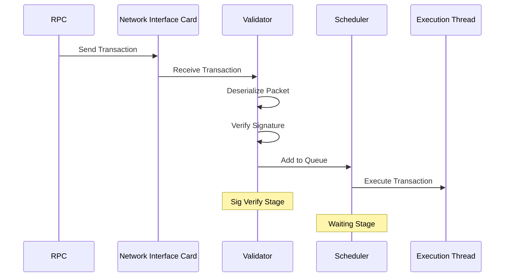

# Part 2: Multi-Stage Solana's Transaction Supply Chain and Control-Theoretic Optimization

## Recap of Part 1 and Overview of Part 2

In [Part 1](https://thogiti.github.io/2024/12/25/Foundations-queueing-theory-Solana-fee-markets.html), we established the foundational queueing-theory concepts that apply to blockchain fee markets:

- **M/M/1 Queues:**  
   - We examined single-server queues with Poisson arrivals and exponential service times.  
   - Key takeaway: If the arrival rate $\lambda$ gets close to or exceeds the service rate $\mu$, waiting times $W_q$ explode.

- **Priority Scheduling:**  
   - Introducing a “high-fee” class (Class 1) can reduce waiting times for those transactions, while “low-fee” (Class 2) traffic endures more delays.  
   - However, if total load $\lambda = \lambda_1 + \lambda_2$ approaches $\mu$, even high-fee traffic is eventually impacted.

- **Dynamic Fee Floors (Admission Control):**  
   - By raising a fee floor $f$, we effectively limit $\lambda_2$, keeping $\rho = \lambda/\mu$ below 1, which helps avoid queue “blow-ups.”

- **Multi-Server M/M/k Models:**  
   - Adding more parallel servers increases overall capacity to $k \times \mu$.  
   - Priority queues still help high-fee transactions, but no matter how many servers, the system saturates if $\lambda$ becomes too large.

In Part 2, we’ll apply these ideas to Solana’s multi-stage transaction pipeline, sometimes described as a “supply chain” of transaction processing steps:

- We’ll map each major stage (ingress, signature verification, scheduling, execution) to a queue.  
- We’ll explore **tandem queue** (Jackson network) concepts and show how the overall system remains stable only if $\lambda$ stays below all stages’ service capacities.  
- We’ll introduce a control-theoretic perspective, where Solana can raise or lower a global fee floor depending on real-time queue lengths, ensuring that high-fee traffic always has a reliable “fast lane.”

---

## Multi-Stage Solana's Transaction Pipeline as Tandem Queues

_Fig 1. Solana's Transaction Pipeline_ 

Solana’s transaction flow involves multiple sequential stages:

1. **RPC**  
   The transaction originates from an RPC node, which sends the transaction to the validator (leader). This can be seen as a logical “ingress” point into the network.

2. **Network Interface Card (NIC)**  
   The NIC is where packets arrive from the network. In queueing terms, we can think of this as the initial “arrival” into the system.

3. **Validator (Deserialization + Signature Verification)**  
   - **Deserialization**: The validator unpacks the transaction from its packet format.  
   - **Signature Verification**: The validator checks that all required signatures are valid (“Sig Verify Stage”).  
   In our queueing model, signature verification can be viewed as one of the service “stages” (e.g., $S_$ in a tandem queue). Transactions pass from NIC (stage $S_1$, though sometimes simplified) to signature verification (stage $S_2$).

4. **Scheduler (Waiting Stage)**  
   Once signatures are verified, transactions move into a scheduler queue, where local fee market logic (i.e., priority rules, dynamic fee floors, etc.) can apply. This is the “waiting stage” in our queueing model, frequently labeled $S_3$.

5. **Execution Thread**  
   The scheduler pulls transactions off its queue and forwards them to an execution thread (stage $S_4$). This is where the transaction is actually processed and state changes occur on-chain.

In queueing terms, each stage $S_i$ is modeled as an **M/M/1** queue with service rate $\mu_i$. Transactions arrive at an overall rate $\lambda$ and must pass through $S_1 \to S_2 \to S_3 \to S_4$. 

### Mapping Diagram Stages to Tandem Queues

In our tandem M/M/1 framework:

- **Stage $S_1$ (Ingress/NIC):**  
  $\mu_1$ is the effective throughput of network ingress + initial acceptance.  
  If many transactions arrive ($\lambda$ is high), $S_1$ can become a bottleneck before they even reach signature verification.

- **Stage $S_2$ (Signature Verification):**  
  $\mu_2$ represents the capacity for deserialization + sig verify. A large backlog here means even high-fee transactions wait unless there is priority scheduling at this stage.

- **Stage $S_3$ (Scheduler Queue):**  
  $\mu_3$ is the capacity to pull transactions from the waiting queue and prepare them for execution. Under heavy load, the scheduler can reorder transactions based on fees (local fee market logic).

- **Stage $S_4$ (Execution Thread):**  
  $\mu_4$ is the actual execution throughput. If the execution environment is slower than the earlier stages, a queue forms here, delaying final transaction confirmation.

By seeing the Solana's transaction “supply chain” steps in both a sequence diagram and a tandem queue structure, we can appreciate how each real-life step aligns with a queueing model stage. This connection to Queuing Theory clarifies:

- Where congestion can occur (e.g., Sig Verify or Scheduler might become bottlenecks).  
- Why priority or fee floors matter at each stage (to ensure high-fee transactions leapfrog low-fee ones in both the scheduler and earlier queues).  
- How dynamic load shedding (raising a fee floor) effectively reduces $\lambda_2$ at the earliest stages, preventing queues from spiraling out of control.

### Stability Condition in a Tandem System

For a tandem queue to be stable, the arrival rate $\lambda$ must be less than the effective capacity of every stage:

$$\lambda < \min(\mu_1,\;\mu_2,\;\mu_3,\;\mu_4).$$

If one stage has $\mu_i < \lambda$, that stage will become a bottleneck and cause queues to grow without bound.

### Priority Classes in Each Stage

Just as in Part 1, we maintain two classes of transactions—Class 1 (high-fee, $\lambda_1$) and Class 2 (low-fee, $\lambda_2$). Each queue at stage $S_i$ implements a non-preemptive priority policy, ensuring high-fee traffic is always served first when the stage is idle or switching tasks. However, if $\lambda$ is near or above $\mu_i$ for all $i$, congestion can overwhelm even high-fee transactions.

---

## Dynamic Fee Floor in a Tandem System

### Feedback-Based Admission Control

A local fee market can do more than passively queue up high-fee traffic—it can also reject (or heavily delay) transactions that pay below a certain fee floor $f$. By dynamically adjusting $f$, Solana can keep $\lambda_2$ in check.

A straightforward way to do this is with a [threshold-based control](https://hal.science/hal-04666859/document):

1. Track the sum of queue lengths across all stages:
   
   $$Q_{\text{total}}(t) \;=\;\; \sum_{i=1}^{4} Q_i(t).$$

2. Define two thresholds:
   - **High watermark** $\Theta$: if $Q_{\text{total}}(t)$ exceeds $\Theta$, raise $f(t)$.  
   - **Low watermark** $\theta$: if $Q_{\text{total}}(t)$ is below $\theta$ for some time, lower $f(t)$.

This approach provides backpressure: when queues get too long, low-fee arrivals ($\lambda_2$) are effectively blocked, ensuring $\lambda$ (the total admitted load) stays below each $\mu_i$.

### Control-Theoretic / MDP Formulation

For an even more rigorous approach, one can model each stage’s queue length $Q_i(t)$ and the fee floor $f(t)$ as part of a [Markov Decision Process (MDP)](https://en.wikipedia.org/wiki/Markov_decision_process). The state is

$$x(t) \;=\; \bigl(Q_1(t),\,Q_2(t),\,Q_3(t),\,Q_4(t),\, f(t)\bigr),$$

and the action $a(t)$ is how much to raise or lower $f(t)$. One then defines an objective function balancing:

- **Latency** (for Class 1 and Class 2 transactions that do get admitted),
- **Drop Rate** (how many low-fee transactions get rejected),
- **Stability** (ensuring queues do not blow up).

- **Actions**:  
  
  $$a(t) \;\in\; \{f\;\pm\;\Delta_f, \; \text{no change}\}.$$
  
- **Dynamics**:  
  
  $$Q_i(t+1) 
    \;=\; Q_i(t) 
         \;+\; \text{arrivals admitted} 
         \;-\; \text{service completions at } S_i.$$
  
- **Cost Function**:  
  
  $$J(x,a) 
    \;=\; \alpha\, \bigl(\text{avg latency}\bigr) 
       \;+\; \beta\, \bigl(\text{drop rate}\bigr),$$
  
  where $\alpha,\beta>0$ are user-defined weights.

Solving such an MDP exactly can be computationally heavy, but [threshold](https://bpb-us-e1.wpmucdn.com/wordpressua.uark.edu/dist/7/795/files/2016/08/comparing_static_and_dynami.pdf) or [PID-like](https://en.wikipedia.org/wiki/Proportional%E2%80%93integral%E2%80%93derivative_controller) controllers are often effective in practice.

---

## Modeling and Simulation in Tandem Priority

### Approximate Analysis

Exact formulae for tandem priority queues can be very complex. However, [Jackson network theory](https://en.wikipedia.org/wiki/Jackson_network) provides approximations or product-form solutions under certain assumptions. For each queue $S_i$:

1. Treat arrivals as roughly Poisson($\lambda$) (or $\lambda_1$, $\lambda_2$ for each class).  
2. Use M/M/1 with priority calculations to estimate mean waiting times $W_{q,i,1}$ and $W_{q,i,2}$.  
3. Sum them across stages:  
   
   $$W_{q,1} \approx \sum_{i=1}^4 W_{q,i,1}, 
   \quad
   W_{q,2} \approx \sum_{i=1}^4 W_{q,i,2}.$$

4. When $\lambda_2$ is large, a dynamic fee floor can reduce $\lambda_2$ to maintain $\lambda_1 + \lambda_2^{\text{eff}} < \min_i(\mu_i)$.

### Discrete-Event Simulation

Given the complexity of exact solutions, Solana developers can build simulators to:

- Represent each stage as a queue, allowing arrivals and departures in discrete time steps (or continuous-event simulation).  
- Implement priority logic: Class 1 always served first.  
- Introduce an admission policy: if fee < $f$, transaction is dropped or queued with extreme delay.  
- Observe average latency, queue lengths, and how many transactions are dropped as you vary the arrival rates $\lambda_1,\lambda_2$.

---

## Putting Theory into Practice

Let's bring it all together.

1. **Measure $\mu_i$**: Benchmark each stage’s max throughput (NIC, Sig verify, scheduling, execution).  
2. **Estimate $\lambda_1,\lambda_2$**: Identify how many transactions typically arrive in each “fee class.”  
3. **Implement Priority**: Non-preemptive priority or head-of-line priority in each stage’s queue.  
4. **Adopt Dynamic Fee Floors**:
   
   $$
   f(t+1) 
   \;=\; 
   \begin{cases}
     f(t) + \Delta_f, & \text{if } \sum_i Q_i(t) > \Theta,\\
     f(t) - \Delta_f, & \text{if } \sum_i Q_i(t) < \theta,\\
     f(t), & \text{otherwise}.
   \end{cases}
   $$

5. **Monitor and Tune**:  
   - Track how often you raise or lower $f$.  
   - Use load tests or real-time data to confirm that high-fee traffic sees short wait times.

---

## A Unified Queueing-Theory Lens

In [Part 1](https://thogiti.github.io/2024/12/25/Foundations-queueing-theory-Solana-fee-markets.html), we established that balancing $\lambda < \mu$ (or $\rho < 1$) is crucial to keep queues finite, and we saw how priority scheduling plus fee floors can *protect* high-fee transactions from floods of low-fee ones. Here in Part 2, we extended that logic to multiple sequential stages—a realistic model of Solana’s transaction pipeline.

- **Tandem Queues**: Each pipeline component can be treated as a separate queue, and stability requires $\lambda < \min_i(\mu_i)$.  
- **Dynamic Fee Floors**: A feedback-based or control-theoretic approach can keep $\lambda_2$ in check, ensuring $\rho < 1$.  
- **Practical Implementation**: Actual Solana validators can integrate these ideas, combining local fee markets with threshold controls and rigorous observation of queue lengths.
