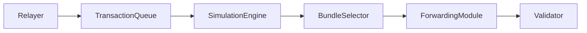
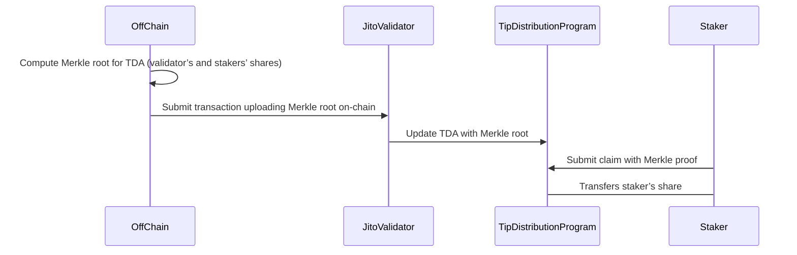
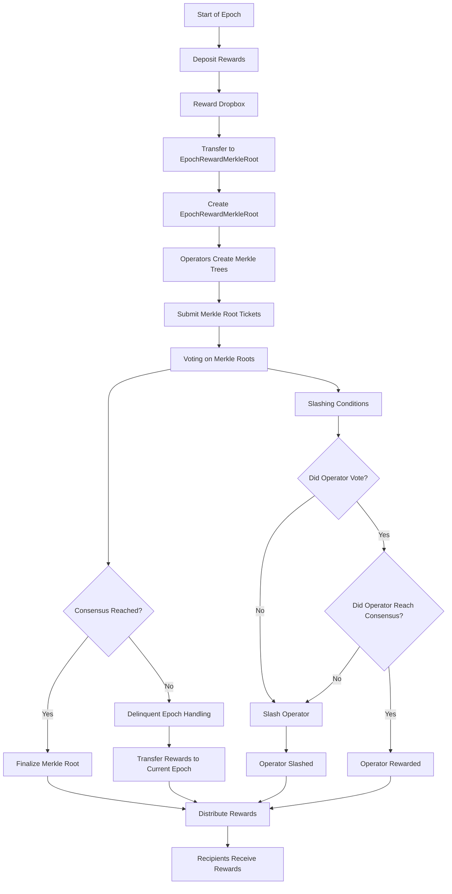
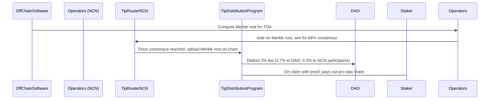

# WORK IN PROGRESS

# **Introduction**


*Figure: Solana REV; Jito Tips are colored in green. Source: Blockworks.*


*Figure: Last 30 days trend, Solana REV; Jito Tips are colored in green. Source: Jito.network.*

Over the past year, Solana's Real Economic Value (REV)—transaction fees plus out-of-protocol MEV tips—has soared to an all-time high of $1.4B. Much of that growth has come from Jito tips, which alone accounted for roughly half of Solana's December 2024 REV. While month-over-month numbers can fluctuate, the bigger picture shows a nearly 50× surge from last year's levels. Over the past 30 days, Jito tips have accounted for nearly two-thirds of the total fees and tips. This explosive trend underscores how critical Jito has become in driving Solana's fee revenue and MEV activity.

Given Jito's position as the "leading MEV infra team", understanding its underlying architecture is vital—especially as more of the network's economic incentives revolve around MEV capture. Yet, it can be difficult to piece together how Jito's technologies (the Jito Block Engine, Jito-Solana client, etc.) actually work. They represent some of the most important infrastructure in Solana's "modular stack," and Jito's MEV-optimized validator client already secures [over 90% of Solana's active stake](https://www.jito.network/stakenet/history/).

In this article, we'll offer a complete account of Jito's inner workings. We'll highlight how MEV bundles are processed, why these optimizations matter for validators and users alike, and how the Jito ecosystem fits into Solana's broader roadmap. We hope to provide a single and detailed reference on Jito, enabling developers, validators, and stakers to fully grasp the benefits—and challenges—of running Jito in a high-volume environment.

# **What Is Jito?**

Jito is a modified Solana client that enables more efficient, profitable, and equitable MEV value capture. It builds on the standard Solana validator with additional off-chain components (the Relayer and Block Engine) and two core on-chain programs (the Tip Payment and Tip Distribution programs).

The ultimate goal of Jito is to enable MEV value capture—monetizable opportunities inside Solana blocks—while redistributing those earnings to validators and delegators, all with minimal trust assumptions. Eventually, the `Tip Rewards NCN` (Node Consensus Network) will further decentralize the reward distribution, removing single points of failure as it exists today.

# **Jito Solana Client Architecture**

Below is a high-level diagram of the Jito system architecture. It shows how user transactions flow into the network, how Jito’s off-chain components (Relayer, Block Engine) handle them, and how on-chain programs finalize the distribution of MEV tips.


*Source: Jito-Solana, [https://docs.Jito.wtf/](https://docs.Jito.wtf/)*


*Source: [https://www.bee.com/15574.html](https://www.bee.com/15574.html)*

**Components**

* Validator ([Jito-Solana Client](https://github.com/jito-foundation/jito-solana)): A Solana validator, modified with extra “stages” to handle MEV bundles. A Jito validator runs additional components for RelayerStage, BlockEngineStage and BundleStage.  
* [Relayer](https://github.com/jito-foundation/jito-relayer): It holds the transactions for 200 ms and forwards them to the validator. This helps in creating bundle formation opportunities.  
* [Block Engine](https://www.notion.so/How-Jito-Works-A-Deep-Dive-16d4a0230830809984a1f0f00bc5dc04?pvs=21): Handles transaction ingestion, MEV bundle simulation, and bundle selection.  
* Tip Payment Program (On-Chain): Acts like an on-chain piggy bank for each validator’s MEV tips.  
* Tip Distribution Program (On-Chain): Distributes the accumulated tips to validators and stakers.

**Typical Flow:**

* The relayer delays user transactions by 200 ms for bundle formation opportunities. Some of these transactions might be interesting for searchers to package as bundles for additional MEV value capture.   
* The Block Engine simulates the transactions with searchers' bundles. It picks the best bundles, and streams them to the validator's `BlockEngineStage`.  
* The validator places them into a "bundle pipeline" (`BundleStage`).  
* Meanwhile, normal transactions from the relayer also come in. They either skip or pass signature verification, then are forwarded to `BankingStage` in the Jito-SOlana validator.   
* The block is divided into two parts:  
  * Compute limits are partially reduced during the first 80% of PoH ticks, but if no bundles arrive, regular transactions can still use it. After 80% of the slot, the cost limit is restored to the maximum.  
* During leading slots (Jito validators), the validator orchestrates the final block:  
  * The highest-priced/most profitable transactions might come from Block Engine.  
  * Bundles get executed atomically.  
* The block is broadcast normally.

Before diving deeper, let’s first understand how Jito bundles work.

# **How Jito Bundles Work**

A bundle is a group of transactions (at most five transactions) that must execute atomically and in sequence. It means if one transaction fails, the entire bundle gets dropped. Jito extends Solana’s validator pipeline with a dedicated `BundleStage` that processes these bundles. The primary goal of these bundles is to capture arbitrage opportunities, liquidations, or other profitable strategies that require timely execution.

**Key constraints**:

* All or nothing (atomic execution).  
* Strict execution order.  
* Bundles cannot span multiple slots.  
* Bundles can’t modify consensus-critical accounts.  
* Must pass cost/QoS checks; if any single transaction is too expensive, the entire bundle is rejected.

## **Bundle Flow and Execution**


* The Block Engine receives normal transactions \+ user-submitted “MEV” transactions.  
* The Block Engine simulates bundles, ranking them by potential profit.  
  * The bundle execution simulation output contains:  
    * Whether transactions were executed successfully  
    * Any execution error  
    * Execution timing metrics  
    * Transaction results  
* The Block Engine sends a final list of profitable bundles to the validator.  
* The Validator executes these bundles in its BundleStage, collecting the tips into the Tip Payment Program PDAs

## **Jito Bundle Auction**

The Jito Bundle Auction streamlines how block space is allocated on Solana, making the process more efficient and profitable.

By running frequent auctions and leveraging parallel locking patterns, it ensures that high-value transactions get prioritized. This setup not only increases the tips earned by validators but also helps searchers and traders execute their strategies faster. In the Jito ecosystem, the bundle auction plays a vital role in boosting the overall performance and profitability of the Solana network.

The Jito bundle auction determines which bundles will be executed in the current block. By running frequent auctions and leveraging parallel locking patterns, it ensures that high-value transactions get prioritized. This setup not only increases the tips earned by validators but also helps searchers and traders execute their strategies faster.

* Bundle Submission by Searchers/Traders  
  * Searchers and traders submit bundles of transactions. Each bundle contains a set of transactions that the searcher wants to be included in a block (typically 4-5 transactions per bundle and the tip instruction is the last transaction).  
* Priority Auction Mechanism  
  * Since block space and opportunities are scarce resources, an auction mechanism is necessary to prioritize which bundles get included in the block.  
  * The auction aims to maximize the total tips (transaction fees) that can be collected within a block. This ensures that validators are incentivized to include the most profitable transactions.  
* Parallelism in Locking Patterns  
  * Transactions within bundles may have different locking patterns on accounts. These patterns can be:  
    * Write-Write (w, w): Both transactions write to the same account.  
    * Read-Write (r, w): One transaction reads from an account while another writes to it.  
    * Write-Read (w, r): One transaction writes to an account while another reads from it.  
    * Read-Read (r, r): Both transactions only read from the same account.  
  * Bundles with intersecting locking patterns (w, w), (r, w), or (w, r) on particular accounts are run in a single auction. Bundles that do not touch the same accounts or have non-intersecting locking patterns (r, r) are run in separate auctions. This allows for parallelism and efficient use of block space.  
* Auction Execution at 200ms Ticks  
  * Parallel auctions are run at 200ms intervals (ticks). This ensures that the auction process is fast enough to keep up with the high throughput and block times of the Solana blockchain.  
  * The frequent auction ticks allow for real-time processing and prioritization of bundles, ensuring that the most profitable transactions are included in the next block.  
* Bundle Ordering and Prioritization  
  * Within a single auction, bundles are ordered and prioritized based on  
    * Requested Tip: The amount of tip (transaction fee) that the searcher is willing to pay.  
    * CU-Requested Efficiency: The computational unit (CU) efficiency of the bundle, which measures how much computation is required relative to the tip offered.  
  * The auction algorithm selects the highest-paying combination of bundles that can fit within the block's computational unit (CU) limit. Compute limits are partially reduced during the first 80% of PoH ticks, but if no bundles arrive, regular transactions can still use it. After 80% of the slot, the cost limit is restored to the maximum. This ensures that the block is filled with the most profitable transactions, without exceeding the computational capacity.  
* Submission to Validator  
  * Jito submits the highest-paying combination of bundles to the validator, up to the CU limit of the block.  
  * The validator includes these bundles in the next block, ensuring that the most profitable transactions are executed promptly.

# **Jito Relayer**

The Relayer is a critical component in the Jito Solana architecture, acting as the gateway for transactions entering the system. It is a standalone service that the Jito validator connects to over gRPC, effectively acting as a transaction “gateway” or “proxy.” The Relayer delays the transactions by 200 ms ensuring bundle formation opportunities. Its integration with the Jito-Solana Validator enables seamless MEV value capture and block production.

**Key Functionality:**

* Intercepts transactions at the TPU layer before they reach the standard Solana validator.  
* Balances the load of incoming transactions to prevent bottlenecks in the Block Engine. Ensures that the system can handle high-throughput workloads.

**Key Code Bases:**

* [relayer\_stage.rs](https://github.com/jito-foundation/jito-solana/blob/master/core/src/proxy/relayer_stage.rs) and [Relayer repo](https://github.com/jito-foundation/jito-relayer)


```rust
fn start_consuming_relayer_packets(
    mut client: RelayerClient<...>,
    packet_tx: &Sender<PacketBatch>,
    ...
) -> Result<(), ProxyError> {
    let mut packet_stream = client.subscribe_packets(...).await?.into_inner();
    while let Some(message) = packet_stream.message().await? {
        match message.msg {
            Some(relayer::subscribe_packets_response::Msg::Batch(proto_batch)) => {
                let packet_batch = PacketBatch::new(
                    proto_batch.packets.iter().map(proto_packet_to_packet).collect()
                );
                // Possibly trust or untrust
                if trust_packets {
                    banking_packet_sender.send(...)?
                } else {
                    packet_tx.send(packet_batch)?;
                }
            }
            Some(relayer::subscribe_packets_response::Msg::Heartbeat(_)) => {
                // Trigger heartbeat channel
            }
            None => { ... }
        }
    }
    Ok(())
}
```

**Typical Flow:**

* Once a validator connects to the relayer, the validator updates its gossip protocol advertising so that the addresses for “TPU” (Transaction Processing Unit) now match the relayer’s IP/port. In other words, any normal client transaction that was going to the validator via UDP might instead discover the relayer’s endpoints.  
* Clients or searchers submit normal Solana transactions to the relayer. The relayer does some additional transaction processing like deduplication, filtering, etc.  
* The relayer holds the transactions for a short time (about 200 ms), giving the Jito system or a Block Engine enough time to run an auction for the bundles submitted by the searchers  
* Eventually, the relayer sends them via gRPC to the validator. The validator either funnels them through normal *sigverify → BankingStage* or, if the validator deems them “trusted,” might skip re-verification and pass them directly to `banking_packet_sender`.  
* Every 500ms (approximately), the relayer sends a “heartbeat” to show it’s alive. The validator expects that. If it doesn’t see it within \~1.5s, it can revert back to direct QUIC usage, so the validator doesn’t starve if the relayer disappears.

## **Integration with Other Components**

The Relayer integrates with several other components in the Jito Solana architecture:

* TPU Layer:  
  * Intercepts transactions before they reach the standard Solana validator.  
* Jito-Solana Validator:  
  * Ensures that selected bundles are executed atomically and included in the blockchain.

## **Challenges and Optimizations**

The Relayer faces several challenges, including:

* High Throughput  
  * The Relayer receives large volumes of transactions from multiple sources (searchers, retail wallets, aggregator services). It needs to quickly validate, batch, and route them to the correct leader or to the Block Engine without becoming a bottleneck.  
* Latency  
  * Solana slots are \~400 ms, the Relayer must handle inbound transactions fast—if it takes too long to forward them, searchers might miss the slot window or fail to realize their MEV opportunities.

To address these challenges, the Relayer implements several optimizations:

* Batch Processing  
  * Batching here means that transactions arriving in quick succession are grouped together. This approach reduces overhead (fewer gRPC or network calls) and allows vectorized operations (like signature checks or simulation requests).  
  * When the Block Engine receives a larger batch, it can pipeline or parallelize signature checks and simulations more easily.  
* Asynchronous I/O  
  * The Relayer typically uses a non-blocking event loop Rust’s Tokio async framework. It ensures that while the Relayer is waiting for I/O (e.g. gRPC send or receive, network write), it can still process other tasks in parallel.  
  * With an async or event-driven style, small overheads (like short network delays) do not stall the entire Relayer pipeline.

# **Jito Block Engine**

The Block Engine is the brain of Jito Solana's MEV value capture system. The Block Engine is another gRPC service, specialized for bundles and transaction flows. It's typically used in parallel with the Relayer. It sits between the Relayer and the Jito-Solana Validator, acting as a decision-making layer that processes, simulates, and selects MEV bundles. Below, we will explore the detailed breakdown of its functionality.

## **Block Engine Workflow**



**Key Responsibilities:**

* Accept normal transactions and especially *bundles* from searchers or aggregators.  
* Possibly re-simulate or reorder them for the highest profitability or MEV value capture..  
* Provide them to the validator.  
* Maintain block builder fee info, letting the validator know how to pay out tip distribution.

**Key Code Snippets:**

* [block\_engine\_stage.rs](https://github.com/jito-foundation/jito-solana/blob/master/core/src/proxy/block_engine_stage.rs)

```rust
pub struct BlockEngineStage {
    t_hdls: Vec<JoinHandle<()>>,
}

impl BlockEngineStage {
    pub fn new(
        block_engine_config: Arc<Mutex<BlockEngineConfig>>,
        bundle_tx: Sender<Vec<PacketBundle>>,
        packet_tx: Sender<PacketBatch>,
        banking_packet_sender: BankingPacketSender,
        exit: Arc<AtomicBool>,
        block_builder_fee_info: Arc<Mutex<BlockBuilderFeeInfo>>,
    ) -> Self {
        let thread = Builder::new().name("block-engine-stage".to_string())
            .spawn(move || {
                let rt = tokio::runtime::Builder::new_multi_thread().enable_all().build().unwrap();
                rt.block_on(Self::start(...));
            }).unwrap();

        Self { t_hdls: vec![thread] }
    }
}
```

```rust
let subscribe_bundles_stream = client
    .subscribe_bundles(SubscribeBundlesRequest {})
    .await?
    .into_inner();

while let Some(resp) = subscribe_bundles_stream.message().await? {
    let bundles = resp.bundles.into_iter()
        .map(|bundle_proto| PacketBundle {
            batch: PacketBatch::new(
                bundle_proto.packets.into_iter().map(proto_packet_to_packet).collect()
            ),
            bundle_id: bundle_proto.uuid,
        })
        .collect();

    // Forward to the bundle_stage:
    bundle_tx.send(bundles)?;
}
```

* Jito uses `BlockEngineValidatorClient` to subscribe to two main streams:  
  * `subscribe_bundles` — inbound *bundles* (each “PacketBundle” is a group of transactions, typically 4-5 transactions per bundle).  
  * The tip instruction is the last transaction (simple transfer to an address \- which is then later sent to EOAs from Jito).  
* `BlockBuilderFeeInfoRequest`is how the validator queries the Block Engine for the current block builder's pubkey and commission.

**Typical Flow:**

* Searcher pushes bundles to the Block Engine. The Block Engine re-checks them or runs simulation off-chain.  
* The validator has a `BlockEngineStage` that connects to the Block Engine. Over gRPC, the engine feeds both normal transactions (almost like a second pipeline) and bundles.  
* If a gRPC message is recognized as a “bundle,” it reassembles it into PacketBundles and sends them down `bundle_tx => consumed` by `BundleStage`.  
* For performance optimization, normal transactions are handled just like the relayer: if they come from a trusted source, (`trust_packets == true`), bypass `sigverify`.  
* The Block Engine also tells the validator about the block builder’s commission and public key. The validator uses this info to adjust tip distribution.  
* Finally, the Block Engine passes down the best or highest-paying bundles to the validator to execute them atomically.

## **Bundle Stage**

`BundleStage` is a new pipeline in the Jito-solana validator that deals with bundles from the Block Engine. Bundles have the property that all the contained transactions must either succeed atomically or fail entirely—which is critical for MEV flows. By design, `BundleStage` acts as a parallel counterpart to the existing Solana transaction flow (like BankingStage), but it enforces stricter atomic guarantees for bundle execution. Once a bundle is accepted, either all transactions in that bundle land in a block successfully or the entire bundle is rejected.

**Key Responsibilities:**

* Each bundle is either fully executed or fully discarded.  
* Transactions within a bundle must execute sequentially in the exact order provided by the searcher. It ensures no partial overlap or interleaving with unrelated transactions from *BankingStage*.

**Key Code Snipets:**

* bundle\_stage.rs and the bundle stage module  
* The bundle\_stage.rs and `bundle_consumer.rs` orchestrate the entire pipeline: receiving, routing them to specialized logic for simulation, atomic locking, final commits, etc.  
* The `bundle_account_locker.rs` ensures that all accounts used by a bundle's set of transactions get locked from the rest of the system until the bundle finishes. If multiple bundles arrive, these locks prevent conflicting modifications.  
* The `bundle_packet_receiver.rs` receives incoming gRPC-based or local `PacketBundle` streams (from the Block Engine or Relayer) and sends them to the next stage.

**Typical Flow:**

* Bundle Reception

```rust
// Rough snippet from `bundle_packet_receiver.rs`
while let Ok(packet_bundles) = bundle_receiver.recv_timeout(recv_timeout) {
    // ... collect them into an internal structure ...
}
```

The`BundleStage`has a BundleReceiver (in`bundle_packet_receiver.rs`) that picks up bundles. Instead of the usual raw UDP or QUIC traffic, these come in from the Block Engine or the Relayer via a reliable gRPC channel.

* Deserialization & Filtering

```rust
/// A bundle has the following requirements:
  /// - all transactions must be sanitiz-able
  /// - no duplicate signatures
  /// - must not contain a blacklisted account
  /// - can't already be processed or contain a bad blockhash
  pub fn build_sanitized_bundle(
      &self,
      bank: &Bank,
      blacklisted_accounts: &HashSet<Pubkey>,
      transaction_error_metrics: &mut TransactionErrorMetrics,
  ) -> Result<SanitizedBundle, DeserializedBundleError> {
      if bank.vote_only_bank() {
          return Err(DeserializedBundleError::VoteOnlyMode);
      }

      let transactions: Vec<SanitizedTransaction> = self
          .packets
          .iter()
          .filter_map(|p| {
              p.build_sanitized_transaction(
                  bank.vote_only_bank(),
                  bank,
                  bank.get_reserved_account_keys(),
              )
          })
          .collect();

      if self.packets.len() != transactions.len() {
          return Err(DeserializedBundleError::FailedToSerializeTransaction);
      }

      let unique_signatures: HashSet<&Signature, RandomState> =
          HashSet::from_iter(transactions.iter().map(|tx| tx.signature()));
      if unique_signatures.len() != transactions.len() {
          return Err(DeserializedBundleError::DuplicateTransaction);
      }

      let contains_blacklisted_account = transactions.iter().any(|tx| {
          tx.message()
              .account_keys()
              .iter()
              .any(|acc| blacklisted_accounts.contains(acc))
      });

      if contains_blacklisted_account {
          return Err(DeserializedBundleError::BlacklistedAccount);
      }

      // assume everything locks okay to check for already-processed transaction or expired/invalid blockhash
      let lock_results: Vec<_> = repeat(Ok(())).take(transactions.len()).collect();
      let check_results = bank.check_transactions(
          &transactions,
          &lock_results,
          MAX_PROCESSING_AGE,
          transaction_error_metrics,
      );

      if check_results.iter().any(|r| r.is_err()) {
          return Err(DeserializedBundleError::FailedCheckTransactions);
      }

      Ok(SanitizedBundle {
          transactions,
          bundle_id: self.bundle_id.clone(),
      })
  }
```

Jito includes an `ImmutableDeserializedBundle` logic (in [`immutable_deserialized_bundle.rs`](https://github.com/jito-foundation/jito-solana/blob/master/core/src/immutable_deserialized_bundle.rs)) that unpacks each bundle. It checks signatures, discards invalid or duplicate transactions, and ensures the entire bundle can be processed. Failing transactions cause the entire bundle to be dropped.

* Account Locking

```rust
pub struct LockedBundle<'a, 'b> {
    bundle_account_locker: &'a BundleAccountLocker,
    sanitized_bundle: &'b SanitizedBundle,
    bank: Arc<Bank>,
}

impl<'a, 'b> LockedBundle<'a, 'b> {
    pub fn new(
        bundle_account_locker: &'a BundleAccountLocker,
        sanitized_bundle: &'b SanitizedBundle,
        bank: &Arc<Bank>,
    ) -> Self {
        Self {
            bundle_account_locker,
            sanitized_bundle,
            bank: bank.clone(),
        }
    }

    pub fn sanitized_bundle(&self) -> &SanitizedBundle {
        self.sanitized_bundle
    }
}

// Automatically unlock bundle accounts when destructed
impl<'a, 'b> Drop for LockedBundle<'a, 'b> {
    fn drop(&mut self) {
        let _ = self
            .bundle_account_locker
            .unlock_bundle_accounts(self.sanitized_bundle, &self.bank);
    }
}

impl BundleAccountLocks {
    pub fn read_locks(&self) -> HashSet<Pubkey> {
        self.read_locks.keys().cloned().collect()
    }

    pub fn write_locks(&self) -> HashSet<Pubkey> {
        self.write_locks.keys().cloned().collect()
    }

    pub fn lock_accounts(
    ...
    }
...    
```

Once validated, `BundleStage` locks all accounts used by the entire bundle ([`bundle_account_locker.rs`](https://github.com/jito-foundation/jito-solana/blob/master/core/src/bundle_stage/bundle_account_locker.rs)). This is an important step: no partial or parallel usage of those accounts is allowed, guaranteeing atomic, conflict-free usage.

* Simulation & Execution

The [`bundle_consumer.rs`](https://github.com/jito-foundation/jito-solana/blob/master/core/src/bundle_stage/bundle_consumer.rs) executes transactions in the bundle, checking for a wide range of potential failures: invalid blockhash, insufficient lamports, or program errors. If any transaction fails simulation, the entire bundle is discarded. If all pass:

* The system loads the transactions into a sequential batch that gets committed to PoH (the ledger’s record).

* Because the transactions are locked and the cost model is computed up front, the system knows it can safely apply them.

* Atomic Commit

```rust
    fn execute_record_commit_bundle(
        committer: &Committer,
        recorder: &TransactionRecorder,
        log_messages_bytes_limit: &Option<usize>,
        max_bundle_retry_duration: Duration,
        sanitized_bundle: &SanitizedBundle,
        bank_start: &BankStart,
    ) -> ExecuteRecordCommitResult {
        let transaction_status_sender_enabled = committer.transaction_status_sender_enabled();

        let mut execute_and_commit_timings = LeaderExecuteAndCommitTimings::default();

        debug!("bundle: {} executing", sanitized_bundle.bundle_id);
        let default_accounts = vec![None; sanitized_bundle.transactions.len()];
        let mut bundle_execution_results = load_and_execute_bundle(
        ...
        
        )
        ...
        
        }
```

If the final execution and record step is successful, all transactions are appended to the ledger (via `PoHRecorder`). If something unexpectedly fails (e.g., a sudden `AccountInUse` error), Jito forcibly rolls back the entire set.

* Tip Management

```rust
    /// The validator needs to manage state on two programs related to tips
fn handle_tip_programs(
    bundle_account_locker: &BundleAccountLocker,
    tip_manager: &TipManager,
    // ...
    bank_start: &BankStart,
    bundle_stage_leader_metrics: &mut BundleStageLeaderMetrics,
) -> Result<(), BundleExecutionError> {
    // 1) Initialize tip-payment and tip-distribution programs if needed
    if let Some(initialize_tip_programs_bundle) =
        tip_manager.get_initialize_tip_programs_bundle(&bank_start.working_bank, &keypair)
    {
        // Lock accounts, then execute & commit...
    }

    // 2) Create and send a “tip crank bundle” if the tip receiver or block builder changed
    if let Some(tip_crank_bundle) = tip_manager.get_tip_programs_crank_bundle(
        &bank_start.working_bank,
        &kp,
        &block_builder_fee_info.lock().unwrap(),
    )? {
        // Lock accounts, then execute & commit...
    }

    Ok(())
}
```

* When the validator becomes a leader (and is about to process a bundle that references tip accounts), the `BundleStage` checks if both the tip-payment and tip-distribution programs have been fully initialized. If they aren't, BundleStage automatically creates (or re-initializes) them by sending a short initialization bundle of transactions.  
* Once the programs themselves are set up, the validator must ensure that each epoch's "tip piggy bank" is prepared. Jito calls it the `TipDistributionAccount`. If a new epoch has arrived (or if the tip distribution account needs changing), the validator constructs another small bundle—the "tip crank bundle". This ensures the tip receiver is updated to the correct place so the validator can earn the expected share of MEV tips.  
* Whenever a user's transaction or MEV strategy references the tip-payment PDAs, the Jito validator needs to confirm that the tip receiver is pointed at the validator's ephemeral `TipDistributionAccount` for the current epoch. If the on-chain state differs from expected, `BundleStage` auto-generates internal transactions (like "drain old tips" or "change block builder \+ tip receiver"), commits them first, then proceeds with user bundles.  
* Just like any other bundle, these internal tip bundles are locked, simulated, then executed as a single atomic set. If a step fails—e.g., insufficient rent-exempt funds for the tip program—`BundleStage` reverts the entire tip update. This avoids partial or conflicting changes to tip accounts mid-slot.  
* Dropping & Cleanup

Once the validator’s leader slot is over, `BundleStage` flushes leftover or partially processed bundles. This prevents stale states from interfering in the next leader slot.

## **Block Engine Integration with Other Components**

The Block Engine integrates with several other components in the Jito Solana architecture:

* Relayer:  
  * Delays transactions by about 200 ms for the bundle formation.  
  * Ensures that transactions are forwarded to the validator in a timely manner.  
* Jito-Solana Validator:  
  * Forwards selected bundles and transactions to the validator.  
  * Ensures that the validator has the necessary context (e.g., account states) to execute the bundles.  
* Tip Payment Program:  
  * Tracks MEV tips associated with bundles.  
  * Ensures that tips are stored in PDAs for later distribution.  
* Tip Distribution Program:  
  * Distributes MEV tips to validators and stakers based on their contribution to the network.

## **Challenges and Optimizations**

The Block Engine faces several challenges, including:

* Scalability  
  * The Block Engine is responsible for ingesting and processing a high volume of transactions and MEV bundles from multiple relayers, searchers, and direct client connections. Solana's transaction throughput can be very high, so naïve approaches might struggle to handle the queue. This is particularly a very hard problem, because:  
    * Solana's fast block times mean new transactions constantly arrive in a stream.  
    * Large bundles must be simulated quickly (sub-200 ms) to avoid stalling.  
    * The engine must coordinate with the validator to ensure no stale or duplicative data is processed.  
  * There are three main areas of bottlenecks:  
    * Network I/O: gRPC-based streams can saturate if not carefully scheduled.  
    * CPU: Rapid simulation of large, multi-transaction bundles requires efficient concurrency.  
    * Memory: Maintaining multiple in-flight simulations or large queue buffers can spike memory usage.  
* Atomicity  
  * A bundle in Jito must be executed together, or not at all. The validator's bundle execution code (the `BundleStage`) enforces this sequential, all-or-nothing property. The Block Engine must prepare and present these bundles in a way that the validator can easily accept or reject in total. It leads to interesting difficulties because:  
    * If a transaction in the middle of a bundle fails, the validator can't commit earlier or later parts of the same bundle.  
    * Multiple bundles may reference the same account or address table. The engine must detect and handle these collisions early to avoid losing time on infeasible merges.  
    * A transaction in one bundle might depend on the output of a prior bundle. Handling chained dependencies can get complex.  
    * If the Block Engine tries to schedule a bundle too close to the end of a slot, the entire bundle might be invalid if it doesn't land in time.  
* Profitability  
  * The Jito ecosystem focuses on maximizing MEV per slot. The Block Engine’s job is to choose the best transactions (tip-paying or otherwise profitable) to fit in the upcoming block. These are hard problems because:  
    * New, higher-paying transactions may arrive mid-selection.  
    * Even if a bundle offers a huge tip, it might also cost too much compute, preventing other high-paying transactions from fitting in the block.  
    * There’s tension between open access (fairness) for many searchers and the desire to pick the single highest-profit (greedy) set of bundles.

To address these challenges, the Block Engine implements several optimizations:

* Parallel Simulation  
  * The Block Engine spawns many worker tasks or threads to simulate and verify if a bundle can succeed on the current ledger state. Each worker simulates a single bundle (or a small subset).  
  * The engine caches the account states to reduce repetitive reads from on-chain storage. Once state is updated by one simulation, it can incrementally update the cache if that simulation is later deemed correct.  
  * If a simulation is taking too long (e.g., older bundles with large footprints), the engine either cancels or deprioritizes it to focus on fresher, higher-value requests.  
* Greedy Selection  
  * The Block Engine often has more simulated bundles than can fit within the block's compute limits. It must choose the subset that yields the maximum total tip for the validator.  
  * Post-simulation, it knows each bundle's probable net tip. It sorts descending by profit.  
  * If the next "most profitable" bundle conflicts on locked accounts or address tables, it skips or reorders to find the next best valid set.  
* Gas Optimization  
  * Even if a bundle advertises a very large tip, it may also require enormous compute units—filling up the entire block. This can crowd out other beneficial transactions, possibly resulting in less total profit.  
  * Each simulated bundle gets an estimate of total compute usage.  
  * The engine calculates a “tip per compute unit” metric for each bundle.  
  * If a bundle’s ratio of (tip / compute\_units) is low, it might be deprioritized behind smaller bundles that collectively pay more total tip.

# **Jito Tip Payment Program**

The Jito Tip Payment Program is another critical component in the Jito Solana architecture, responsible for storing and managing MEV tips. By securely storing tips in PDAs and providing the necessary data to the Tip Distribution Program, it ensures that searchers are incentivized to submit profitable MEV bundles, while validators and stakers are fairly compensated for their contributions.

**Key Responsibilities:**

* Stores MEV tips in PDAs. Each PDA is associated with a specific bundle or searcher.  
* Maintains a record of tips associated with each bundle or searcher.  
* Ensures that tips are accurately processed, tracked, and can be retrieved when needed.  
* Provides the necessary data (e.g., tip balances) to the Tip Distribution Program for distributing tips to validators and stakers.

**Typical Flow**

Users pay extra MEV tips to get transaction priority. These tips are lamports deposited into up to eight static `PDAs (e.g., PDA0…PDA7)`. A configuration `PDA (CFG_PDA)` ties them all together, allowing the validator to set the correct `tip_receiver` each epoch.

Tip Payment Flow:

* `changeTipReceiver` instruction sets the current epoch’s `TDA` (Tip Distribution Account) as the `tip_receiver`.  
* Whenever a tip-paying transaction executes, it deposits lamports into one of the tip `PDAs`.  
* At epoch’s end, these tip `PDAs` are drained into the `TDA` for distribution.

## **Integration with Other Components**

The Tip Payment Program integrates with several other components in the Jito Solana architecture:

* Block Engine:  
  * Receives tip payments from the Block Engine when bundles are selected for inclusion in a block.  
  * Ensures that tips are stored in the correct PDA.  
* Tip Distribution Program:  
  * Provides tip balance data to the Tip Distribution Program for distributing tips to validators and stakers.  
* Jito-Solana Validator:  
  * Ensures that tips are securely stored and can be retrieved when needed.

## **Challenges and Optimizations**

The Tip Payment Program faces several challenges, including:

* Security  
  * The program must ensure that only the Jito-Solana validator can update the "tip" accounts. That means normal users must not be able to manipulate tip balances or incorrectly grab lamports from the tip accounts.  
* Scalability  
  * If the validator is receiving many small tip transfers, it can be inefficient to handle them one by one—especially if you have to do multiple on-chain updates per block or per epoch.

To address these challenges, the Tip Payment Program implements several optimizations:

* PDA Security  
  * The Tip Payment Program uses PDAs keyed by known seeds (`TIP_ACCOUNT_SEED_0..7`, `CONFIG_ACCOUNT_SEED`) to ensure only the authorized can reassign or withdraw from these tip accounts.  
* Batch Processing  
  * Many tip update instructions get aggregated into either one or a small handful of transactions—e.g., `initialize_tip_payment_program_tx`, `initialize_tip_distribution_account_tx`, or "crank" bundles that manage multiple PDAs simultaneously, instead of one-by-one.  
* Asynchronous Updates  
  * The Jito-Solana validator periodically inserts special transactions (the "crank") that finalize or rotate tip PDAs, or do the tip distribution to the actual validator or stakers. This is done in a background loop—not a synchronous overhead on every single user transaction mentioning the tip program.

# **Jito Tip Distribution Program**

The Tip Distribution Program manages per-epoch tip collection. Each validator has a `TDA: PDA(vote_key, epoch)`. This accumulates all tips for that epoch.

At the end of the epoch, an off-chain (or decentralized NCN in future) process computes a Merkle root that defines how the tips in the `TDA` are split among the validator and its delegators (or stakers), pro-rata by stake. The current tip distribution is centralized, and the new JIP Tip Rewards NCN will decentralize this process.

**Key Functionalities:**

* Retrieves tip balances from the Tip Payment Program for each bundle or searcher.  
* Calculates the distribution shares for validators and stakers based on their contribution to the network.  
* Distributes tips to validators and stakers based on their calculated shares.  
* Updates the balances of validators and stakers with their share of the tips.  
* Ensures that the distribution is accurately reflected in the blockchain state.

## **Integration with Other Components**

The Tip Distribution Program integrates with several other components in the Jito Solana architecture:

* Tip Payment Program:  
  * Retrieves tip balances from the Tip Payment Program for distribution.  
  * Ensures that the total amount of tips to be distributed is accurately calculated.  
* Jito-Solana Validator:  
  * Distributes tips to validators based on their contribution to the network.  
  * Ensures that validators are fairly compensated for their work.  
* Stakers:  
  * Distributes tips to stakers based on their stake in the network.  
  * Ensures that stakers are fairly compensated for their contributions.

## **End-of-Epoch Distribution Flow (current)**

At the end of the epoch, an off-chain authority calculates the distribution. The Merkle root is uploaded on-chain for stakers to claim.



In the current setup (pre-NCN), a centralized or “permissioned” party is responsible for finalizing rewards at the end of each epoch:

* Compute Merkle Root Off-Chain

An off-chain service (often run by the validator or a designated authority) calculates a Merkle root based on how many tips the validator and its stakers earned for that epoch.

* Upload Merkle Root

This service then sends a transaction to the validator, which passes the Merkle root to the `TipDistributionProgram` on-chain.

* Merkle-Based Claims

Once the Merkle root is stored, each Staker provides a Merkle proof to claim their share of the tips.

* Staker Receives Share

Upon a valid proof, the `TipDistributionProgram` transfers the correct portion of lamports to the staker’s account.

**What gets stored in Merkle tree**

```rust
#[derive(Clone, Eq, Debug, Hash, PartialEq, Deserialize, Serialize)]
pub struct TreeNode {
    // The stake account or validator vote account that will claim tips.
    pub claimant: Pubkey,

    // Pubkey of the ClaimStatus PDA (used for preventing double-claims).
    pub claim_status_pubkey: Pubkey,

    // Bump seed for the above claim_status_pubkey.
    pub claim_status_bump: u8,

    // Staker and withdrawer fields, typically from the stake account.
    pub staker_pubkey: Pubkey,
    pub withdrawer_pubkey: Pubkey,

    // The lamports owed to this claimant for the current epoch’s tips.
    pub amount: u64,

    // The Merkle proof from this leaf to the root (populated after the tree is built).
    pub proof: Option<Vec<[u8; 32]>>,
}
```

**Remarks:**

* This process centralizes trust in whoever calculates and uploads the Merkle root.  
* Stakers must trust that the calculation is fair.  
* The approach is simpler but is less transparent and introduces a single point of failure.

# **Decentralized Distribution with the Tip Rewards NCN**

*(This is a work in progress and all specific details are under R\&D for now.)*

The Jito Tip Rewards NCN is a decentralized framework designed to ensure fair and efficient reward distribution within the Jito-Solana ecosystem. By combining on-chain programs with off-chain processes, it provides a robust mechanism for handling rewards, ensuring that all participants are incentivized to contribute to the network's security and efficiency. The system's focus on consensus and slashing mechanisms ensures that rewards are distributed fairly and that operators are held accountable for their participation.



**Key Components:**

* Epoch Rewards Merkle Tree:  
  * Each node maintains its own epoch rewards Merkle tree, which contains the rewards to be distributed for a given epoch.  
  * The root hash of each Merkle Tree is used to verify the integrity of the rewards data.  
* Jito Reward NCN:  
  * The Jito Reward NCN ensures consensus among the participating NCNs by validating the root hashes of their Epoch Rewards Merkle Trees.  
  * It also handles the distribution of rewards and enforces slashing conditions for non-compliant operators.

The reward distribution flow involves several steps, from depositing rewards to distributing them to the recipients. Below is a detailed explanation of each step, along with relevant code snippets.

## **Depositing Rewards**

```rust
pub fn process_dropbox_to_latest(program_id: &Pubkey, accounts: &[AccountInfo]) -> ProgramResult {
    // Add code here
    todo!();
}
```

Rewards can be deposited into the `EpochRewardMerkleRoot` account or the `RewardDropbox` PDA. The `dropbox_to_latest` instruction is used to transfer rewards from the `RewardDropbox` to the current epoch's `EpochRewardMerkleRoot`.

## **Voting and Consensus**

```rust
pub fn process_upload_and_vote(program_id: &Pubkey, accounts: &[AccountInfo], root: MerkleRoot) -> ProgramResult {
    // Add code here
    todo!();
}
```

Operators create and vote on their `EpochRewardMerkleRootTicket` within the voting window. The `upload_and_vote` instruction is used to update the roots based on the operator's vote.

## **Distributing Rewards**

```rust
pub fn process_distribute_crank(program_id: &Pubkey, accounts: &[AccountInfo]) -> ProgramResult {
    // Add code here
    todo!();
}
```

If consensus is reached, the `distribute_crank` instruction is used to distribute rewards from a valid `EpochRewardMerkleRoot` using the consensus root hash as proof.

## **Handling Delinquent Epochs**

```rust
pub fn process_delinquent_to_latest(program_id: &Pubkey, accounts: &[AccountInfo]) -> ProgramResult {
    // Add code here
    todo!();
}
```

If no consensus is reached, rewards can be transferred to the current epoch's rewards using the `delinquent_to_latest` instruction.

## **Slashing Non-Compliant Operators**

```rust
pub fn process_slash(program_id: &Pubkey, accounts: &[AccountInfo]) -> ProgramResult {
    // Add code here
    todo!();
}
```

Operators who do not vote within the voting window or fail to reach consensus can be slashed using the `slash` instruction.

## **End-of-Epoch Distribution Flow (with TipRouter NCN)**

NCN node operators each compute the Merkle root. Once two-thirds consensus is reached, the root is posted on-chain, and the reward distribution automatically includes the 3% fee for the DAO and NCN participants.



When the `TipRouter NCN` is live, distribution is decentralized through a network of operators:

* Collective Computation

Off-chain software first compiles all the tip data into a candidate Merkle root. Each Operator (NCN node) computes or verifies the same Merkle root.

* On-Chain Voting

These operators submit votes on the Merkle root via the `TipRouterNCN` smart contract. If two-thirds of the staked voting power agrees, the Merkle root is finalized.

* Automated Upload

With consensus reached, the NCN program automatically posts the Merkle root to the `TipDistributionProgram` on-chain.

* Fee Deduction & Distribution

A 3% cut of the tips goes to the DAO treasury (2.7%) and to NCN participants (0.3%). The remainder is paid out to validators and stakers as described by the Merkle root.

* Stakers Claim Rewards

Finally, each staker uses a Merkle proof to claim their portion, ensuring a trust-minimized distribution.

**Remarks:**

* This process removes the single point of failure; no single party can alter or withhold the Merkle root.  
* Adds slashing conditions to penalize misbehavior, thereby aligning operator incentives.  
* Improves overall transparency and fairness in how MEV rewards are distributed.

## **Challenges and Optimizations**

The Tip Distribution Program faces several challenges, including:

* Fairness: Ensuring that tips are fairly distributed between validators and stakers.  
* Efficiency: Handling a large number of distributions efficiently.  
* Security: Ensuring that tips are securely distributed and cannot be tampered with.

To address these challenges, the Tip Distribution Program may implement several optimizations:

* Predefined Formula: Uses a predefined formula to calculate distribution shares, ensuring fairness.  
* Batch Processing: Processes distributions in batches to improve efficiency.  
* Secure Distribution: Uses secure on-chain mechanisms to distribute tips, preventing tampering.

# **Conclusions**

In summary, MEV on Solana is enormous—both in scale and in how it shapes the user experience and validator economics. With [over 90% of Solana stake opting into the Jito network](https://www.jito.network/stakenet/history/), understanding Jito is, to a large extent, understanding how Solana itself operates day to day. Our deep dive into the Jito Relayer, Block Engine, bundle stage, and the surrounding system architecture should provide a solid basis for analyzing and interacting with transactions and MEV across Solana.

Here at Eclipse, we believe in open research that brings greater transparency to how cutting-edge blockchain protocols like Solana evolve—ultimately bridging the gap between on-chain mechanics, data analysis, and best practices. We’ll continue to publish works that break down the inner workings of key Solana infrastructure, so everyone in the ecosystem can benefit from an informed, in-depth perspective.

By shedding light on Jito’s architecture and MEV processes, we hope more stakeholders—searchers, traders, validators, and everyday users—will have the knowledge they need to engage with and optimize the Solana network responsibly. If you have questions or insights, we welcome the collaboration and look forward to fostering an ever-richer research community around Solana’s emerging “modular” stack.

# **References**

* [Jito Solana](https://github.com/jito-foundation/jito-solana)  
* [Jito relayer](https://github.com/jito-foundation/jito-relayer)  
* [Jito Tip Router](https://github.com/jito-foundation/jito-tip-router)  
* [Jito Rewards NCN](https://github.com/jito-foundation/jito-rewards-ncn)  
* [Jito docs](https://jito-foundation.gitbook.io/mev)  
* [Jito Labs docs](https://docs.jito.wtf/lowlatencytxnsend/)  
* [Jito Labs Technical Specifications](https://docs.google.com/document/d/1PNSpqR-bmQpRp-Vq5wmy-wwp9g8Ni4ikoWmRYnWO-CY/edit?tab=t.0#heading=h.rde1dhp9fma8)  
* [Jito Fee Stats](https://explorer.jito.wtf/fee-stats)  
* [Solana REV trends \- Blockworks](https://blockworks.co/news/solana-top-protocols-by-fees)
