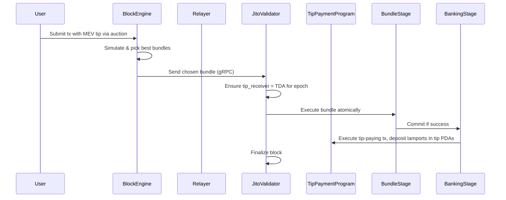
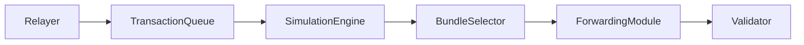
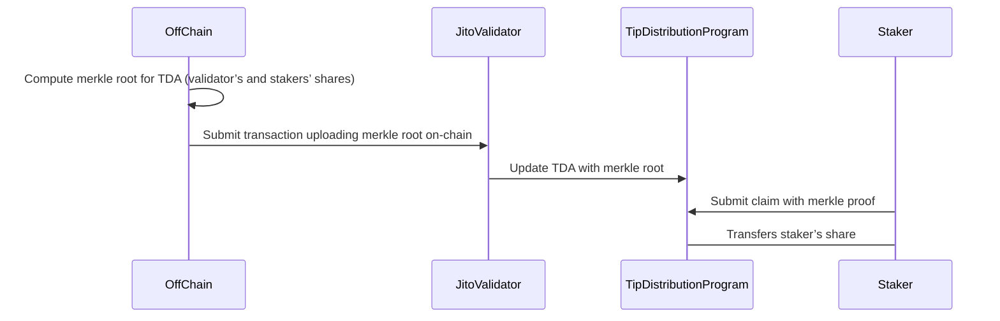
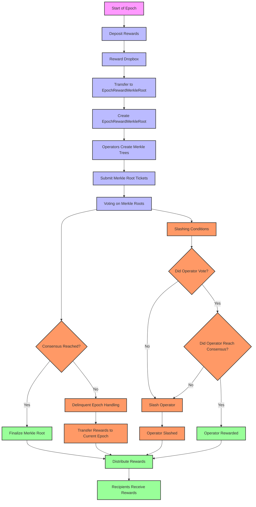
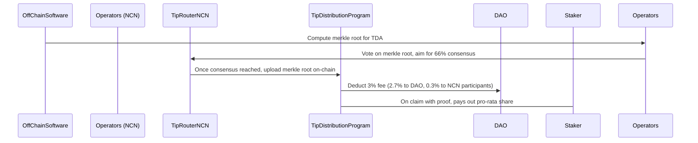

# **Introduction**

Jito is a modified Solana stack that enables more efficient, profitable, and equitable MEV extraction. It builds on the standard Solana validator with additional off-chain components (the Relayer and Block Engine) and two core on-chain programs (the Tip Payment and Tip Distribution programs).

The ultimate goal of Jito is to extract MEV—monetizable opportunities inside Solana blocks—while redistributing those earnings to validators and delegators, all with minimal trust assumptions. Eventually, the `Tip Rewards NCN` (Node Consensus Network) further decentralizes the reward distribution, removing single points of failure.

# **Jito System Architecture**

Below is a high-level diagram of the Jito system. It shows how user transactions flow into the network, how Jito’s off-chain components (Relayer, Block Engine) handle them, and how on-chain programs finalize MEV tips distribution.

](/assets/images/2025/jito-systems-architecture.png)

Source: Jito-Solana, [https://docs.jito.wtf/](https://docs.jito.wtf/)

**Components**

- Validator (Jito-Solana Client): A Solana validator, modified with extra “stages” to handle MEV bundles.
- [Relayer](#jito-relayer): Intercepts transactions at the TPU layer and forwards them to the Block Engine (and eventually to the validator).
- [Block Engine](#jito-block-engine): Handles transaction ingestion, MEV bundle simulation, and bundle selection.
- [Tip Payment Program (On-Chain)](#jito-tip-payment-program): Stores MEV tips in designated `PDAs`.
- [Tip Distribution Program (On-Chain)](#jito-tip-distribution-program): Distributes the accumulated tips to validators and stakers.
- [`Tip Rewards NCN` (Node Consensus Network)](#decentralized-distribution-with-the-tip-rewards-ncn): Decentralizes the final step of uploading merkle roots that define the final tip distribution.

Before diving deeper, let’s first understand how jito bundles work. 

# **How Jito Bundles Work**

A bundle is a group of transactions (at most five transactions) that must execute atomically and in sequence. It means if one transaction fails, the entire bundle gets dropped. Jito extends Solana’s validator pipeline with a dedicated `BundleStage` that processes these bundles.

**Key constraints**:

- All or nothing (atomic execution).
- Strict execution order.
- Bundles cannot span multiple slots.
- Bundles can’t modify consensus-critical accounts.
- Must pass cost/QoS checks; if any single transaction is too expensive, the entire bundle is rejected.

## **Flow of Bundle**



- Block Engine receives normal transactions + user-submitted “MEV” transactions.
- Block Engine simulates bundles, ranking them by potential profit.
- Block Engine sends a final list of profitable bundles to the validator.
- Validator executes these bundles in its BundleStage.
- The `BankingStage` finalizes the transactions, depositing MEV tips into the Tip Payment Program’s `PDAs`.

## Jito Bundle Auction

The Jito Bundle Auction is a highly efficient mechanism for optimizing the allocation of block space on the Solana. By leveraging parallelism in locking patterns and running frequent auctions, it ensures that the most profitable transactions are prioritized and included in the block. This not only maximizes the tips collected by validators but also ensures that searchers and traders can execute their strategies in a timely manner. The auction mechanism is a key component of the Jito ecosystem, contributing to the overall efficiency and profitability of the Solana network.

- Bundle Submission by Searchers/Traders
    - Searchers and traders submit bundles of transactions. Each bundle contains a set of transactions that the searcher wants to be included in a block.
    - The primary goal of these bundles is to capture arbitrage opportunities, liquidations, or other profitable strategies that require timely execution.
- Priority Auction Mechanism
    - Since block space and opportunities are scarce resources, an auction mechanism is necessary to prioritize which bundles get included in the block.
    - The auction aims to maximize the total tips (transaction fees) that can be collected within a block. This ensures that validators are incentivized to include the most profitable transactions.
- Parallelism in Locking Patterns
    - Transactions within bundles may have different locking patterns on accounts. These patterns can be:
        - Write-Write (w, w): Both transactions write to the same account.
        - Read-Write (r, w): One transaction reads from an account while another writes to it.
        - Write-Read (w, r): One transaction writes to an account while another reads from it.
        - Read-Read (r, r): Both transactions only read from the same account.
    - Bundles with intersecting locking patterns (w, w), (r, w), or (w, r) on particular accounts are run in a single auction. Bundles that do not touch the same accounts or have non-intersecting locking patterns (r, r) are run in separate auctions. This allows for parallelism and efficient use of block space.
- Auction Execution at 200ms Ticks
    - Parallel auctions are run at 200ms intervals (ticks). This ensures that the auction process is fast enough to keep up with the high throughput of the Solana blockchain.
    - The frequent auction ticks allow for real-time processing and prioritization of bundles, ensuring that the most profitable transactions are included in the next block.
- Bundle Ordering and Prioritization
    - Within a single auction, bundles are ordered and prioritized based on:
        - Requested Tip: The amount of tip (transaction fee) that the searcher is willing to pay.
        - CU-Requested Efficiency: The computational unit (CU) efficiency of the bundle, which measures how much computation is required relative to the tip offered.
    - The auction algorithm selects the highest-paying combination of bundles that can fit within the block's computational unit (CU) limit. This ensures that the block is filled with the most profitable transactions without exceeding the computational capacity.
- Submission to Validator
    - Jito submits the highest-paying combination of bundles to the validator, up to the CU limit of the block.
    - The validator includes these bundles in the next block, ensuring that the most profitable transactions are executed promptly.

## **Tip Payment Program**

Users pay extra MEV tips to get transaction priority. These tips are lamports deposited into up to eight static `PDAs (e.g., PDA0…PDA7)`. A configuration `PDA (CFG_PDA)` ties them all together, allowing the validator to set the correct `tip_receiver` each epoch.

Tip Payment Flow:

- `changeTipReceiver` instruction sets the current epoch’s `TDA` (Tip Distribution Account) as the `tip_receiver`.
- Whenever a tip-paying transaction executes, it deposits lamports into one of the tip `PDAs`.
- At epoch’s end, these tip `PDAs` are drained into the `TDA` for distribution.

## **Tip Distribution Program**

The Tip Distribution Program manages per-epoch tip collection. Each validator has a `TDA: PDA(vote_key, epoch)`. This accumulates all tips for that epoch.

At the end of the epoch, an off-chain (or decentralized NCN) process computes a merkle root that defines how the tips in the `TDA` are split among the validator and its delegators (or stakers), pro-rata by stake.

# **Jito Relayer**

The Relayer is a critical component in the Jito Solana architecture, acting as the gateway for transactions entering the system. By intercepting, categorizing, and forwarding transactions, the Relayer ensures that MEV bundles and regular transactions are processed efficiently and routed correctly. Its integration with the Block Engine and Jito-Solana Validator enables seamless MEV extraction and block production.

**Key Responsibilities:**

- Intercepts transactions at the TPU layer before they reach the standard Solana validator.
- Categorizes transactions into regular transactions and MEV bundles. Performs optional filtering, e.g., dropping spam txs.
- Forwards transactions and MEV bundles to the Block Engine for further processing. Ensures that transactions are delivered to the Block Engine in a timely manner.
- Balances the load of incoming transactions to prevent bottlenecks in the Block Engine. Ensures that the system can handle high-throughput workloads.

The Jito Relayer is composed of several sub-components that work together to achieve its goals.

## **TPU Listener**

```rust
// core/src/tpu_listener.rs
pub struct TPUListener {
    tpu_socket: UdpSocket,
    transaction_buffer: Vec<SanitizedTransaction>,
}

impl TPUListener {
    pub fn listen(&mut self) {
        loop {
            let mut buf = [0; 1024];
            let (amt, _) = self.tpu_socket.recv_from(&mut buf).unwrap();
            let tx: SanitizedTransaction = bincode::deserialize(&buf[..amt]).unwrap();
            self.transaction_buffer.push(tx);
        }
    }
}
```

- The main purpose of the `TPUListener` is to capture transactions from the TPU layer.
- Flow:
    - Listens for incoming transactions on a UDP socket.
    - Deserializes the transaction data and adds it to the `transaction_buffer`.

## **Transaction Categorizer**

```rust
// core/src/transaction_categorizer.rs
pub struct TransactionCategorizer {
    transactions: Vec<SanitizedTransaction>,
    bundles: Vec<SanitizedBundle>,
}

impl TransactionCategorizer {
    pub fn categorize(&mut self, tx: SanitizedTransaction) {
        if self.is_mev_bundle(&tx) {
            self.bundles.push(SanitizedBundle::new(vec![tx]));
        } else {
            self.transactions.push(tx);
        }
    }

    fn is_mev_bundle(&self, tx: &SanitizedTransaction) -> bool {
        // Heuristic to identify MEV bundles
        tx.message().instructions().len() > 1
    }
}
```

- The main purpose of the `TransactionCategorizer` is to categorize transactions into regular transactions and MEV bundles.
- Flow:
    - Checks if a transaction is part of an MEV bundle using a heuristic (e.g., multiple instructions).
    - Adds the transaction to the appropriate category (`transactions` or `bundles`).

## **Forwarding Module**

```rust
// core/src/forwarding_module.rs
pub struct ForwardingModule {
    block_engine_client: BlockEngineClient,
}

impl ForwardingModule {
    pub fn forward_transactions(&self, transactions: Vec<SanitizedTransaction>) {
        self.block_engine_client.send_transactions(transactions);
    }

    pub fn forward_bundles(&self, bundles: Vec<SanitizedBundle>) {
        self.block_engine_client.send_bundles(bundles);
    }
}
```

- The main purpose of the `ForwardingModule` is to send transactions and bundles to the Block Engine.
- Flow:
    - Receives transactions and bundles from the `TransactionCategorizer`.
    - Forwards them to the Block Engine using a `BlockEngineClient`.

## **Load Balancer**

```rust
// core/src/load_balancer.rs
pub struct LoadBalancer {
    block_engine_instances: Vec<BlockEngineClient>,
}

impl LoadBalancer {
    pub fn forward_transactions(&self, transactions: Vec<SanitizedTransaction>) {
        let instance = self.select_instance();
        instance.send_transactions(transactions);
    }

    fn select_instance(&self) -> &BlockEngineClient {
        // Simple round-robin load balancing
        self.block_engine_instances.iter().next().unwrap()
    }
}
```

- The `LoadBalancer` distributes transactions across multiple Block Engine instances.
- Flow:
    - It selects a Block Engine instance using a load-balancing algorithm (e.g., round-robin).
    - It forwards transactions to the selected instance.
- This prevents overloading a single Block Engine instance and ensures efficient processing.

## **Integration with Other Components**

The Relayer integrates with several other components in the Jito Solana architecture:

- TPU Layer:
    - Intercepts transactions before they reach the standard Solana validator.
- Block Engine:
    - Forwards transactions and bundles to the Block Engine for MEV processing.
- Jito-Solana Validator:
    - Ensures that selected bundles are executed atomically and included in the blockchain.

## **Challenges and Optimizations**

The Relayer faces several challenges, including:

- High Throughput: Handling a large number of transactions efficiently.
- Latency: Ensuring that transactions are forwarded to the Block Engine with minimal delay.
- Load Balancing: Distributing transactions evenly across multiple Block Engine instances.

To address these challenges, the Relayer implements several optimizations:

- Batch Processing: Groups transactions into batches for efficient forwarding.
- Asynchronous I/O: Uses non-blocking I/O to minimize latency.
- Dynamic Load Balancing: Adjusts the load-balancing algorithm based on real-time system metrics.

# **Jito Block Engine**

The Block Engine is the brain of Jito Solana’s MEV extraction system. It sits between the Relayer and the Jito-Solana Validator, acting as a decision-making layer that processes, simulates, and selects MEV bundles. Below, we will explore the detailed breakdown of its functionality.

## **Block Engine Workflow**



Let’s explore how these different subcomponents work together in the Block Engine.

### **Transaction Queue**

```rust
// core/src/block_engine.rs
pub struct TransactionQueue {
    transactions: Vec<SanitizedTransaction>,
    bundles: Vec<SanitizedBundle>,
}

impl TransactionQueue {
    pub fn add_transaction(&mut self, tx: SanitizedTransaction) {
        self.transactions.push(tx);
    }

    pub fn add_bundle(&mut self, bundle: SanitizedBundle) {
        self.bundles.push(bundle);
    }
}
```

- The main purpose of the `TransactionQueue` is store incoming transactions and MEV bundles.
- Flow:
    - The Relayer forwards transactions and bundles to the Block Engine.
    - The Block Engine adds them to the `TransactionQueue`.
    - It categorizes the transactions into regular transactions and bundles, groups of transactions that must be executed atomically to extract value (e.g. arbitrage, liquidations, etc.).
- This queue ensures that the Block Engine has a buffer of transactions and bundles to process, enabling efficient handling of high-throughput workloads.

### **Simulation Engine**

```rust
// core/src/simulation_engine.rs
pub struct SimulationEngine {
    bank: Bank,
}

impl SimulationEngine {
    pub fn simulate_bundle(&self, bundle: &SanitizedBundle) -> SimulationResult {
        let result = self.bank.simulate_bundle(bundle);
        SimulationResult {
            is_valid: result.is_ok(),
            profitability: result.profitability(),
            gas_cost: result.gas_cost(),
        }
    }
}
```

- The main purpose of the `SimulationEngine` is to simulate the bundles to determine their validity (i.e. the bundle does not violate Solana’s consensus rules), profitability (e.g., arbitrage opportunities, liquidation profits) and the gas cost (the computational cost of executing bundle).
- Flow:
    - The Block Engine retrieves bundles from the `TransactionQueue`.
    - The `SimulationEngine` simulates the bundle using a sandboxed `Bank` (a mock Solana runtime).
    - The simulation results are returned as a `SimulationResult`.
- It also ensures that the bundle does not conflict with other transactions or bundles.

### **Bundle Selector**

```rust
// core/src/bundle_selector.rs
pub struct BundleSelector {
    bundles: Vec<SanitizedBundle>,
}

impl BundleSelector {
    pub fn select_bundles(&self) -> Vec<SanitizedBundle> {
        self.bundles
            .iter()
            .filter(|b| b.profitability > 0) // Filter profitable bundles
            .sorted_by(|a, b| b.profitability.cmp(&a.profitability)) // Sort by profitability
            .take(MAX_BUNDLES_PER_BLOCK) // Limit the number of bundles per block
            .cloned()
            .collect()
    }
}
```

- The main purpose of the `BundleSelector` is to select the most profitable bundles using a greedy algorithm or optimization model to maximize the total value extracted from the selected bundles.
- The selection criteria include:
    - Priority: Bundles with higher tips are prioritized.
    - Atomicity: Ensures that all transactions in the bundle are executed together.
    - Gas efficiency: Bundles with lower gas costs are preferred.
- Flow:
    - The Block Engine retrieves simulation results from the `SimulationEngine`.
    - The `BundleSelector` filters out unprofitable bundles (`profitability > 0`).
    - It sorts the remaining bundles by profitability (highest first).
    - It selects up to `MAX_BUNDLES_PER_BLOCK` bundles for inclusion in the next block.

### **Forwarding Module**

```rust
// core/src/forwarding_module.rs
pub struct ForwardingModule {
    validator: ValidatorClient,
}

impl ForwardingModule {
    pub fn forward_bundles(&self, bundles: Vec<SanitizedBundle>) {
        self.validator.process_bundles(bundles);
    }
}
```

- The main purpose of the `ForwardingModule` is to send these bundles to the Jito-Solana Validator.
- Flow:
    - The Block Engine retrieves the selected bundles from the `BundleSelector`.
    - The `ForwardingModule` sends these bundles to the validator via the `ValidatorClient`.
    - The validator processes the bundles and includes them in the next block.
- The Block Engine ensures that the validator has the necessary context (e.g., account states) to execute the bundles.

## **Block Engine Integration with Other Components**

The Block Engine integrates with several other components in the Jito Solana architecture:

- Relayer:
    - Receives transactions and bundles from the Relayer.
    - Ensures that transactions are forwarded to the Block Engine in a timely manner.
- Jito-Solana Validator:
    - Forwards selected bundles and transactions to the validator.
    - Ensures that the validator has the necessary context (e.g., account states) to execute the bundles.
- Tip Payment Program:
    - Tracks MEV tips associated with bundles.
    - Ensures that tips are stored in PDAs for later distribution.
- Tip Distribution Program:
    - Distributes MEV tips to validators and stakers based on their contribution to the network.

## **Challenges and Optimizations**

The Block Engine faces several challenges, including:

- Scalability: Handling a large number of transactions and bundles efficiently.
- Atomicity: Ensuring that all transactions in a bundle are executed together.
- Profitability: Maximizing the value extracted from MEV bundles.

To address these challenges, the Block Engine implements several optimizations:

- Parallel Simulation: Simulates multiple bundles in parallel to improve throughput.
- Greedy Selection: Uses a greedy algorithm to select the most profitable bundles.
- Gas Optimization: Prioritizes bundles with lower gas costs to maximize profitability.

# Jito Tip Payment Program

The Jito Tip Payment Program is another critical component in the Jito Solana architecture, responsible for storing and managing MEV tips. By securely storing tips in PDAs and providing the necessary data to the Tip Distribution Program, it ensures that searchers are incentivized to submit profitable MEV bundles, while validators and stakers are fairly compensated for their contributions.

**Key Responsibilities:**

- Stores MEV tips in PDAs. Each PDA is associated with a specific bundle or searcher.
- Maintains a record of tips associated with each bundle or searcher.
- Ensures that tips are accurately processed, tracked and can be retrieved when needed.
- Provides the necessary data (e.g., tip balances) to the Tip Distribution Program for distributing tips to validators and stakers.

The Tip Payment Program is implemented as an on-chain smart contract. It is composed of several key components. Let’s explore them below.

## **PDA Management**

```rust
// core/src/tip_payment_program.rs
pub struct TipPaymentProgram {
    pda_map: HashMap<Pubkey, Pubkey>, // Maps bundle ID or searcher address to PDA
}

impl TipPaymentProgram {
    pub fn create_pda(&mut self, bundle_id: Pubkey) -> Pubkey {
        let pda = Pubkey::create_program_address(&[&bundle_id.to_bytes()], &PROGRAM_ID).unwrap();
        self.pda_map.insert(bundle_id, pda);
        pda
    }

    pub fn get_pda(&self, bundle_id: &Pubkey) -> Option<&Pubkey> {
        self.pda_map.get(bundle_id)
    }
}
```

- The `TipPaymentProgram` manages PDAs for each bundle or searcher.
- Flow:
    - Creates a PDA for a given `bundle_id` using `Pubkey::create_program_address`.
    - Stores the PDA in a `HashMap` for easy retrieval.

## **Tip Storage**

```rust
// core/src/tip_payment_program.rs
pub fn store_tip(ctx: Context<StoreTip>, tip: u64) -> ProgramResult {
    let pda = &ctx.accounts.pda;
    let mut pda_account = ctx.accounts.pda_account.load_mut()?;
    pda_account.tip_balance += tip;
    Ok(())
}
```

- The `store_tip` function stores a tip in the appropriate PDA.
- Flow:
    - Retrieves the PDA account associated with the bundle or searcher.
    - Updates the `tip_balance` in the PDA account.

## **Tip Tracking**

```rust
// core/src/tip_payment_program.rs
pub fn get_tip_balance(ctx: Context<GetTipBalance>) -> ProgramResult {
    let pda_account = ctx.accounts.pda_account.load()?;
    Ok(pda_account.tip_balance)
}
```

- The `get_tip_balance` function retrieves the tip balance for a given PDA.
- Flow:
    - Retrieves the PDA account associated with the bundle or searcher.
    - Returns the `tip_balance` stored in the PDA account.

## **Integration with Block Engine**

```rust
// core/src/tip_payment_program.rs
pub fn process_tip_payment(ctx: Context<ProcessTipPayment>, bundle_id: Pubkey, tip: u64) -> ProgramResult {
    let pda = ctx.accounts.pda;
    store_tip(ctx, tip)?;
    Ok(())
}
```

- The `process_tip_payment` function processes a tip payment from the Block Engine.
- Flow:
    - Retrieves the PDA associated with the `bundle_id`.
    - Stores the tip in the PDA using the `store_tip` function.

## **Integration with Other Components**

The Tip Payment Program integrates with several other components in the Jito Solana architecture:

- Block Engine:
    - Receives tip payments from the Block Engine when bundles are selected for inclusion in a block.
    - Ensures that tips are stored in the correct PDA.
- Tip Distribution Program:
    - Provides tip balance data to the Tip Distribution Program for distributing tips to validators and stakers.
- Jito-Solana Validator:
    - Ensures that tips are securely stored and can be retrieved when needed.

## **Challenges and Optimizations**

The Tip Payment Program faces several challenges, including:

- Security: Ensuring that tips are securely stored and cannot be tampered with.
- Scalability: Handling a large number of tip payments efficiently.
- Integration: Seamlessly integrating with the Block Engine and Tip Distribution Program.

To address these challenges, the Tip Payment Program implements several optimizations:

- PDA Security: Uses PDAs to securely store tips, ensuring that only the program can modify the data.
- Batch Processing: Processes tip payments in batches to improve efficiency.
- Asynchronous Updates: Updates tip balances asynchronously to minimize latency.

# Jito Tip Distribution Program

The Tip Distribution Program is a critical component in the Jito Solana architecture, responsible for distributing MEV tips to validators and stakers. By ensuring that tips are fairly and securely distributed, it incentivizes network participation and ensures that the value extracted from MEV bundles is shared among all participants.

**Key Responsibilities:**

- Retrieves tip balances from the Tip Payment Program for each bundle or searcher.
- Calculates the distribution shares for validators and stakers based on their contribution to the network.
- Distributes tips to validators and stakers based on their calculated shares.
- Updates the balances of validators and stakers with their share of the tips.
- Ensures that the distribution is accurately reflected in the blockchain state.

## **Tip Balance Retrieval**

```rust
// core/src/tip_distribution_program.rs
pub struct TipDistributionProgram {
    tip_payment_program: Pubkey,
}

impl TipDistributionProgram {
    pub fn get_total_tips(&self) -> u64 {
        let pda_accounts = self.get_pda_accounts();
        pda_accounts.iter().map(|pda| pda.tip_balance).sum()
    }

    fn get_pda_accounts(&self) -> Vec<PdaAccount> {
        // Logic to retrieve PDA accounts from the Tip Payment Program
        vec![]
    }
}
```

- The `get_total_tips` function retrieves the total amount of tips to be distributed.
- Flow:
    - Retrieves PDA accounts from the Tip Payment Program.
    - Sums the tip balances from all PDA accounts.

## **Distribution Calculation**

```rust
// core/src/tip_distribution_program.rs
pub fn calculate_distribution_shares(&self, total_tips: u64) -> (u64, u64) {
    let validator_share = total_tips * VALIDATOR_SHARE_PERCENT / 100;
    let staker_share = total_tips - validator_share;
    (validator_share, staker_share)
}
```

- The `calculate_distribution_shares` function calculates the distribution shares for validators and stakers.
- Flow:
    - Calculates the validator share as a percentage of the total tips.
    - Calculates the staker share as the remaining tips.

## **Tip Distribution**

```rust
// core/src/tip_distribution_program.rs
pub fn distribute_tips(ctx: Context<DistributeTips>, validator_share: u64, staker_share: u64) -> ProgramResult {
    let validator_account = &ctx.accounts.validator;
    let staker_account = &ctx.accounts.staker;

    validator_account.balance += validator_share;
    staker_account.balance += staker_share;

    Ok(())
}
```

- The `distribute_tips` function distributes tips to validators and stakers.
- Flow:
    - Retrieves the validator and staker accounts.
    - Updates their balances with their share of the tips.

## **Balance Update**

```rust
// core/src/tip_distribution_program.rs
pub fn update_balances(ctx: Context<UpdateBalances>, validator_share: u64, staker_share: u64) -> ProgramResult {
    let validator_account = &ctx.accounts.validator;
    let staker_account = &ctx.accounts.staker;

    validator_account.balance += validator_share;
    staker_account.balance += staker_share;

    Ok(())
}
```

- The `update_balances` function updates the balances of validators and stakers.
- Flow:
    - Retrieves the validator and staker accounts.
    - Updates their balances with their share of the tips.

## **Integration with Other Components**

The Tip Distribution Program integrates with several other components in the Jito Solana architecture:

- Tip Payment Program:
    - Retrieves tip balances from the Tip Payment Program for distribution.
    - Ensures that the total amount of tips to be distributed is accurately calculated.
- Jito-Solana Validator:
    - Distributes tips to validators based on their contribution to the network.
    - Ensures that validators are fairly compensated for their work.
- Stakers:
    - Distributes tips to stakers based on their stake in the network.
    - Ensures that stakers are fairly compensated for their contributions.

## **Challenges and Optimizations**

The Tip Distribution Program faces several challenges, including:

- Fairness: Ensuring that tips are fairly distributed between validators and stakers.
- Efficiency: Handling a large number of distributions efficiently.
- Security: Ensuring that tips are securely distributed and cannot be tampered with.

To address these challenges, the Tip Distribution Program implements several optimizations:

- Predefined Formula: Uses a predefined formula to calculate distribution shares, ensuring fairness.
- Batch Processing: Processes distributions in batches to improve efficiency.
- Secure Distribution: Uses secure on-chain mechanisms to distribute tips, preventing tampering.

## **End-of-Epoch Distribution Flow (pre-NCN)**

At the end of the epoch, an off-chain authority calculates the distribution. The merkle root is uploaded on-chain for stakers to claim.



In the pre-NCN approach (current setup), a centralized or “permissioned” party is responsible for finalizing rewards at the end of each epoch:

- Compute Merkle Root Off-Chain

An off-chain service (often run by the validator or a designated authority) calculates a merkle root based on how many tips the validator and its stakers earned for that epoch.

- Upload Merkle Root

This service then sends a transaction to the validator, which passes the merkle root to the `TipDistributionProgram` on-chain.

- Merkle-Based Claims

Once the merkle root is stored, each Staker provides a merkle proof to claim their share of the tips.

- Staker Receives Share

Upon a valid proof, the `TipDistributionProgram` transfers the correct portion of lamports to the staker’s account.

**Remarks:**

- This process centralizes trust in whoever calculates and uploads the merkle root.
- Stakers must trust that the calculation is fair.
- The approach is simpler but introduces a single point of failure and less transparency.

# **Decentralized Distribution with the Tip Rewards NCN**

*(This is a work in progress and all specific details are under R&D for now.)*

The Jito Tip Rewards NCN is a decentralized framework designed to ensure fair and efficient reward distribution within the Jito-Solana ecosystem. By combining on-chain programs with off-chain processes, it provides a robust mechanism for handling rewards, ensuring that all participants are incentivized to contribute to the network's security and efficiency. The system's focus on consensus and slashing mechanisms ensures that rewards are distributed fairly and that operators are held accountable for their participation.



**Key Components:**

- Epoch Rewards Merkle Tree:
    - Each Node maintains its own Epoch Rewards Merkle Tree, which contains the rewards to be distributed for a given epoch.
    - The root hash of each Merkle Tree is used to verify the integrity of the rewards data.
- Jito Reward NCN:
    - The Jito Reward NCN ensures consensus among the participating NCNs by validating the root hashes of their Epoch Rewards Merkle Trees.
    - It also handles the distribution of rewards and enforces slashing conditions for non-compliant operators.

The reward distribution flow involves several steps, from depositing rewards to distributing them to the recipients. Below is a detailed explanation of each step, along with relevant code snippets.

## **Depositing Rewards**

```rust
pub fn process_dropbox_to_latest(program_id: &Pubkey, accounts: &[AccountInfo]) -> ProgramResult {
    // Add code here
    todo!();
}
```

Rewards can be deposited into the `EpochRewardMerkleRoot` account or the `RewardDropbox` PDA. The `dropbox_to_latest` instruction is used to transfer rewards from the `RewardDropbox` to the current epoch's `EpochRewardMerkleRoot`.

## **Voting and Consensus**

```rust
pub fn process_upload_and_vote(program_id: &Pubkey, accounts: &[AccountInfo], root: MerkleRoot) -> ProgramResult {
    // Add code here
    todo!();
}
```

Operators create and vote on their `EpochRewardMerkleRootTicket` within the voting window. The `upload_and_vote` instruction is used to update the roots based on the operator's vote.

## **Distributing Rewards**

```rust
pub fn process_distribute_crank(program_id: &Pubkey, accounts: &[AccountInfo]) -> ProgramResult {
    // Add code here
    todo!();
}
```

If consensus is reached, the `distribute_crank` instruction is used to distribute rewards from a valid `EpochRewardMerkleRoot` using the consensus root hash as proof.

## **Handling Delinquent Epochs**

```rust
pub fn process_delinquent_to_latest(program_id: &Pubkey, accounts: &[AccountInfo]) -> ProgramResult {
    // Add code here
    todo!();
}
```

If no consensus is reached, rewards can be transferred to the current epoch's rewards using the `delinquent_to_latest` instruction.

## **Slashing Non-Compliant Operators**

```rust
pub fn process_slash(program_id: &Pubkey, accounts: &[AccountInfo]) -> ProgramResult {
    // Add code here
    todo!();
}
```

Operators who do not vote within the voting window or fail to reach consensus can be slashed using the `slash` instruction.

## **End-of-Epoch Distribution Flow (with TipRouter NCN)**

NCN node operators each compute the merkle root. Once two-thirds consensus is reached, the root is posted on-chain, and the reward distribution automatically includes the 3% fee for the DAO and NCN participants.



When the `TipRouter NCN` is live, distribution is decentralized through a network of operators:

- Collective Computation

Off-chain software first compiles all the tip data into a candidate merkle root. Each Operator (NCN node) computes or verifies the same merkle root.

- On-Chain Voting

These operators submit votes on the merkle root via the `TipRouterNCN` smart contract. If two-thirds of the staked voting power agrees, the merkle root is finalized.

- Automated Upload

With consensus reached, the NCN program automatically posts the merkle root to the `TipDistributionProgram` on-chain.

- Fee Deduction & Distribution

A 3% cut of the tips goes to the DAO treasury (2.7%) and to NCN participants (0.3%). The remainder is paid out to validators and stakers as described by the merkle root.

- Stakers Claim Rewards

Finally, each staker uses a merkle proof to claim their portion, ensuring a trust-minimized distribution.

**Remarks:**

- This process removes the single point of failure; no single party can alter or withhold the merkle root.
- Adds slashing conditions to penalize misbehavior, thereby aligning operator incentives.
- Improves overall transparency and fairness in how MEV rewards are distributed.

# References
- [Jito Solana](https://github.com/jito-foundation/jito-solana)
- [Jito relayer](https://github.com/jito-foundation/jito-relayer)
- [Jito Tip Router](https://github.com/jito-foundation/jito-tip-router)
- [Jito Rewards NCN](https://github.com/jito-foundation/jito-rewards-ncn)
- [Jito docs](https://jito-foundation.gitbook.io/)
- [Jito Labs Technical Specifications](https://docs.google.com/document/d/1PNSpqR-bmQpRp-Vq5wmy-wwp9g8Ni4ikoWmRYnWO-CY/edit?tab=t.0#heading=h.rde1dhp9fma8) 