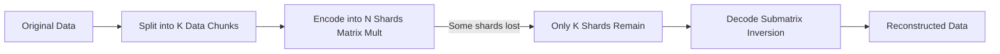
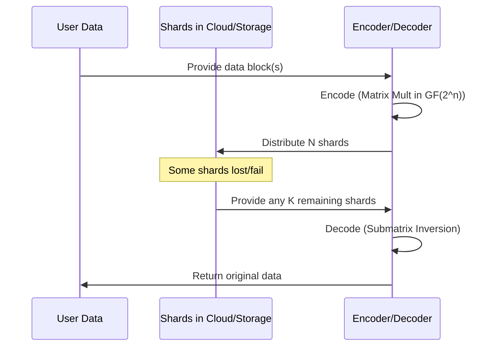

# Introduction

Imagine you’re part of a new decentralized blockchain aiming to store massive amounts of data on-chain—think NFT artwork, transaction histories, and user-generated archives. Each node in the network hosts only a slice of the total ledger. Some nodes go offline unexpectedly; others might be malicious. Directly replicating every byte multiple times is costly and slows down the entire blockchain.  
   
Meanwhile, losing data is not an option: if critical records vanish, the decentralized trust model breaks. How can you keep data *highly available* without drowning in storage costs?  

That’s where erasure coding shines—splitting your data into shards, each individually *unusable* if intercepted or lost, yet fully reconstructable if you can gather enough surviving pieces. This approach drastically lowers overhead compared to naive replication (like storing three or five copies of everything) and offers built-in security advantages because no single shard reveals your entire data.

## Motivation and Article Roadmap

This article provides a deep dive into how erasure coding works, explaining the linear algebra, finite field arithmetic, binary matrix optimizations and other Mathematical foundations behind it. By the end, you’ll see how blockchain projects, cloud services, and countless other data-centric platforms rely on mathematics to keep mission-critical data safe—while avoiding the heavy burden of repeated replicas.

We’ll cover:

- Erasure Coding Basics: Core definitions, highlighting why it outperforms straightforward replication.  
- Mathematical Foundations: From Cauchy matrices and matrix multiplication to decoding with submatrix inversions.  
- Finite Fields: How prime fields $GF(p)$ and extension fields $GF(2^n)$ empower exact, lossless arithmetic.  
- Binary Matrices: Translating field operations into high-speed XOR-based implementations.  
- Implementation Details: Pseudocode examples in Python, plus some practical tips on performance.  
- Challenges & Future Directions: The overhead of repair, quantum-era considerations, and beyond.

Let’s dive in.

---

# Erasure Coding Basics

## What Is an $[N, K]$ Erasure Code?
An $[N, K]$ erasure code transforms your original data into $N$ encoded pieces (shards), with these properties:

- Each shard is roughly $1/K$th the size of the original data (ignoring small overhead).  
- If you lose up to $N - K$ shards, you can still recover the original data from any K surviving shards.

This means you get tolerance to failures (up to $N - K$) without storing multiple full copies.

Here’s a diagram showing the conceptual flow:



Let's understand what's going on in the above diagram. 
- We chunk the data into $K$ parts.  
- We multiply by an $N \times K$ encoder matrix to produce N shards.  
- Even if some shards vanish, as long as we have any $K$ shards, we can decode back to the original data.

## Why Is It Better Than Replication?

- Reduced Cost  
   - Replication: To tolerate $F$ failures, you need $F+1$ full copies (i.e., $(F+1) \times overhead$).  
   - Erasure Coding: You can use an $[S, S-F]$ code (where $S$ is your total number of storage providers). The overhead is $\frac{S}{S-F}$, which is generally less than $F+1$ for most practical values of $S$ and $F$.  

   | # Providers ($S$) | # Failures ($F$) | Replication Overhead | Erasure Code Overhead | Storage Savings |
   |-----------------|----------------|----------------------|-----------------------|-----------------|
   | 4               | 2              | 3X                   | 2X                    | 33%            |
   | 5               | 2              | 3X                   | 1.67X (approx)        | ~44%           |

- Enhanced Security  
   Because each shard is only a fragment, no single shard (fewer than $K$) reveals the original data. This is a built-in layer of “information slicing” that can augment your security posture.

---

# Mathematical Foundations

## Linear Algebra Primer

At the core of erasure coding lies matrix multiplication. We treat data chunks as vectors and multiply by an encoder matrix. Some key definitions:

- A vector $v$ in $\mathbb{R}^K$ is $\begin{bmatrix}v_1 \\ v_2 \\ \dots \\ v_K \end{bmatrix}$.  
- An $(N\times K)$ matrix $M$ is an array of $N$ rows and $K$ columns.  
- Matrix multiplication: $M \cdot v$ yields an $N\times 1$ vector.

For erasure coding, we construct a matrix $E$ (size $N\times K$). The encoded shards are simply:

$$
\text{encoded} = E \times \text{datavector}.
$$

## Cauchy Matrices: Guaranteed Invertibility

To be more precise, not just any matrix works. We need that *any* $K \times K$ submatrix is invertible over our chosen field. [Cauchy matrices](https://en.wikipedia.org/wiki/Cauchy_matrix) are a classic choice:

$$
C_{i,j} = \frac{1}{x_i - y_j}, \quad 1 \leq i \leq N,\ 1 \leq j \leq K,
$$

where $\{x_1, \dots, x_N\}$ and $\{y_1, \dots, y_K\}$ are all distinct elements in a field.

- Construction  
   - Pick $N$ distinct values $\{x_1, \dots, x_N\}$.  
   - Pick $K$ distinct values $\{y_1, \dots, y_K\}$ that don’t overlap with the $x_i$.  
   - Fill the matrix with $\frac{1}{x_i - y_j}$.  

- Why submatrices are invertible  
   Each $K\times K$ submatrix is also a Cauchy matrix (just a “smaller slice” of the bigger one). The determinant of a Cauchy matrix has a known closed-form that is *never zero* if the $x_i$ and $y_j$ sets are distinct.

## Encoding/Decoding Example in Simple Terms

Suppose $K=2$, $N=3$. Let $\{x\}=\{1,2,4\}$, $\{y\}=\{0,3\}$. Then,

$$
E =
\begin{bmatrix}
\frac{1}{1-0} & \frac{1}{1-3} \\
\frac{1}{2-0} & \frac{1}{2-3} \\
\frac{1}{4-0} & \frac{1}{4-3}
\end{bmatrix}
=
\begin{bmatrix}
1 & -\tfrac{1}{2} \\
\tfrac{1}{2} & -1 \\
\tfrac{1}{4} & 1
\end{bmatrix}.
$$

> Real caution: We’ll ultimately do all arithmetic in a *finite field* to avoid floating-point issues. But this matrix illustrates the structure.

- Encoding:  
   $$
   \begin{bmatrix} \text{Shard 1}\\ \text{Shard 2}\\ \text{Shard 3}\end{bmatrix}
   =
   E
   \times
   \begin{bmatrix} d_1 \\ d_2 \end{bmatrix}.
   $$

- Decoding: If we only have shards 1 and 3, we form the $2\times2$ submatrix of $E$ from rows 1 and 3, invert it, then multiply by $\begin{bmatrix}\text{Shard 1}\\ \text{Shard 3}\end{bmatrix}$ to get $\begin{bmatrix} d_1 \\ d_2 \end{bmatrix}$.

---

# Finite Fields for Lossless Encoding

The above fractions $\tfrac{1}{2}, \tfrac{1}{4}, \dots$ in real arithmetic can cause precision issues in actual digital systems. Finite fields solve this by making every number an element of a set with *exact* modular arithmetic.

## Prime Fields $GF(p)$

- Elements: $\{0, 1, 2, \dots, p-1\}$.  
- Addition and multiplication are done $\mod p$.  
- Inverse: an element $a\neq0$ always has a multiplicative inverse $a^{-1}$ such that $(a \times a^{-1}) \equiv 1\ (\mod p)$.

### Example in $GF(7)$

Arithmetic Table for $GF(7)$ (Addition and Multiplication):

Addition ($mod \space 7$):

| +  | 0 | 1 | 2 | 3 | 4 | 5 | 6 |
|----|---|---|---|---|---|---|---|
| 0  | 0 | 1 | 2 | 3 | 4 | 5 | 6 |
| 1  | 1 | 2 | 3 | 4 | 5 | 6 | 0 |
| 2  | 2 | 3 | 4 | 5 | 6 | 0 | 1 |
| 3  | 3 | 4 | 5 | 6 | 0 | 1 | 2 |
| 4  | 4 | 5 | 6 | 0 | 1 | 2 | 3 |
| 5  | 5 | 6 | 0 | 1 | 2 | 3 | 4 |
| 6  | 6 | 0 | 1 | 2 | 3 | 4 | 5 |

Multiplication ($mod \space 7$):

| ×  | 0 | 1 | 2 | 3 | 4 | 5 | 6 |
|----|---|---|---|---|---|---|---|
| 0  | 0 | 0 | 0 | 0 | 0 | 0 | 0 |
| 1  | 0 | 1 | 2 | 3 | 4 | 5 | 6 |
| 2  | 0 | 2 | 4 | 6 | 1 | 3 | 5 |
| 3  | 0 | 3 | 6 | 2 | 5 | 1 | 4 |
| 4  | 0 | 4 | 1 | 5 | 2 | 6 | 3 |
| 5  | 0 | 5 | 3 | 1 | 6 | 4 | 2 |
| 6  | 0 | 6 | 5 | 4 | 3 | 2 | 1 |

Example: $\tfrac{1}{2} \equiv 4\ (\mod 7)$ because $2 \times 4 = 8 \equiv 1\ (\mod 7)$.

## Extension Fields $GF(2^n)$

Prime fields $GF(p)$ are great for small alphabets or numeric data. However, most real-world data is binary. $GF(2^n)$ (e.g., $GF(8)$, $GF(16)$, $GF(256)$, etc.) is often more natural:

- Elements can be seen as *polynomials* of $degree < n$, with coefficients in $\{0,1\}$.  
- Arithmetic is done modulo an irreducible polynomial of degree $n$.  
- Addition is bitwise XOR.  

### Example in $GF(8) = GF(2^3)$

Let the irreducible polynomial be $y^3 + y + 1$. Then each element is a 3-bit pattern: $000$, $001$, $010$, …, $111$.  

- Addition: $\oplus$ (XOR) on the bit pattern.  
- Multiplication: Multiply the polynomials, then reduce modulo $y^3 + y + 1$.

### Concrete Example of Multiplication in $GF(8)$

Suppose we label $\alpha = y$ (the polynomial representing $010$ in binary). Then:

$$
\alpha^3 = \alpha \times \alpha^2 = (y) \times (y^2) = y^3 \equiv y + 1 \quad (\text{mod } y^3 + y + 1),
$$

hence $\alpha^3 = \alpha + 1$. This identity helps compute higher powers.

Let’s do a direct multiplication:

$$
(y^2 + y + 1) \times (y^2 + 1)\quad \text{mod } (y^3 + y +1).
$$

- Polynomial multiplication:  
   $$
   (y^2 \cdot y^2) + (y^2 \cdot 1) + (y \cdot y^2) + (y \cdot 1) + (1 \cdot y^2) + (1 \cdot 1)
   $$
   $$
   = y^4 + y^2 + y^3 + y + y^2 + 1
   $$
   $$
   = y^4 + y^3 + 2y^2 + y + 1.
   $$

- Because we’re in $GF(2^3)$, note $2y^2 = 0$ (coefficient 2 in binary is 0), so we get:  
   $$
   y^4 + y^3 + y + 1.
   $$

- Now reduce mod $y^3 + y +1$:  
   - $y^4 = y \cdot y^3 = y (y+1) = y^2 + y.$  
   So the expression becomes:  
   $$
   (y^2 + y) + y^3 + y + 1.
   $$
   Combine like terms (remember additions are XOR, so repeated terms vanish):  
   $$
   y^2 + y^3 + 1.
   $$

This result, $\alpha^2 + \alpha^3 + 1$, is another polynomial in $GF(8)$. Tracking these steps carefully ensures exact, *lossless* arithmetic.

---

# Binary Matrices for Efficient Encoding

While $GF(2^n)$ arithmetic is conceptually clean, direct polynomial multiplication can be CPU-intensive for large data. A popular optimization is to represent each element of $GF(2^n)$ as an $n\times n$ binary matrix:

- Addition in $GF(2^n) \leftrightarrow$ XOR of the matrix bits.  
- Multiplication in $GF(2^n) \leftrightarrow$ a combination of matrix multiplication + XOR.  

Moreover, many real systems skip the explicit matrix representation and simply do repeated XOR operations in hardware. For example, if you only have coefficients $0$ or $1$, you can pick an encoding matrix with lots of $0/1$ patterns, so each row’s multiplication is basically:

$$
\text{shard} = \bigoplus_{\substack{\text{positions } j \\ \text{where row}[j]=1}} \text{data\_block}_j,
$$

where $\oplus$ is XOR.

---

# Practical Implementation

## Algorithmic Pseudocode




Let’s illustrate a simplified $[4, 2]$ code in $GF(8)$. We’ll show how each step ties to the mathematics:

Encoder Construction (Cauchy-like or custom-designed):
```plaintext
Given irreducible polynomial p(y) for GF(8),
Define encoder_matrix E of size (4 x 2), with each entry in GF(8).

Example (not necessarily minimal):
E = [
  [1, 1],  # row 0
  [2, 3],  # row 1
  [4, 5],  # row 2
  [6, 7]   # row 3
]
```

Encoding:
```plaintext
function encode_block(data_vector):
    # data_vector has length 2 in GF(8)
    # encoder_matrix E is 4 x 2

    shards = E * data_vector   # matrix multiply in GF(8)
    return shards  # length 4
```

Decoding:
```plaintext
function decode_shards(shards_subset, row_indices):
    # shards_subset has length K=2 (any 2 shards from the 4)
    # row_indices is which rows of E they came from (e.g., [0,2])

    E_sub = submatrix(E, row_indices)  # shape 2 x 2
    E_sub_inv = invert(E_sub in GF(8)) # find matrix inverse in GF(8)

    data_vector = E_sub_inv * shards_subset
    return data_vector
```

## Step-by-Step Example with $GF(7)$

Below, we do an explicit example with $GF(7)$. Let’s say:

- $K = 2, N = 3$.  
- Data vector = $[2, 2]$ in $GF(7)$.  
- Encoder matrix:

$$
E=
\begin{bmatrix}
\frac{1}{2} & 1 \\
\frac{1}{3} & \frac{1}{2} \\
\frac{1}{4} & \frac{1}{3}
\end{bmatrix} \quad (\text{all ops mod }7).
$$

We interpret $\frac{1}{2}\equiv4$, $\frac{1}{3}\equiv5$, $\frac{1}{4}\equiv2$ in $GF(7)$. So:

$$
E =
\begin{bmatrix}
4 & 1 \\
5 & 4 \\
2 & 5
\end{bmatrix} \ (\mod 7).
$$

- Encoding:

$$
\begin{bmatrix} \text{Shard1}\\ \text{Shard2}\\ \text{Shard3}\end{bmatrix}
=
\begin{bmatrix}
4 & 1 \\
5 & 4 \\
2 & 5
\end{bmatrix}
\cdot
\begin{bmatrix}2\\2\end{bmatrix}
=
\begin{bmatrix}
(4\times2 + 1\times2)\mod7\\
(5\times2 + 4\times2)\mod7\\
(2\times2 + 5\times2)\mod7
\end{bmatrix}.
$$

That is:

- Shard1 = $(8 + 2)\mod7 = 10 \mod7 = 3$.  
- Shard2 = $(10 + 8)\mod7 = 18 \mod7 = 4$.  
- Shard3 = $(4 + 10)\mod7 = 14 \mod7 = 0$.

Hence, $\text{shards}=[3,4,0]$.

- Decoding (suppose we only have shards 1 and 3). Then $\text{shards\_subset}=[3, 0]$ from rows [0, 2] in $E$. The submatrix is:

$$
E'=
\begin{bmatrix}
4 & 1\\
2 & 5
\end{bmatrix}.
$$

Compute its inverse in $GF(7)$. The determinant $\Delta = 4\times5 - 1\times2 = 20 - 2 = 18 \equiv 4 \ (\mod7)$. The inverse of $\Delta=4$ is $2$, because $4\times2=8\equiv1\ (\mod7)$.

The inverse matrix is:

$$
(E')^{-1} = \frac{1}{\Delta}
\begin{bmatrix}
5 & -1 \\
-2 & 4
\end{bmatrix}
=
2 \times
\begin{bmatrix}
5 & 6 \\  
5 & 4    
\end{bmatrix}
=
\begin{bmatrix}
10 & 12\\
10 & 8
\end{bmatrix}
\mod7
=
\begin{bmatrix}
3 & 5\\
3 & 1
\end{bmatrix}.
$$

Now multiply $(E')^{-1}\times[3,0]^T$:

$$
\begin{bmatrix}
3 & 5\\
3 & 1
\end{bmatrix}
\cdot
\begin{bmatrix}
3\\
0
\end{bmatrix}
=
\begin{bmatrix}
(3\times3 + 5\times0)\mod7\\
(3\times3 + 1\times0)\mod7
\end{bmatrix}
=
\begin{bmatrix}
9\mod7\\
9\mod7
\end{bmatrix}
=
\begin{bmatrix}
2\\
2
\end{bmatrix}.
$$

We recover 

$$\begin{bmatrix}2\\
2\end{bmatrix}$$ 

exactly—our original data vector.

---

# Challenges and Beyond

- Repair Overhead:  
   When a shard is lost, you can regenerate it by decoding from any $K$ surviving shards and re-encoding. This can be bandwidth-heavy. Advanced solutions (e.g., Local Reconstruction Codes) mitigate this by adding local parity shards.

- Quantum Threats:  
   Erasure coding itself is not threatened by quantum computing (it’s linear algebra). However, cryptographic layers that often run *on top* must adapt to post-quantum methods.

- Implementation Complexity:  
   - Coordinating multiple cloud providers or physical disks.  
   - Tracking lost shards and orchestrating repairs.  
   - Ensuring code correctness with finite-field arithmetic—bugs can be subtle.

---


>I wrote about how Erasure coding works in Ethereum Danksharding using Reed Solomon Codes. You can read this [here.](https://thogiti.github.io/2023/11/09/Error-Correction-in-Danksharding-Harnessing-the-Power-of-Generalized-Reed-Solomon-Codes-for-Ethereum-Scalability.html)

# Conclusion

Erasure coding bridges abstract linear algebra and practical data reliability. By splitting data into shards, we gain:

- Durability: Tolerate multiple failures with less overhead than replication.  
- Security: No single shard reveals the entire file.  
- Efficiency: Fine-tuned overhead, especially when scaling storage.  

As data volumes skyrocket, erasure coding becomes a must-have. With the knowledge of finite-field arithmetic and matrix mechanics, you’re ready to implement or optimize an erasure-coding system. Embrace it now to keep your data safe from unexpected storage failures—and do so *cost-effectively*.

---

# Appendix & Further Reading

- Full $GF(2^n)$ Implementation Examples: Libraries like [galois (Python)](https://pypi.org/project/galois/) and [Intel ISA-L Erasure Coding (C)](https://github.com/intel/isa-l) offer production-grade building blocks.  
- [Cachy matrices.](https://en.wikipedia.org/wiki/Cauchy_matrix)
- [Local reconstruction codes.](https://www.usenix.org/system/files/conference/atc12/atc12-final181_0.pdf)
- [Hamming codes - the origin of error correction part 1 by 3blue1brown.](https://www.youtube.com/watch?v=X8jsijhllIA)
- [Hamming codes - the origin of error correction part 2 by 3blue1brown.](https://www.youtube.com/watch?v=b3NxrZOu_CE)
- [Error Correction in Ethereum's Danksharding - Harnessing the Power of Generalized Reed-Solomon Codes for Ethereum's Scalability](https://thogiti.github.io/2023/11/09/Error-Correction-in-Danksharding-Harnessing-the-Power-of-Generalized-Reed-Solomon-Codes-for-Ethereum-Scalability.html)