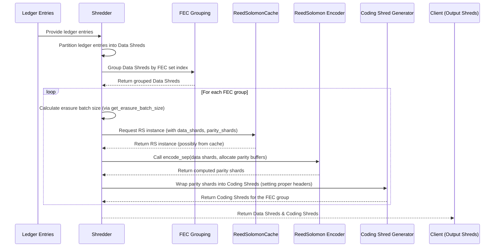
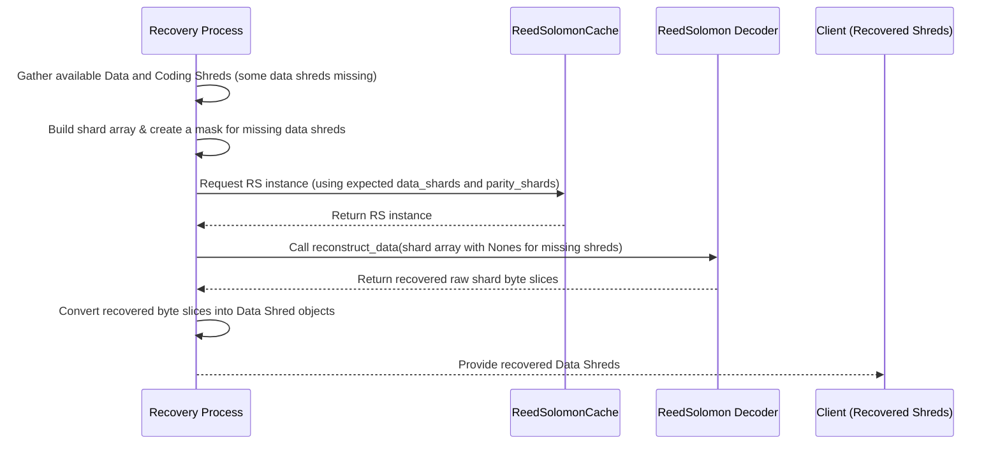

Solana achieves high throughput and near-instant finality, yet it must also handle the reality of real-world networks: data loss, latency, and potential adversarial behavior. One key strategy used is erasure coding—specifically, Reed–Solomon codes—which allow a block (or shard set) to be reconstructed even if some data packets are lost.

In this blog post, we’ll explore:
- The high-level ledger architecture in Solana.  
- Turbine, its block propagation protocol
- The mechanics and math behind Reed–Solomon coding.  
- Detailed code walkthroughs with diagrams to illustrate encoding and decoding flows.  
- How Solana chooses different erasure batch sizes and maintains consistent recovery probabilities.  
- A look at performance, challenges, and future directions.

---

# Introduction

Solana processes thousands of transactions per second, finalizing them in under a second—all while tolerating packet drops and other network issues. Erasure Coding is central to that resilience. By adding a small amount of parity data, missing pieces can be reconstructed without requiring the leader to resend entire blocks.


My previous article, [Understanding Erasure Coding from First Principles](https://thogiti.github.io/2025/02/02/Understanding-Erasure-Coding-Math.html), dives into the mathematical foundations of erasure coding. It’s a great place to start if you’re interested in understanding how erasure coding works from first principles.


**Scalability Trilemma & Solana**

Decentralized blockchain networks often face the scalability trilemma: balancing speed, security, and decentralization. Solana addresses this with:
- Proof of History (PoH): A lightweight, verifiable time-stamping mechanism that orders transactions in time without relying purely on block intervals.  
- Turbine: A tree-based broadcast protocol for distributing data shreds efficiently across the network.  
- Gulf Stream: A system that pushes transactions directly to the leader (bypassing a traditional mempool), reducing confirmation times.  
- Reed–Solomon Erasure Coding: Ensuring data availability even if packets are lost, which is the focus of this post.

---

# Solana’s Ledger Architecture


*Flow - Solana's Ledger Architecture, Source: [syndica.io](https://blog.syndica.io/sig-engineering-part-4-solanas-ledger-and-blockstore/?t)*
## The Blockstore: A Solana's Decentralized Database

Let's first understand the complete flow of the Solana's ledger architecture. 

Each validator in Solana runs a Blockstore that manages:
- Shreds: The atomic data units (roughly 1–2 KB each).  
- Entries: Small batches of transactions.  
- Blocks: Collections of entries (or shreds) for each slot (~400 ms).  
- Metadata: Including transaction statuses, block time, and more.

Solana’s Blockstore is typically implemented with a key-value or columnar database (e.g., RocksDB) optimized for large throughput.

## Transactions and Blocks

- Transaction Lifecycle  
   - A user signs a transaction and submits it to an RPC node.  
   - The leader executes the transaction and appends it to the block.  
   - Other validators re-execute (replay) the transaction to confirm results, reaching consensus.

- Block Creation  
   - Slots (~400 ms): Each slot corresponds to a single block produced by the designated leader.  
   - Epochs (~2 days): Comprise ~432,000 slots; leaders are scheduled via a [stake-weighted process](https://www.helius.dev/blog/stake-weighted-quality-of-service-everything-you-need-to-know).  
   - Atomic Blocks: All included transactions must be valid; otherwise, the entire block is invalidated.

## Entries and Shreds

- Entries  
   - Leaders produce entries continuously, each containing a batch of transactions.

- Shreds  
   - Data Shreds: Contain raw transaction data in ~1228-byte chunks.  
   - Coding Shreds: Parity data computed from data shreds via Reed–Solomon encoding (used for recovery).

A typical “erasure set” might be 32 data shreds + 32 code shreds (32:32), but Solana can vary the ratio (see [Erasure Batch Size Selection](#erasure-batch-size-selection)).

---

# Turbine: Solana’s Block Propagation Protocol

Turbine is the mechanism by which shreds (both data and coding) are broadcasted to all validators. The central idea is to organize the network in a tree rather than relying on a “one-to-all” or simple gossip mechanism. By doing so, Solana alleviates the bandwidth burden on any single node and improves scalability.

## Turbine Tree: Root Nodes, and Layer Formation

When the leader finishes generating and erasure-coding a shred group, it sends those shreds in a network packet to a special root node. This root node is responsible for figuring out which validators will participate in the first layer of data relay. The overall process includes:

- List Creation:  
   The root node gathers a list of all active validators. This list is then sorted by stake weight, prioritizing nodes with higher stake. The rationale is that high-stake validators, once they receive the shreds, can quickly verify and respond with their own votes, speeding up consensus.

- List Shuffling:  
   To avoid having a static and potentially exploitable tree structure, the sorted list is shuffled in a deterministic way. The shuffle uses a seed derived from factors like the *slot leader’s ID*, *current slot number*, *shred index*, and *shred type*. This ensures each shred group has its own Turbine tree, while still being predictable enough for honest participants to know where they fit.

- Layer Formation:  
   Finally, nodes are split into layers based on the `DATA_PLANE_FANOUT` parameter. Solana’s current fanout value of 200 often results in a 2- or 3-layer tree:  
   - Leader → Root Node  
   - Root Node → Layer 1  
   - Layer 1 → (possibly) Layer 2  

   Because of this relatively large fanout, most validators are only a couple of hops (often 2 or 3 hops) away from the leader, helping shreds propagate quickly through the network.

The Turbine Tree lets each validator determine precisely where it should forward the shred next. The approach strikes a balance between speed (high fanout) and resilience (stake-based prioritization, per-shred randomization). In practice, this yields low-latency, multi-hop propagation that can saturate a global network in mere milliseconds.

## Fallback: Gossip and Repair

If a node fails to receive enough shreds to reconstruct the block (e.g., network issues or loss rates exceeding the FEC ratio), it can:
- Request retransmission directly from the leader, or  
- Use deterministic Turbine repair: Any node that has fully reconstructed the block can provide the missing shreds upon request. This on-demand “repair” process extends data distribution down the branches of the Turbine tree that need it.


## Erasure Coding in Turbine

Let’s look at how erasure coding works in Turbine.

- The leader splits the block’s entries into data shreds and computes coding shreds (Reed–Solomon parity).  
- Both data and coding shreds are disseminated throughout the tree. Even if certain branches lose some data shreds, they can often recover them locally, provided they receive enough parity shreds.  
- This approach means the network does not need to rely on the leader to re-broadcast missing data. Any node that has enough data and coding shreds can rebuild what’s missing.

## Shred Propagation Workflow
While the previous two sections described the “why” and “how,” let’s look closer at the step-by-step flow:

- Serialize & Shred:  
   The leader breaks block entries into data shreds (each ~1228 bytes, plus header).  
- Generate Coding Shreds:  
   For every group (Forward Error Correction set or “FEC set”) of data shreds, Reed–Solomon coding is applied to generate parity.  
- Turbine Transmission:  
   These data and coding shreds are then sent to a small set of peers, which relay them further down the “tree.”  
- Reassembly:  
   If a validator receives enough total shreds (≥ number of data shreds in the FEC set), it can reconstruct the entire data. This reassembly process heavily relies on the [`try_recovery()`](https://github.com/solana-labs/solana/blob/7700cb3128c1f19820de67b81aa45d18f73d2ac0/ledger/src/shredder.rs#L330) function from Solana’s code.

## UDP vs. QUIC
Solana currently uses [QUIC](https://www.helius.dev/blog/all-you-need-to-know-about-solana-and-quic) for block propagation, but it used to use UDP.  

- UDP (User Datagram Protocol): Historically Solana chose UDP because it has minimal overhead—no handshake, no built-in congestion control, which is desirable for low-latency block propagation.  
- QUIC: A modern transport layer protocol that runs over UDP but includes congestion control, improved security (TLS 1.3), and more robust error recovery. Solana switched to QUIC to handle extremely high transaction rates with better reliability than raw UDP alone.


---

# Erasure Coding Mechanics: From Theory to Implementation

If you want to quickly refresh your theoretical foundations on Erasure coding, you can refer to [this article.](https://thogiti.github.io/2025/02/02/Understanding-Erasure-Coding-Math.html)

## The Alternative: Naive Replication
Without erasure coding, one might replicate entire blocks to ensure reliability. This quickly becomes prohibitively expensive for large blocks or frequent transmissions, wasting bandwidth and network resources.

## Polynomial Interpolation & Reed–Solomon
Reed–Solomon Erasure Coding sees each data shred as a point on a polynomial. With a few extra parity points, one can reconstruct the polynomial even if some points (data shreds) are missing. This is significantly more efficient than raw replication and is well-suited for partial loss recovery.

**Data Shreds vs. Code Shreds**

- Data Shreds: Contain the raw transaction data.  
- Code Shreds: Generated from data shreds using Reed–Solomon codes. By collecting enough total shreds (data + code), nodes can recover any missing data shards.

## Code Walkthrough: Key Functions

### `data_shreds_to_coding_shreds()`

The function [`data_shreds_to_coding_shreds()`](https://github.com/solana-labs/solana/blob/7700cb3128c1f19820de67b81aa45d18f73d2ac0/ledger/src/shredder.rs#L190) groups data shreds by their “FEC set index” and calculates how many code shreds to produce:

```rust
fn data_shreds_to_coding_shreds(
    keypair: &Keypair,
    data_shreds: &[Shred],
    next_code_index: u32,
    reed_solomon_cache: &ReedSolomonCache,
    process_stats: &mut ProcessShredsStats,
) -> Result<Vec<Shred>, Error> {
    if data_shreds.is_empty() {
        return Ok(Vec::default());
    }
    // 1) Group data shreds by their FEC set index
    let chunks: Vec<Vec<&Shred>> = data_shreds
        .iter()
        .group_by(|shred| shred.fec_set_index())
        .into_iter()
        .map(|(_, shreds)| shreds.collect())
        .collect();

    // 2) For each group, figure out the total erasure batch size
    let next_code_index: Vec<_> = std::iter::once(next_code_index)
        .chain(chunks.iter().scan(next_code_index, |next_code_index, chunk| {
            let num_data_shreds = chunk.len();
            let is_last_in_slot = chunk.last()
                .copied()
                .map(Shred::last_in_slot)
                .unwrap_or(true);
            let erasure_batch_size = get_erasure_batch_size(num_data_shreds, is_last_in_slot);
            *next_code_index += (erasure_batch_size - num_data_shreds) as u32;
            Some(*next_code_index)
        }))
        .collect();

    // 3) Generate coding shreds (possibly in parallel)
    let coding_shreds: Vec<_> = if chunks.len() <= 1 {
        chunks.into_iter()
            .zip(next_code_index)
            .flat_map(|(shreds, next_code_index)| {
                Shredder::generate_coding_shreds(&shreds, next_code_index, reed_solomon_cache)
            })
            .collect()
    } else {
        PAR_THREAD_POOL.install(|| {
            chunks.into_par_iter()
                .zip(next_code_index)
                .flat_map(|(shreds, next_code_index)| {
                    Shredder::generate_coding_shreds(&shreds, next_code_index, reed_solomon_cache)
                })
                .collect()
        })
    };
    Ok(coding_shreds)
}
```

Key Steps in the Process: 
- Groups data shreds by their FEC index.  
- Uses `get_erasure_batch_size()` to decide how many total shreds (data + coding) are needed.  
- Generates coding shreds (via Reed–Solomon) in parallel if multiple FEC sets are present.

### `generate_coding_shreds()`

The function [`generate_coding_shreds()`](https://github.com/solana-labs/solana/blob/7700cb3128c1f19820de67b81aa45d18f73d2ac0/ledger/src/shredder.rs#L266) is the heart of Reed–Solomon encoding:

```rust
pub fn generate_coding_shreds<T: Borrow<Shred>>(
    data: &[T],
    next_code_index: u32,
    reed_solomon_cache: &ReedSolomonCache,
) -> Vec<Shred> {
    // 1) Convert data shreds to raw slices
    let data: Vec<_> = data.iter()
        .map(Borrow::borrow)
        .map(Shred::erasure_shard_as_slice)
        .collect::<Result<_, _>>()?;

    // 2) Allocate parity shards
    let mut parity = vec![vec![0u8; data[0].len()]; num_coding];

    // 3) Perform Reed–Solomon encoding
    reed_solomon_cache
        .get(num_data, num_coding)?
        .encode_sep(&data, &mut parity[..])?;

    // 4) Wrap parity slices into coding shreds
    ...
}
```

Key Steps in the Process: 
- Convert data shreds into raw byte arrays.  
- Use a cached Reed–Solomon instance to fill the parity buffers.  
- Package parity buffers into “coding shred” structures.

### `try_recovery()`

The recovery function [`try_recovery()`](https://github.com/solana-labs/solana/blob/7700cb3128c1f19820de67b81aa45d18f73d2ac0/ledger/src/shredder.rs#L330) is used when some data shreds didn’t arrive:

```rust
pub fn try_recovery(
    shreds: Vec<Shred>,
    reed_solomon_cache: &ReedSolomonCache,
) -> Result<Vec<Shred>, Error> {
    // 1) Identify missing shards
    let mut shards = vec![None; fec_set_size];
    for shred in shreds {
        let idx = shred.erasure_shard_index()?;
        shards[idx] = Some(shred.erasure_shard()?);
    }

    // 2) Use Reed–Solomon to reconstruct data
    reed_solomon_cache
        .get(num_data_shreds, num_coding_shreds)?
        .reconstruct_data(&mut shards)?;

    // 3) Convert recovered bytes into data shreds
    ...
}
```

Key Steps in the Process:
- Collect existing data/coding shreds, marking missing ones as `None`.  
- Invoke `reconstruct_data()` to fill in the missing pieces.  
- Convert the recovered raw bytes back into complete data shred objects.

### The `ReedSolomonCache`
Building Reed–Solomon lookup tables is expensive. Hence, Solana caches them by `(data_shards, parity_shards)` by implementing [`ReedSolomonCache`](https://github.com/solana-labs/solana/blob/7700cb3128c1f19820de67b81aa45d18f73d2ac0/ledger/src/shredder.rs#L418):

```rust
pub struct ReedSolomonCache(
    Mutex<LruCache<(usize, usize), Arc<ReedSolomon>>>,
);
```

This LRUCache avoids recomputing the same tables for repeated `(data, code)` configurations.

---

# Implementation in Depth: Flow Diagrams

Below are two flow diagrams showing how Solana encodes data into shreds (the “encoding flow”) and how it recovers missing data (the “decoding flow”). 

## Erasure Coding Generation (Encoding Flow)



Flow Explanation:
- The Shredder splits ledger entries into fixed-size data shreds.  
- Data shreds are grouped by an FEC index to form an “erasure set.”  
- The Shredder computes the total erasure batch size (data + coding) for each group.  
- A Reed–Solomon instance is requested from a ReedSolomonCache.  
- Parity shards are computed and then wrapped as “coding shreds.”  
- The output is a set of data shreds plus the corresponding coding shreds.

## Erasure Coding Recovery (Recovery Flow)



Flow Explanation:
- The recovery process collects all shreds it has (data or coding).  
- It marks the data-shred positions that are missing.  
- It requests a matching Reed–Solomon instance from the cache.  
- Reconstructs the missing shards by calling `reconstruct_data()`.  
- Reassembles recovered bytes into standard data shred objects.

These two diagrams show how functions like `data_shreds_to_coding_shreds()`, `generate_coding_shreds()`, and `try_recovery()` interact in practice. They show the end-to-end flow: from ledger entries → data shreds → coding shreds (encoding) and from partial data shreds + coding → full data shreds (decoding/recovery).

---

# Erasure Batch Size Selection

## The Need for Variable Batch Sizes
While Solana often uses a 32 data : 32 code arrangement, in reality the network encounters scenarios where fewer or more data shreds are produced in a slot. If you only have 8 data shreds, how many coding shreds should you generate to maintain the same ~99% success probability that 32:32 yields?

## The `ERASURE_BATCH_SIZE` Lookup Table
Solana defines a small array for mapping the number of data shreds `d` to the total erasure batch size `d + c`. This is defined in the codebase in the [`ERASURE_BATCH_SIZE`](https://github.com/solana-labs/solana/blob/7700cb3128c1f19820de67b81aa45d18f73d2ac0/ledger/src/shredder.rs#L34). For example:

```rust
pub(crate) const ERASURE_BATCH_SIZE: [usize; 33] = [
    0, 18, 20, 22, 23, 25, 27, 28, 30, // up to 8 data
    32, 33, 35, 36, 38, 39, 41, 42,    // up to 16 data
    43, 45, 46, 48, 49, 51, 52, 53,    // up to 24 data
    55, 56, 58, 59, 60, 62, 63, 64,    // up to 32 data
];
```

- Index: The number of data shreds.  
- Value: The total (data + coding) needed to match the reliability of 32:32 when per-shred success is ~65–70%.

For instance:  
- `ERASURE_BATCH_SIZE[1] = 18` → 1 data + 17 code.  
- `ERASURE_BATCH_SIZE[8] = 30` → 8 data + 22 code.

## Underlying Probability Analysis
Solana's reference standard is 32:32 Erasure set as it typically offers ~99%+ block recovery if each shred arrives with ~65% success probability.  

### The Probability Table
In [this table](https://docs.google.com/spreadsheets/d/1SpzC5c0Uf254FZWKHCFrMPrEKgtyU9-kyuLMmUvlVYs?ref=blog.syndica.io) a binomial or combinatorial analysis was done for each row (erasure set size) under various network conditions (per-shred success from 1% to 100%). The table shows:

- Rows: Different (data, code, total).
- Columns: Probability that each shred arrives (1%, 5%, 10%, etc.).
- Cells: Overall chance the entire erasure set can be reconstructed.

This is how the code ensures that smaller partial sets (like 1 data shred or 8 data shreds) remain comparable to 32:32 in terms of success probability. Once the per-shred success probability is ~70%, basically all these sets exceed 99% success.


### How the Table Was Derived

- Standard (32:32) Reference Point  
   Solana engineers treat 32:32 as a “golden standard” because it yields about a 99% recovery probability if individual shreds have at least a 65% chance of arriving successfully.

- Binomial (or Combinatorial) Analysis  
   Each shred’s arrival is (roughly) independent with probability $p$. For an erasure set of size $N = (\text{data} + \text{code})$, you can lose up to $\text{code}$ shreds and still recover. The probability of a successful full recovery can be computed via the binomial distribution:

   $$
     \Pr(\text{recover}) 
     \;=\; \sum_{k=0}^{\text{code}} 
     \binom{N}{k} \, p^{(N-k)} \, (1-p)^{k}.
   $$
   
   Solana’s table or script tests different permutations of data shreds vs. code shreds until it finds the combinations that reach the same target success probability as 32:32.

- Look‐Up for Each Data Count  
   The engineering team built the table that says, “Given $d$ data shreds, how many total shreds $N$ do we need so that the chance of success at typical shred success rates (≥65%) is at least 99%?” Each row in that table is stored in `ERASURE_BATCH_SIZE[d]`.


## Practical Usage
Whenever the Shredder sees *d* data shreds in a partial batch, it does:

```rust
let erasure_batch_size = ERASURE_BATCH_SIZE[d];
let num_coding_shreds = erasure_batch_size - d;
```

Thus, if fewer data shreds are created, a higher proportion of coding shreds is produced—maintaining the same overall reliability.

The `ERASURE_BATCH_SIZE` array simply picks the minimal `(data+code)` total that meets or *exceeds* 32:32’s reliability curve whenever your per‐shred success rate is around 65–70%.

---

# Few comments on Performance and Challenges

## Performance

### Bandwidth Efficiency
- Naive Approach: Re-sending entire blocks is not scalable for blockchains like Solana.  
- Reed–Solomon Encoding: Typically adds ~50% overhead (e.g., 32:32), achieving ~99% success if each shred has at least a ~65% chance of arriving. This is a significant bandwidth saving over raw duplication, since you only transmit parity data once per FEC set rather than replicating the entire dataset multiple times.

### Latency Benchmarks
- Turbine Propagation: Usually ~2–3 hops in the tree for each shred, resulting in a total of ~100–200 ms block propagation across a global cluster. This means Solana can finalize blocks at sub-second speeds while distributing data to all validators.  
- Comparison to Ethereum: Ethereum’s gossip-based approach (DevP2P) has simpler flooding but ~12-second block times. Solana’s combination of short slot times (~400 ms) and the Turbine tree-based distribution is tailor-made for rapid finality.

### Storage Optimization
- Blockstore compresses and indexes shreds for local storage. This is essential because of Solana’s high transaction rate—raw data can grow extremely quickly.  
- Historical data may be archived externally, e.g., with IPFS, Filecoin, or dedicated archiver nodes, to reduce the on-chain storage burden on validators.

**Solana vs. Ethereum**

| Metric               | Solana                                           | Ethereum                |
|--------------------------|------------------------------------------------------|-----------------------------|
| Block Time           | ~400 ms                                              | ~12 s                       |
| Propagation Protocol | Turbine + Reed–Solomon Erasure Coding               | Gossip (DevP2P)             |
| Bandwidth            | ~1 Gbps peaks (bursty, not continuous)              | ~25 Mbps                    |
| Data Recovery        | Typically 32:32 FEC + partial requests if needed     | Mostly relies on re-sends   |


**Turbine vs. Celestia’s DAS**

- Turbine: Replicates entire block data across validators, scaled by Erasure Coding. This ensures every validator has or can reconstruct the full data.  
- Celestia: Uses Data Availability Sampling (DAS) so that light clients can confirm data availability without storing it all. Solana’s approach is more monolithic but suits its design goals of very high throughput and rapid confirmation times.

---

# Future Directions

- Adaptive Erasure Coding  
   - Dynamically adjusting data/code ratios (e.g., 32:48) based on real-time network conditions. This could further optimize reliability under periods of high packet loss or suboptimal connectivity.

- Light Client Support  
   - Potentially adopting Celestia-like Data Availability Sampling for specialized light clients, allowing them to verify the chain state without storing all transaction data.

- Firedancer Optimizations  
   - The Firedancer project aims for 10 Gbps throughput with further parallelization in Turbine and I/O layers, pushing the envelope of real-time block propagation. This may include leveraging advanced NIC features, GPU acceleration, or more efficient concurrency.

---

# Conclusion

Solana’s Reed–Solomon erasure coding is an important feature of its high-performance design, allowing for:
- Rapid data propagation via Turbine,  
- Robust recovery even when data or packets go missing,  
- Flexible batch sizes that maintain ~99% success probabilities across varying network conditions.

By pairing these coding strategies with features like Merkle proofs, signatures, and a well-designed cache for Reed–Solomon tables, Solana sustains extreme throughput without sacrificing reliability. Whether you’re dealing with the canonical 32:32 or smaller partial sets, erasure coding ensures your block data remains recoverable—even when the network isn’t perfect.

---

# References
- [Solana GitHub Repo](https://github.com/solana-labs/solana)
- [Solana - Turbine Block Propagation](https://docs.anza.xyz/consensus/turbine-block-propagation)
- [Helius - Turbine: Block Propagation on Solana](https://www.helius.dev/blog/turbine-block-propagation-on-solana?t)
- [Solana’s Ledger and Blockstore](https://blog.syndica.io/sig-engineering-part-4-solanas-ledger-and-blockstore/?t)
- [Solana's Stake-Weighted Quality of Service](https://www.helius.dev/blog/stake-weighted-quality-of-service-everything-you-need-to-know)
- [Firedancer's Reed-Solomon module](https://github.com/firedancer-io/firedancer/pull/244)
- [Solana and QUIC](https://www.helius.dev/blog/all-you-need-to-know-about-solana-and-quic)
- [Reed Solomon Codes GitHub repo](https://github.com/rust-rse/reed-solomon-erasure/tree/ac2b561e406fedcccd144a436580921906d3eee9)
- [Understanding Erasure Coding from First Principles](https://thogiti.github.io/2025/02/02/Understanding-Erasure-Coding-Math.html)