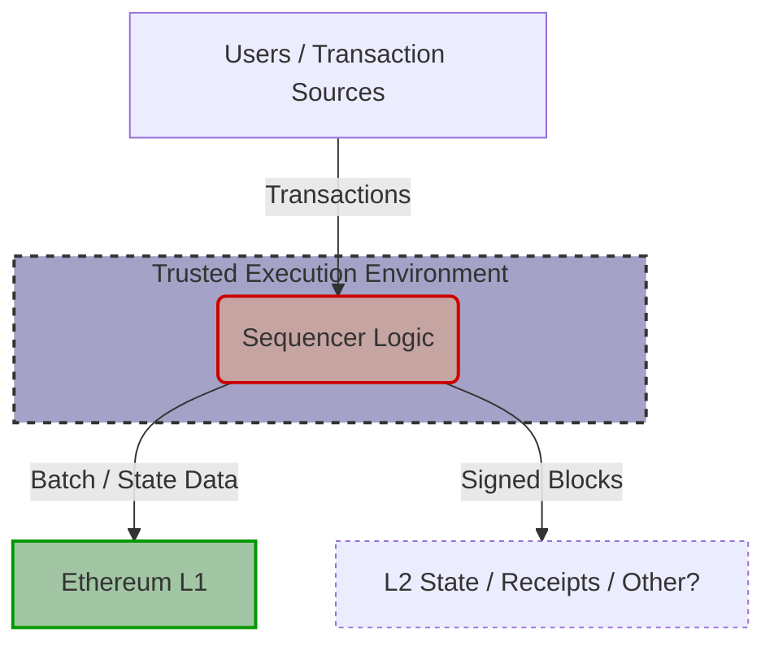
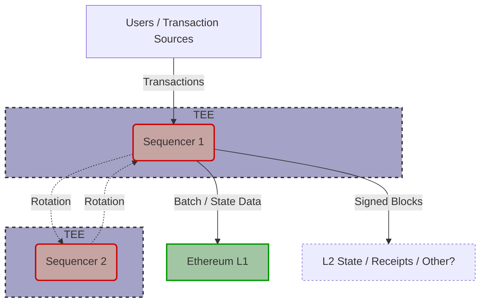
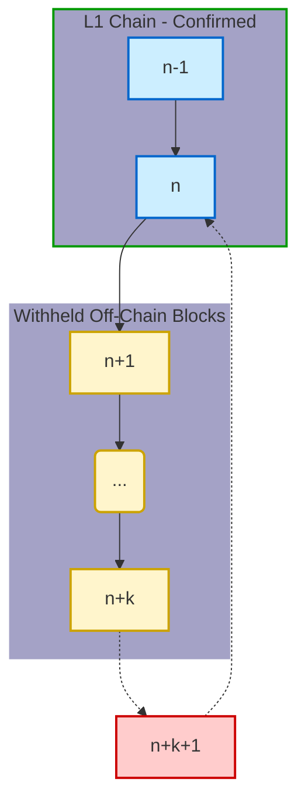

# Introduction and Background

Many Layer-2 (L2) blockchain systems today rely on a single, centralized sequencer to collect, order, and batch user transactions before submitting them to Layer 1 (L1). This design is popular because it’s straightforward to implement, offers high throughput, and provides a fast user experience. However, it also creates a single point of failure with several significant drawbacks. First, the sequencer can censor certain users’ transactions by arbitrarily excluding or delaying them. Second, a single sequencer can reorder transactions to capture MEV (Miner/Maximal Extractable Value), such as frontrunning large trades or sandwiching user transactions. Finally, if the centralized sequencer behaves maliciously or becomes unresponsive (liveness), users must rely on forcibly posting their transactions to L1 (where fees and latency are higher) to guarantee inclusion.

In response to these vulnerabilities, the community is exploring alternative approaches to L2 sequencing. Some projects (e.g. original Astria, Metis, Espresso shared sequencing marketplaces) use decentralized sequencing, distributing the task among multiple sequencer nodes or committees, which then coordinate via Byzantine-Fault Tolerant (BFT) consensus. Others propose leaning heavily on L1-based sequencing, using force-inclusion queues that treat L1 as the ultimate arbiter of all L2 transactions. A third approach, and the primary focus of this post, involves **Trusted Execution Environments (TEEs)**. TEEs can run the core transaction-ordering logic in a hardware-protected enclave, offering potential benefits for fair ordering and censorship resistance while keeping the latency advantages of a single sequencer. 

The following sections compare these three broad designs and examine the specific security challenges of TEE-based sequencers. We’ll also consider how TEEs affect censorship resistance beyond what is already provided by L1 forced inclusion. Real-world case studies like Uniswap’s Unichain and RARI Chain’s Espresso Sequencer illustrate how these ideas are being put into practice.

---

# Three Approaches to L2 Sequencing

## TEE-Protected Single Sequencer

_Source: [Decentralising Rollups](https://collective.flashbots.net/t/decentralising-rollups/3680)_

A TEE-protected single sequencer leverages hardware enclaves (e.g., Intel SGX, AMD SEV) to run block-building logic. The L2 protocol trusts the enclave to enforce a prescribed ordering policy and to keep transaction data private until blocks are finalized. Because the TEE cryptographically proves that it’s running the approved code via remote attestation, the on-chain contract can reject blocks produced outside of that enclave. This approach preserves the low latency of a centralized sequencer while reducing the operator’s ability to manipulate ordering.

Still, TEE-based designs do not guarantee liveness. The sequencer operator can always withhold transactions from the TEE before they arrive in the enclave’s mempool. If the operator goes offline or refuses to cooperate, users are forced to resort to the L1’s forced inclusion mechanism. Additionally, TEEs introduce new assumptions about hardware security and vendor trust. If a vulnerability in the CPU microcode, firmware, or remote attestation process is discovered, attackers could produce “valid” blocks that violate the protocol logic.

## TEE-Protected Single Sequencer (with Rotation)

*Figure: A rotating sequencer design uses multiple TEE-protected sequencers. Only one is active, receiving transactions and producing blocks. Upon rotation (scheduled or triggered), another takes over. The dashed arrow indicates the handoff.*
_Source: [Decentralising Rollups](https://collective.flashbots.net/t/decentralising-rollups/3680)_

To improve liveness beyond a static single sequencer, a variant introduces **sequencer rotation**. Instead of one fixed operator, the active sequencer role is periodically or conditionally transferred to a new operator chosen from a predetermined set. Each operator in this set runs their sequencing logic within their own TEE instance, ensuring adherence to protocol rules. This diversification means the rollup is not indefinitely tied to a single entity's uptime or honesty. If the current sequencer goes offline or malfunctions, another can promptly [step in and continue block production](https://arxiv.org/pdf/2310.03616#:~:text=Reconfiguration,2%20Sequencing%20Policy), assuming the rotation mechanism (often managed by an L1 smart contract verifying credentials) functions correctly. By rotating the duty, the system avoids a single point of failure and significantly improves liveness ([Source comparing static vs. dynamic reconfiguration](https://arxiv.org/pdf/2310.03616#:~:text=September%202023%2C%20Arbitrum%20One%20stands,95)).

Rotation also enhances **censorship resistance** over time. No single party controls transaction ordering indefinitely. A malicious sequencer can only suppress transactions during their active window; once rotated out, the next sequencer can include previously censored transactions. Regularly changing the sequencer ensures that *every valid transaction will eventually be included*, as different operators take turns proposing blocks ([Source on eventual inclusion](https://arxiv.org/pdf/2310.03616#:~:text=or%20delay%20transactions,eventually%20included%2C%20bolstering%20censorship%20resistance)). Aztec’s research on their *Fernet* protocol, which uses random leader election per block, highlights this benefit, noting it “contributes nicely to the network’s censorship resistance” by preventing any permanent monopoly on block production ([Aztec Blog on Fernet](https://medium.com/aztec-protocol/announcing-fernet-aztecs-decentralized-sequencer-selection-protocol-dd06194d572f#:~:text=The%20random%20leader%20election%20in,alongside%20features%20like%20forced%20transactions)).

However, introducing sequencer rotation requires careful coordination to maintain consistency and avoid **reorganizations (reorgs)** at the rotation boundary. A key challenge arises if the outgoing sequencer has built blocks off-chain (say, up to height *n+k*) but only finalized blocks up to *n* on L1. If a new sequencer immediately takes over and builds from the last L1-confirmed state (*n*), a fork occurs if the outgoing sequencer later reveals its unpublished blocks (*n+1* to *n+k*).

*Figure: Reorg risk during rotation. Blue blocks (n-1, n) are L1-finalized. The outgoing sequencer built yellow blocks (n+1...n+k) off-chain but didn't publish them. If the new sequencer starts at n and builds red block n+k+1, it conflicts with the withheld yellow blocks if they appear later. A delay/buffer prevents this.*
_Source: [Decentralising Rollups](https://collective.flashbots.net/t/decentralising-rollups/3680)_

To prevent this, designs often include a **delay buffer** or **handoff protocol**. This typically requires the outgoing sequencer to finalize its work (publish all necessary data for blocks up to *n+k* to L1) within a specific window before the new sequencer begins. This buffer ensures the new sequencer starts from a clean, L1-confirmed state (either *n+k* if published, or *n* if the old sequencer failed to publish and potentially faces penalties), thus avoiding surprise “shadow blocks” causing reorgs.

A malicious outgoing sequencer might still attempt **censorship or withholding attacks** by intentionally failing to publish valid blocks near the end of their term. Mitigations include:

-   **Dual-Signed Blocks:** Requiring the last block(s) of the outgoing sequencer or the first block of the incoming sequencer to be signed by *both* parties. This forces agreement on the exact handoff state, cryptographically preventing the outgoing sequencer from later claiming a different, longer chain extending from *before* the handoff without the incoming sequencer's explicit consent.
-   **Slashing/Penalties:** Imposing penalties on sequencers who fail to publish their work completely before the rotation deadline.

These measures help ensure a clean transition and preserve chain integrity ([Source discussing reconfiguration policies](https://arxiv.org/pdf/2310.03616#:~:text=Reconfiguration,2%20Sequencing%20Policy)).

Overall, a rotating TEE-protected sequencer model aims to blend the efficiency of a single active sequencer (low latency, high throughput per block) with the resilience of a multi-operator set. It sits between the extremes of a static centralized operator and fully decentralized consensus. Because the role changes hands, the network gains robustness against downtime and prolonged censorship that can affect static single-sequencer designs ([Source on centralized sequencer risks](https://arxiv.org/pdf/2310.03616#:~:text=Centralized%20sequencers%20also%20present%20the,introduced%20an%20%E2%80%9Cescape%20hatch%E2%80%9D%20mechanism)). This concept is actively explored, with Aztec's Fernet using a VRF-based lottery for rapid rotation ([Aztec Blog on Fernet](https://medium.com/aztec-protocol/announcing-fernet-aztecs-decentralized-sequencer-selection-protocol-dd06194d572f#:~:text=Today%2C%20Aztec%20Labs%20is%20thrilled,RFP%29%20%E2%80%94%20%E2%80%9CFernet%E2%80%9D)). The table below adds this variant to our comparison:

## Decentralized Sequencing (Multiple Sequencers / Committees)

Decentralized sequencing removes the single-sequencer risk by distributing the function across a set of independent nodes or a committee. These nodes coordinate via a consensus protocol (e.g., BFT, HotStuff, or a specialized proof-of-stake mechanism) to agree on transaction ordering. As long as a threshold of nodes is honest, a single party cannot unilaterally censor transactions or reorder them for personal gain. This approach greatly improves censorship resistance, since an attacker must corrupt or coerce a majority of the committee rather than just one operator.

However, coordinating multiple nodes naturally adds latency and protocol complexity. The overhead of message passing and signature aggregation can reduce throughput or slow final confirmations. Economic incentives are often required to make sure nodes remain honest and reliable, and the system must handle node churn or byzantine participants. Despite these drawbacks, many believe that longer-term, decentralized sequencing is the ultimate route to a censorship-resistant L2.

## L1 Forced Inclusion / L1-Based Sequencing

Many L2 systems already incorporate L1 forced inclusion, allowing users to post transactions directly to a contract on L1 if the L2 sequencer refuses them. After a specified delay (which might range from a few hours to a full day), the L2 protocol must accept those transactions from L1. Some rollups go even further, relying on Ethereum L1 for *all* transaction ordering (colloquially known as “based rollups”), thus inheriting the same censorship resistance and consensus properties as the underlying chain.

Using L1 in this manner provides a powerful backstop against malicious or censoring L2 operators, guaranteeing eventual inclusion. However, heavy reliance on L1 sacrifices the throughput and cost advantages of an L2. Posting transactions directly on L1 can be expensive for users, and they must wait for L1 finality plus the delay period. As a result, most rollups treat forced inclusion as an emergency fallback rather than the standard path.

---

## Comparison at a Glance

A simplified comparison of these approaches is shown below:

| **Sequencing Model**                     | **Liveness** | **Censorship Resistance** | **Complexity**                  | **Notes** |
| :--------------------------------------- | :----------- | :------------------------ | :------------------------------ | :-------- |
| *TEE-Protected Single Sequencer (Static)*| **Low** (Relies on single operator uptime) | **Low** (Single entity can censor; relies on L1 escape hatch) | **Low** (Simple architecture)    | Requires trusting TEE & operator keys. Manual/governed failover can be slow (e.g., [Arbitrum historically ~1 week](https://arxiv.org/pdf/2310.03616#:~:text=September%202023%2C%20Arbitrum%20One%20stands,95)). |
| *Rotating Single Sequencer (TEE Variant)*| **Moderate** (Improved via rotation/failover) | **Moderate** (No indefinite censorship; eventual inclusion likely) | **Medium** (Coordination logic) | Faster failover than static. Needs reorg prevention (buffers, dual-sign). Example: [Aztec Fernet (rapid rotation)](https://medium.com/aztec-protocol/announcing-fernet-aztecs-decentralized-sequencer-selection-protocol-dd06194d572f#:~:text=Today%2C%20Aztec%20Labs%20is%20thrilled,RFP%29%20%E2%80%94%20%E2%80%9CFernet%E2%80%9D). |
| *Decentralized Sequencing (Consensus)*   | **High** (Resilient to single node failures) | **High** (Requires majority collusion to censor) | **High** (Consensus protocol)   | BFT/PoS overhead, higher latency potential. Examples: Espresso, Astria. |
| *L1 Forced Inclusion / L1 Sequencing*    | **High** (Fallback to L1 guarantees progress) | **High** (Users can bypass L2 sequencer via L1) | **Medium** (Relies on L1 infra) | Higher fees/latency for forced txs. Examples: Arbitrum escape hatch, [Based Rollups](https://discourse.aztec.network/t/proposal-based-rollup-simple-decentralized-tokenless-sequencerless-l2/479#:~:text=Network%20risk%20is%20minimized%20compared,MEV%20moves%20to%20L1). |

---

# Security Challenges of TEE-Based Sequencers

While TEEs can promise code integrity and confidentiality, they also introduce a new set of risks:

## Side-Channel Attacks
Intel SGX, AMD SEV, and other TEEs have a track record of side-channel vulnerabilities, such as cache timing or speculative execution exploits (e.g., Meltdown, Spectre, SGAxe). These exploits can leak secrets from inside the enclave, including private keys or transaction data that the TEE is supposed to protect. In the worst cases, a side-channel attack might allow an adversary to tamper with the enclave’s logic or glean enough information to reorder transactions or front-run valuable trades.

## Firmware and Software Exploits
Beyond side channels, bugs in the TEE implementation (microcode, firmware, or SDK libraries) can allow malicious code to run inside the enclave. Because TEE vendors like Intel typically provide closed-source firmware, the broader community cannot easily audit it. A single, severe vulnerability could undermine the entire L2, especially if attackers can forge TEE attestations or alter transaction ordering logic while appearing legitimate on-chain.

## Remote Attestation Risks
TEE security also hinges on remote attestation, which proves to an external verifier that the code inside the enclave is genuine. If attestation keys leak—or if the attestation service is flawed—attackers can spoof TEE measurements and trick on-chain contracts into accepting malicious blocks. Such a key leak can jeopardize much of the TEE ecosystem if not swiftly revoked, because it enables an attacker to forge proofs that their (compromised) enclave is genuine.

## Physical and Supply-Chain Attacks
Although less common in public data centers, TEEs can be physically tampered with. Nation-state or insider adversaries might implant backdoors, intercept chips during manufacturing, or extract keys by physically accessing hardware. While TEEs do mitigate threats from untrusted software or operating systems, they remain susceptible to sophisticated physical adversaries.

## Enclave Availability and Operator Control
A TEE cannot force an operator to hand over all transactions. If the operator intentionally withholds certain transactions or simply shuts down the enclave, censorship can still occur until users resort to L1. A single TEE also represents a single point of failure for availability; if it crashes or the operator refuses to power it, the L2 halts unless there is a fallback mechanism.

## Governance and Upgrade Risks
On-chain contracts typically check the enclave’s cryptographic measurement (e.g., `MRenclave`). Any change to the enclave code or TEE configuration requires updating this measurement in the contract. A trusted team or multisig usually controls such updates, introducing a governance dimension: if the wrong measurement is approved, the system’s security is effectively bypassed.

Overall, TEE-based solutions transfer some of the trust from the sequencer operator to the hardware’s integrity. When TEEs work as intended, they can strongly enforce ordering policies and protect user data from the operator. However, the vulnerability surface shifts to hardware exploits, leaked attestation keys, and governance mishaps that can be more opaque than software-based attacks.

---

# Does a TEE Meaningfully Improve Censorship Resistance Over L1?

In the short term, TEEs do offer enhanced censorship resistance and fair ordering so long as the sequencer forwards all transactions. Because the TEE enforces an ordering algorithm (e.g., first-in-first-out or fee-based) and can keep transaction contents encrypted until finalized, it becomes harder for the operator to reorder or selectively drop specific transactions for personal gain. This “blind sequencing” approach prevents frontrunning by hiding trade sizes or other sensitive details, and it makes covert censorship easier to detect when the TEE periodically reports which transactions it processed.

Nevertheless, the TEE does not eliminate the ultimate reliance on L1. If the sequencer simply refuses to pass a user’s transaction into the TEE or goes offline, the user’s only recourse remains posting that transaction to L1. This fallback might involve significant cost and latency, particularly if the forced inclusion delay is set to hours or more. Hence, TEEs address subtle manipulation and can significantly reduce the operator’s freedom to reorder transactions, but they cannot prevent an all-out refusal to operate.

---

# Real-World Case Studies

## Uniswap’s Unichain (Rollup-Boost by Flashbots)
Uniswap is launching an L2 called [Unichain](https://uniswap.org)  that uses Flashbots’ Rollup-Boost, which incorporates Intel TDX enclaves for verifiable block construction. The key design feature is to separate the block-building function from the sequencer, offloading actual transaction ordering to TEE-based builders. These builders receive encrypted transactions, determine their order according to a predefined codebase, and publish sealed blocks. The sequencer then finalizes those blocks on L1. Because the transaction contents are invisible until after ordering, the operator cannot frontrun or pick winners arbitrarily. Unichain still relies on Ethereum L1 for final security and forced inclusion, but the TEE-based approach delivers low-latency, MEV-resistant ordering.

## RARI Chain with Espresso Sequencer
[RARI Chain](https://rarichain.org/), built on Arbitrum Orbit (an L3 framework), integrates Espresso Systems’ Espresso Sequencer, which combines BFT consensus with SGX-based attestation. A committee of validators (Espresso’s network) quickly finalizes transaction blocks, and each block is posted to L1 with a TEE signature proving it was built inside the approved enclave. If the signature doesn’t match the expected SGX measurement, the on-chain contract rejects the block. This design ensures no single node can rewrite ordering to its advantage. Governance still controls which enclave measurements are valid, indicating a social trust layer in addition to hardware trust.

## TeeRollup (Research Prototype)
The [TeeRollup](https://arxiv.org/html/2409.14647v1) project envisions an entire rollup running all transaction execution within a set of TEEs, rather than relying on cryptographic fraud or validity proofs. By requiring multiple enclaves to sign off on each state transition, TeeRollup aims for robust protection against any single hardware compromise. If the TEEs stall or censor, users revert to an on-chain challenge system to force inclusion. Although not in production, TeeRollup demonstrates a more extreme approach to TEE reliance, where hardware security is considered an acceptable substitute for more resource-intensive proof systems.

---

# Conclusion

TEE-based sequencers serve as a middle ground between naive centralized operators and more complex multi-party consensus. When properly implemented, they can raise the bar for censorship and frontrunning by enforcing an honest ordering policy and keeping transaction data concealed until it’s too late to reorder. Users thereby gain short-term protection against subtle manipulation, and the sequencer must either comply or make censorship overt (which can be spotted more easily).

However, TEEs come with significant hardware trust assumptions. If the TEE is compromised, the system’s security effectively collapses back to the operator. Despite these risks, many projects (such as Uniswap’s Unichain and RARI Chain’s Espresso Sequencer) are actively experimenting with TEE-hardened rollups and L3s to achieve low latency, privacy, and neutrality. They balance these benefits with the fallback of L1 forced inclusion for ultimate guarantees. 

Looking ahead, we may see hybrid solutions that use TEEs alongside decentralized committees or cryptographic techniques (like threshold encryption or ZK proofs) to further reduce the trust in any one party or piece of hardware. Whether TEEs become a widely trusted element of the Ethereum scaling stack or remain a temporary niche solution depends on ongoing research, the evolution of hardware security, and the practical economics of L2 infrastructure.

---

### References 

- [Flashbots Forum Discussions on TEE Sequencing](https://collective.flashbots.net)  
- [Decentralising Rollups](https://collective.flashbots.net/t/decentralising-rollups/3680)
- [Optimism Documentation (Forced Inclusion)](https://community.optimism.io/docs)  
- [Arbitrum Developer Docs (Force Movement Queue)](https://developer.arbitrum.io/)  
- [Espresso Systems (Espresso Sequencer)](https://docs.espressosys.com)  
- [Uniswap’s Unichain Announcement](https://uniswap.org)  
- [Intel SGX Overview](https://www.intel.com/content/www/us/en/developer/tools/software-guard-extensions/overview.html)
- [Espresso Sequencer](https://hackmd.io/@EspressoSystems/EspressoSequencer)
- [Anatomy of Decentralized Sequencers](https://blog.kroma.network/decentralized-sequencers-d2a4aeaf1084)
- [TeeRollup - Efficient Rollup Design Using Heterogeneous TEE](https://arxiv.org/html/2409.14647v1)