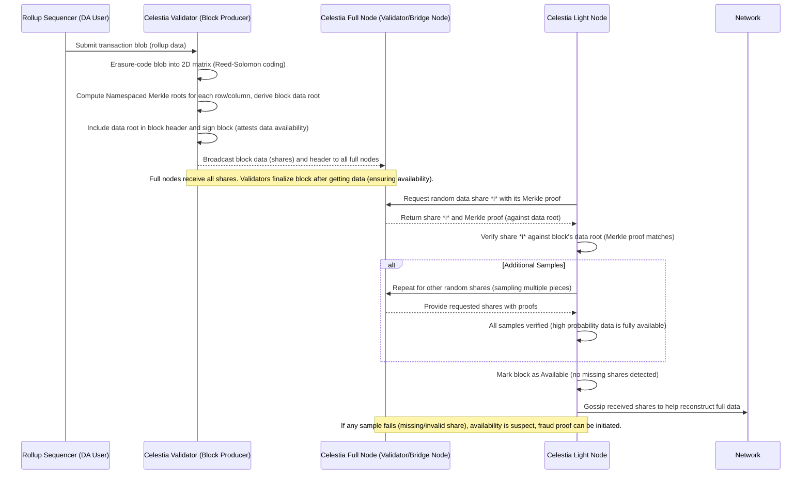
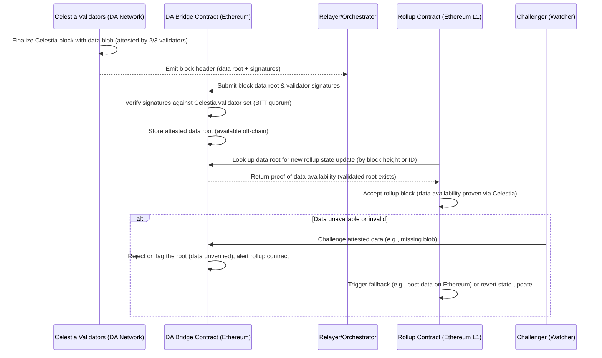
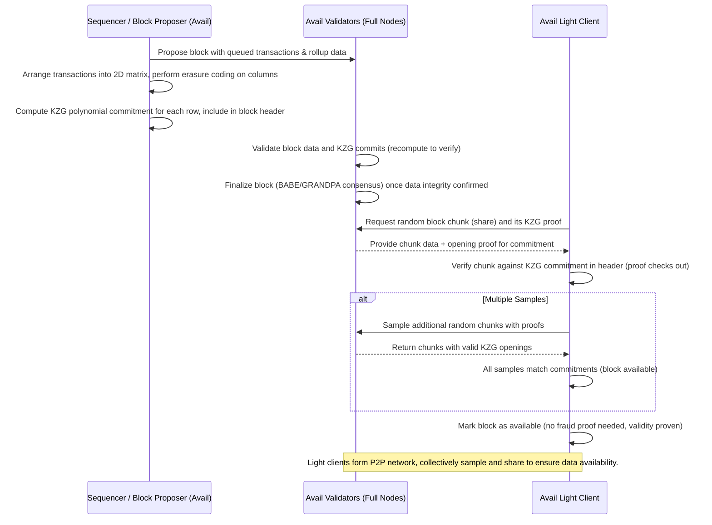
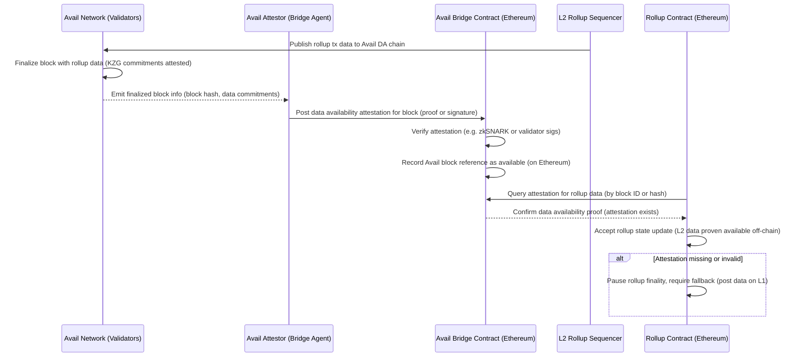
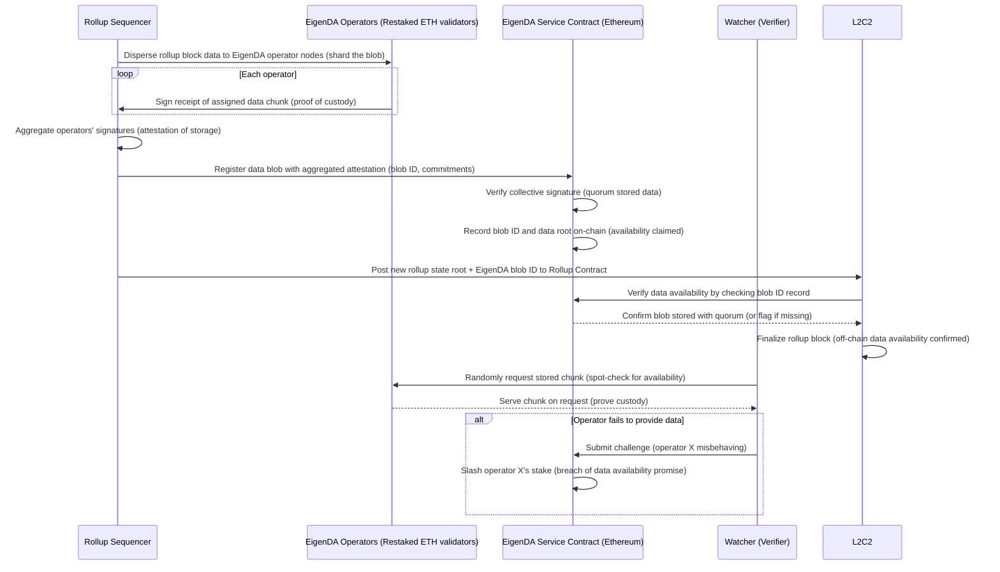

# TL;DR

- Data availability (DA) ensures that anyone can retrieve the necessary information (transactions) for verifying a blockchain or rollup.  
- Posting all rollup data on Ethereum is secure but very expensive and limited by Ethereum’s throughput.  
- Celestia, Polygon Avail, and EigenDA each tackle off-chain data availability differently, with varying *trade-offs in trust, throughput, finality, and cost*.  
- By understanding how each solution works (and how it anchors proofs to Ethereum), you can select the best DA layer for your rollups or L2 projects.

---

# Background: Why Data Availability Matters

Rollups compress transactions and must post the transaction data somewhere so anyone can reconstruct it if needed (for fraud proofs, validation, etc.). Traditionally, this data was posted on Ethereum as calldata—trust-minimized but very expensive. Data Availability (DA) layers aim to store rollup data more cheaply while preserving the ability for any honest party to retrieve it. Each DA solution—Celestia, Polygon Avail, EigenDA—balances *cost, throughput, trust assumptions, and finality* in different ways.

---

# Quick Comparison Table

Below is a brief snapshot of how Celestia, Polygon Avail, and EigenDA compare on some key metrics:

| Dimension      | Celestia                                                                                                                                | Polygon Avail                                                                                         | EigenDA                                                                                                                                                           |
|--------------------|----------------------------------------------------------------------------------------------------------------------------------------------|--------------------------------------------------------------------------------------------------------------------------------------------------|------------------------------------------------------------------------------------------------------------------------------------------------------------------------|
| Blockchain?    | Yes (Cosmos-based, new L1). Uses   *Tendermint BFT & Cosmos SDK*.                                                                          | Yes (standalone PoS chain, Substrate-based).  Uses *BABE/GRANDPA* finality.                                                               | No (service built on Ethereum restaking).                                                                                                                         |
| Data Proof     | Fraud-proof & sampling   (erasure-coded blocks, Namespaced   Merkle Tree for rows+columns).                                        | KZG polynomial commitments   (row-based commitments for the   erasure-coded data matrix).                                             | Committee attestation   (operators sign they store data,   enforced by ETH slashing).                                                                        |
| Finality Time  | ~10 min for guaranteed DA (optimistic wait   for potential fraud proofs).                                                                  | ~40s (fast finality via GRANDPA +   immediate KZG validation).                                                                                 | Aligned with Ethereum finality (~12 min to finalize on L1);   but the attestation typically appears   as soon as included in an ETH block.                                                        |
| Throughput     | ~2 MB per block (scalable to 8 MB, plans for   100 MB–1GB).                                                                               | ~2 MB (tested up to 128 MB), can expand   with validator capacity.                                                                            | Potentially huge (15 MB/s demonstrated),   sharding approach with more operators =>   more total capacity.                                                   |
| Security Model | Independent PoS (~100 validators). *Anyone*   can sample data. Fraud proofs   slash proposers for missing data.                                                               | Independent PoS (Nominated). KZG-based   cryptographic integrity. Still a separate   trust domain from Ethereum.                                                                 | Ethereum stakers restaking ETH, can be   slashed. Effectively a committee with   cryptoeconomic incentives (off-chain but   anchored by Ethereum L1).      |
| Long-Term Storage | Full nodes store blocks (potentially pruned   after challenge window). Light nodes do   indefinite sampling for new blocks.          | Data is stored on Avail’s chain. Over time,   older data may be pruned, but KZG   ensures the block’s correct encoding.                                                            | Operators promise to store data for the agreed   dispute period. If they fail to serve,   watchers can slash them on Ethereum.                                  |
| Bridging       | External bridging to Ethereum  (e.g., “Celestia DA” contract).                                                                             | Avail Data Attestation Bridge to Ethereum,   uses optimistic or zk proofs.                                                                 | Native to Ethereum’s EigenLayer; no separate bridging.   Attestations posted directly on Ethereum.                                                              |
| Best Use Cases | Sovereign rollups wanting *ultra low cost*,   modular chain approach.  Often favored by *smaller rollups*, Cosmos-based.                | Polygon ecosystem or *fast finality* needs (e.g., <1 min).  “Middle ground” approach with easy bridging.                                                                            | High-throughput L2s wanting direct Ethereum alignment,  slashing-based security. E.g. large-scale DeFi rollups   or OP Stack chains.                         |
| Example Users  | Rollkit, AltLayer, Dymension RollApps,  Arbitrum Conduit (Celestium).                                                                      | Polygon zkEVM validium, Starkware volition,   Polygon Supernets.                                                                              | OP Stack (Optimism) testnets (OP Craft), AltLayer’s   OP EigenDA, future “Superchain” or major L2.                                                                  |

---

# Celestia

Celestia is a modular blockchain (built on Cosmos SDK/Tendermint) that specializes in ordering transactions and making the data available, but does not execute those transactions.

## Full Data Availability Flow

**Diagram Explanation:** 

- Erasure Coding & NMT: Celestia validator encodes the data into many *shares* and commits them in a Namespaced Merkle Tree. Notably, Celestia arranges the data in a 2D matrix and includes both row and column roots.  
- Light Nodes do random sampling of shares. If they can retrieve valid shares, they assume (with high probability) the entire block is available.  
- Fraud Proofs: If any share is missing, a fraud proof can be raised to slash or penalize the proposer.  

Because of this *optimistic* approach, Celestia finality includes a short wait—commonly around 10 minutes—to ensure no withholding was discovered.

**Flow Steps:**

1. Data Submission: A rollup sequencer or user submits a block of transactions (as a data *blob*) to Celestia’s data availability network. The Celestia validator (block proposer) takes this blob and splits it into smaller *shares*, arranging them into a 2D matrix. It then performs erasure coding (Reed-Solomon) to extend the data matrix with parity shares, effectively doubling its size. This redundancy means even if some shares are missing, the full data can be reconstructed from the rest.

2. Commitment via Merkle Roots: The validator computes Namespaced Merkle Tree (NMT) roots for each row and column of the extended matrix, then combines those into a single root-of-roots commitment included in the block header. This Merkle root in the header binds the entire block’s data. By signing and publishing the block header, Celestia validators attest that they have stored and witnessed the full data (they will not sign a block unless they received all shares). The block and its data propagate to all Celestia full nodes in the network.

3. Data Availability Sampling: Light nodes (clients with limited resources) do not download full blocks, but they download every block header (containing the data root). To verify data availability, each light node performs random sampling of shares. The light node picks a random index (or multiple indices) in the extended data matrix and asks a full node for the share at that index along with a Merkle proof of its inclusion. The full node serving the request returns the requested share and its Merkle proof (a path to the root in the header).

4. Verification of Shares: The light node checks the returned share against the header’s Merkle root using the proof. If the proof is valid and the share data matches, the light node gains confidence that this portion of the block is available. The light node repeats this process for several random shares (the protocol ensures only a small number of samples are needed). If all sampled shares verify correctly, there is a high-probability guarantee that the *entire block’s data is available*. This works because if any significant portion of the block were missing, a random sample is very likely to hit a missing share and detect it.

5. Gossip and Recovery: Each time a light node obtains a valid share and proof, it gossips that share to other peers. Over the network, light nodes collectively spread different shares they retrieve. As long as a sufficient number of unique shares (at least the original data size *k* shares) are obtained by honest nodes, the full block can eventually be reconstructed by the network. This decentralized gossip acts as an additional safeguard: even if a block proposer tried withholding some data, the sampling process will catch it, and honest nodes can piece together the full data from the shares.

6. Handling Unavailability: Celestia uses an *optimistic* assumption that blocks are available. If a light node’s sample fails (e.g., it cannot obtain a particular share or a proof is invalid), this is evidence of data withholding. Celestia then allows for fraud proofs or challenges. For example, if someone finds that the block’s erasure-coded data was computed incorrectly or a share is missing, they can submit a proof of malfeasance. Celestia’s design includes a challenge period wherein fraud proofs of incorrectly generated data can be submitted, leading to the block (and malicious validator) being rejected or slashed. In practice, with data availability sampling and erasure coding, such scenarios are extremely rare – honest nodes will detect unavailability with overwhelming probability.

## Ethereum Anchoring Process

**Diagram Explanation:** 

- Relayer forwards the finalized Celestia header and validator signatures to an Ethereum contract.  
- The rollup contract checks that the data root is valid on Celestia, thus saving itself from posting large data on Ethereum.  
- If unavailability is detected, the system falls back to more expensive on-chain posting or halts.

**Flow Steps:**

1. Celestia Block Finalization: When Celestia includes a rollup’s data blob in a block, its validators run consensus (Tendermint-based) to finalize that block. A supermajority (≥66%) of Celestia validators sign the block header, which contains the Merkle root commitment of the data. This validator-signed data root is an attestation that the block’s data is available and valid. Once finalized, the block header (with signatures) is ready to be relayed to Ethereum.

2. Data Root Relay to Ethereum: Celestia uses a bridge mechanism (the Quantum Gravity Bridge contract on Ethereum) to publish proofs of data availability to Ethereum. A specialized relayer (which could be one of the Celestia bridge nodes or a coalition of validators) takes the finalized Celestia block header and submits it to the Ethereum bridge contract. The submission includes the block’s data root and a set of validator signatures attesting to that root. Essentially, the Celestia network is saying “here is the cryptographic commitment to the data, signed by our validators.”

3. Verification on Ethereum: The DA bridge contract on Ethereum maintains knowledge of Celestia’s validator set (public keys) and the required quorum threshold. Upon receiving the header and signatures, the contract verifies that a sufficient majority of Celestia validators have signed the data root. If the signatures are valid and meet the quorum, the contract accepts this as proof that the data was published on Celestia. The bridge contract then stores the data root (and associated block height or ID) on Ethereum, in effect anchoring Celestia’s data availability proof on Ethereum.

4. Rollup Contract Checkpointing: When the rollup wants to finalize a state update on Ethereum (e.g., end of an L2 block or epoch), it references the data stored on Celestia instead of posting all transaction data on Ethereum. The rollup’s smart contract on Ethereum might call or query the bridge contract with an identifier (such as the Celestia block height or the expected data root hash) to confirm that the corresponding data was indeed posted to Celestia and attested as available. The bridge contract returns the stored data root or a boolean indicating the data availability proof is present. This allows the rollup contract to verify data availability off-chain: if the data root is found and valid in the bridge contract, the rollup knows its data was safely published on Celestia.

5. State Update Finalization: Given the bridge contract’s confirmation, the rollup contract finalizes the L2 state update on Ethereum. In other words, Ethereum acknowledges the new state (e.g., new L2 state root) because the underlying transaction data was proven available on the Celestia DA layer. This design enables rollups (sometimes called *Celestiums* when they use Celestia for DA) to use Celestia as a data ledger while relying on Ethereum for settlement and dispute resolution. It significantly reduces costs, since the rollup does not need to post all data as Ethereum calldata – it can just post a cheap proof/reference to Celestia’s data.

6. Challenge Mechanism and Fallback: In the rare case that Celestia’s data availability proof is contested or missing, a safety mechanism kicks in. If the bridge contract does not have a valid attestation for the expected data (for instance, if Celestia failed to finalize the block or withheld data), the rollup cannot finalize that state on Ethereum. A challenger (watcher) or even the rollup contract itself can detect this. The rollup may then initiate a fallback, such as posting the raw data to Ethereum L1 (ensuring availability the slow, expensive way) or halting the update. In an optimistic scenario, if a fraudulent attestation somehow got through (e.g., validators signed a root but later the data was found unavailable), a challenge could be raised within a defined period. The bridge contract would mark that data root as invalid and the rollup would ignore that off-chain data, reverting to an on-chain solution or rolling back the state. Celestia’s design minimizes this risk by using fraud proofs on its own side for bad encoding and by economic incentives (validators would be slashed on Celestia for misbehavior). Additionally, rollups integrating Celestia often include an Ethereum fallback mechanism – if Celestia’s DA fails, they ensure the data gets posted to Ethereum so it remains available.

## Trade-offs vs Ethereum DA
- Pros  
  - Low cost and flexible block sizes (2 MB → 8 MB → future 100-1000 MB).  
  - Full decentralization: any node can sample to verify availability.  
- Cons  
  - Requires trusting *another chain* (Celestia’s ~100 validators, DPoS).  
  - ~10-minute finality wait to confirm no withheld data (fraud-proof window).  
  - No *direct* Ethereum enforcement (unless bridging solutions mature).  

## Projects Using Celestia
Celestia only launched its mainnet in late 2023, but several projects are already building on it. 

- The Celestia Rollkit SDK allows developers to launch rollups that use Celestia for DA with minimal overhead. For example, AltLayer has integrated Celestia’s DA layer to make their rollups more scalable and affordable ([blog.altlayer.io](https://blog.altlayer.io/altlayer-optimizes-rollups-with-celestias-data-availability-layer-8f53f07c118d#:~:text=AltLayer%20optimizes%20rollups%20with%20Celestia%27s,rollups%20more%20scalable%20and%20affordable)). 
- Eclipse and Saga are working on customizable rollups (for Solana VM, etc.) that can plug into Celestia for data availability. 
- In the Cosmos ecosystem, Dymension is creating “RollApps” that settle on Cosmos hubs while using Celestia as their data layer. 
- Even Ethereum-centric frameworks like OP Stack have prototypes for “Celestium” models (using Celestia instead of posting call-data on Ethereum). For instance, Arbitrum’s Conduit initiative lets anyone launch an Arbitrum Stylus chain with Celestia providing DA. 

These early adopters are attracted by Celestia’s low costs and throughput: one analysis noted Celestia was ~64% cheaper per MB than Ethereum’s proto-danksharding blobs over a test period ([conduit.xyz](https://www.conduit.xyz/blog/data-availability-costs-ethereum-blobs-celestia/#:~:text=Data%20Availability%20Costs%3A%20Ethereum%20Blobs,56)). The trade-off, as always, is accepting Celestia’s separate trust domain for DA.

> Note on Data Retention: In Celestia, full nodes store data on-chain, but older data (2+ weeks) might eventually be pruned beyond a certain challenge window. Light nodes only need block headers plus random sampling to confirm new blocks. Archival nodes can keep older data if needed for extended verification.

---

# Polygon Avail

Polygon Avail is another standalone DA chain (initially incubated at Polygon) with a focus on [KZG polynomial commitments](https://thogiti.github.io/2024/03/22/Mastering-KZG-by-hands.html), offering *faster finality* than Celestia’s fraud-proof approach. Built on Substrate, it uses BABE for block production and GRANDPA for finality (~40 seconds).

## Full Data Availability Flow

**Diagram Explanation:**

- Data is erasure-coded across columns and each row is committed via KZG.  
- Validators finalize the block in ~40s. KZG acts like a “zero-knowledge” proof for each chunk’s integrity.  
- No waiting period needed if KZG is correct—*the block is cryptographically proven to be available*.

**Flow Steps:**

1. Block Proposal and Erasure Coding: Polygon Avail is a purpose-built data availability blockchain. When transactions and rollup data are submitted to Avail, a block proposer (sequencer) gathers them into a new block. The proposer organizes the block’s transaction data (including any L2 blobs) into a 2D matrix format and then applies erasure coding to the data columns. This means extra parity chunks are added for each column of data, expanding the block size (for example, a 2 MB block might be extended to 4 MB with redundancy). Erasure coding ensures that even if some data chunks are missing, the original data can be reconstructed from the remainder.

2. KZG Commitments in Block Header: For each row of the extended data matrix, Avail computes a KZG polynomial commitment and inserts these commitments into the block header. A KZG commitment is a cryptographic commitment to a polynomial (in this case representing a row’s data), allowing one to verify any data chunk against the commitment with a succinct proof. By binding multiple KZG commitments (one per row) in the header, Avail provides a strong cryptographic fingerprint of all block data. Unlike Celestia’s Merkle tree (which requires downloading many hashes for verification), a KZG commitment allows for very short constant-size proofs for any data piece. This eliminates the need for fraud proofs for missing data – if a piece were missing or incorrect, a proof would fail immediately.

3. Validator Verification and Consensus: Avail validators (full nodes) receive the proposed block and its data. They independently recompute the erasure coding and the KZG row commitments to ensure the block data is correct and matches the header. This acts as an integrity check: if the proposer included any incorrect commitment or corrupted data, it would be detected by honest validators. Avail uses a consensus mechanism (e.g., Polkadot’s BABE for block production and GRANDPA for finality to finalize the block once a supermajority of validators agree that the data and commitments are valid. The result is a finalized block whose data availability is *inherently verified* by the commitments – there’s no need to “assume” availability then challenge later, since the commitments serve as a validity proof that the data is correct and complete.

4. Light Client Sampling: Similar to Celestia, Avail supports data availability sampling (DAS) by light clients. Light clients only download block headers (with KZG commitments) and not the full data. To verify a block’s data availability, a light client randomly requests a small number of data chunks from various parts of the block. For each requested chunk, an Avail full node provides the chunk along with a KZG opening proof – a short proof that this chunk is consistent with the polynomial commitment in the header. The light client uses the KZG commitment (from the header) to verify the proof for the chunk. If the proof passes, that chunk is confirmed to be present and correct in the block.

5. High-Probability Assurance: The light client repeats this for a few randomly selected chunks (the exact number of samples can be small – KZG commitments allow strong guarantees even with a constant number of samples. If all sampled chunks yield valid proofs, the client is highly confident that the entire block’s data is available. Thanks to erasure coding, a malicious validator would have to hide a large portion of the block for data to be unavailable; such a large gap would almost certainly be caught by random sampling. Avail’s design thus gives near 100% guarantee of data availability to light clients without needing any adversarial challenge process. In other words, if an Avail block finalizes, clients can trust that the data is published and available, as any inconsistency would have been detected by the commitments and sampling.

6. Peer-to-Peer Light Client Network: Avail distinguishes itself by encouraging a robust P2P network of light clients. These light clients coordinate to sample different parts of each block. If a light client obtains a chunk and its proof, it can share this information with others. This cooperative sampling means even if some light clients sample different random pieces, collectively they cover a large portion of the block. Avail’s light clients can even serve as a backup to full nodes: in case some full nodes go offline, the network of light clients has chunks and can help reconstruct the data. This approach ensures redundancy and resilience – data remains available even during network disruptions, which is a key design goal for Avail’s availability layer.

## Ethereum Anchoring Process

**Diagram Explanation:**

- Avail finalizes the block with a cryptographic guarantee (KZG).  
- Bridge posts an attestation to Ethereum. The L2 rollup contract checks that attestation, confirming off-chain data.  
- If the attestation fails to appear, the rollup might wait, fallback to on-chain data, or pause.

**Flow Steps:**

1. Rollup Data Sent to Avail: An Ethereum Layer-2 (or Layer-3) rollup that uses Avail for data availability (for example, a Validium or any off-chain data storage scheme) will first send its transaction data to the Avail network. The rollup’s sequencer includes the L2 transaction blob in an Avail block by submitting it to Avail’s validators. This data gets included in a block on the Avail chain, with all the guarantees of integrity and availability as described above (erasure-coded, committed via KZG, and validated by Avail’s consensus).

2. Avail Block Finalization: The Avail network finalizes the block containing the rollup data. By this point, the data has been proven available on Avail (via the KZG commitments and validator checks). Now, the important part is communicating this fact to Ethereum. Avail was initially conceived as a “data attestation bridge” to Ethereum for off-chain data. In its current architecture, Avail operates as an independent DA chain, but it provides an attestation to Ethereum that “the data for rollup X at time Y is available on Avail.”

3. Data Attestation Bridge: Once the Avail block is finalized, an off-chain process or entity (here labeled Avail Attestor) prepares a data availability attestation for Ethereum. This could be one of two approaches:
   - Validator Signatures: A set of Avail validators (or a dedicated bridge committee) signs a message containing the Avail block ID and data root, confirming the data is available. 
   - zkSNARK Proof: Alternatively, a zkSNARK (zero-knowledge proof) can be generated to prove that a certain data commitment exists in the Avail chain’s state or that the Avail consensus finalized that block. Avail’s team introduced the VectorX bridge which uses zkSNARKs for an efficient, trust-minimized message bridge between Avail and Ethereum.
   
   The attestor submits this proof/attestation to the Avail Bridge Contract deployed on Ethereum.

4. Verification on Ethereum: The Avail Bridge Contract on Ethereum verifies the attestation. If it’s a set of signatures, the contract checks that enough authorized Avail validators signed off (similar to how a multisig or light client might work). If it’s a zkSNARK, the contract uses the proof to confirm the attestation is valid (for example, that it corresponds to a real Avail block with the given data root). Once verified, the contract now has an on-chain record that a particular Avail block (and thus the rollup data within it) is available. Essentially, Ethereum gets a cryptographic assurance, via this contract, that the rollup’s data exists off-chain and has been published properly.

5. Rollup Contract Integration: The rollup’s smart contract on Ethereum (which handles its state transitions and fraud proofs) interacts with the bridge contract to confirm data availability. For instance, when the rollup sequencer posts a new L2 state root to the rollup contract, it will also provide a reference to where the data is stored on Avail (such as the Avail block number or a hash). The rollup contract can call the bridge contract to check that an attestation for that reference exists. The bridge contract returns a confirmation that the data was indeed attested as available on Avail. With this confirmation, the rollup contract can safely accept the new state root, knowing the underlying transactions are accessible off-chain if needed.

6. Finalize L2 State on Ethereum: Once the data availability proof is confirmed, the rollup’s state update is finalized on Ethereum. In an Optimistic Rollup context, this means the block can go into the challenge period with data available for fraud proofs; in a Validium context, Ethereum has an assurance that data is held safely by Avail. This anchored attestation on L1 replaces the need to post full transaction data on Ethereum, thereby saving gas while still maintaining security (anyone disputing the rollup can retrieve the data from Avail and present a fraud proof if necessary).

7. Challenge or Fallback (if needed): If the attestation from Avail fails to appear on Ethereum (for example, if Avail’s network did not produce or transmit the proof in time), the rollup must have a fallback to avoid a security hole. Typically, the rollup would not finalize the state root without an availability proof. It might delay finalization and eventually fall back to posting data on Ethereum (at higher cost) to ensure availability. In extreme cases, if Avail were believed to be compromised or unable to provide data, the rollup could switch to an emergency mode where it publishes data on-chain or pauses operation. The goal of the bridge is to prevent this scenario by reliably providing a proof to Ethereum that data is available off-chain. Avail’s design, with its strong cryptographic commitments and validator attestations, makes it unlikely that an invalid or false attestation would be given. There isn’t a direct “slashing on Ethereum” for Avail’s validators since Avail is a separate chain with its own economics, but any false attestation would imply a catastrophic failure of Avail’s security. In practice, the attestation bridge is meant to be trust-minimized and reliable, so Ethereum can trust Avail’s data availability with confidence.

## Trade-offs vs Ethereum DA
- Pros  
  - Immediate data availability at finality via KZG (no challenge period).  
  - Faster (~40s) finality vs Celestia’s ~10min.  
  - Flexible bridging approach with optional zk proofs.  
- Cons  
  - Separate chain security: depends on Avail’s PoS validator set.  
  - Current bridging to Ethereum is “optimistic” (requires watchers).  
  - Not as “battle-tested” as Ethereum.

## Projects Using Avail
Avail is relatively new (its token went live in 2023), but it has been positioned as a DA solution for Polygon’s ecosystem and beyond. 

- Polygon’s zkEVM team has discussed offering a validium mode – Avail could serve as the off-chain DA layer for zkEVM or future Polygon chains, to boost throughput without Ethereum fees. Avail’s Data Attestation Bridge is designed to be generic, so any EVM rollup (Optimistic or ZK) can integrate it. For example, Avail could be used by zkSync or StarkNet in “volition” mode (where users choose on-chain vs off-chain data) to provide a decentralized off-chain option instead of a centralized committee. 
- The Avail team explicitly mentions enabling Starkware-style Volitions and zkPorter-like scenarios ([forum.celestia.org](https://forum.celestia.org/t/validiums-settling-transaction-data-on-celestia/66#:~:text=Sure%2C%20validiums%20are%20basically%20zkRs,up%20being%20volitions%20long%20term)) ([blog.availproject.org](https://blog.availproject.org/data-attestation-bridge/#:~:text=Avail%E2%80%99s%20Data%20Attestation%20Bridge%3A%20Enabling,Secure%20Validiums%20and%20Optimistic%20Chains)). 
- Beyond Ethereum, Avail’s tech is also applicable to app-specific chains or sidechains that need a reliable DA backstop. As of early 2025, specific deployments are in testing; for instance, Polygon Supernets (app-chains) are expected to offer Avail as a DA layer. Also, Avail has partnered with projects like dWallet (for Bitcoin rollups) ([dailycoin.com](https://dailycoin.com/press-releases/avail-partners-with-dwallet-network-to-introduce-native-bitcoin-rollups-to-web3/#:~:text=Avail%20Partners%20with%20dWallet%20Network,rollups%2C%20enhancing%20security%20and%20functionality)), indicating a breadth of use-cases. 

The vision is that Avail will act as a “unification layer” for Web3 – multiple rollups across different ecosystems could all use Avail as a common DA hub, each anchoring their proofs to their own L1 but sharing the same data layer. While still early, Avail’s trajectory is to be a widely adopted DA backbone, especially for those already in the Polygon orbit.

> Note on Data Retention: Avail stores all data on its chain, and validators confirm it via KZG. Over time, older blocks could be pruned, but the chain must keep enough data to satisfy challenge windows (for bridging) and potential re-checks. Avail also fosters a P2P network of light clients to ensure redundancy.

---

# EigenDA

EigenDA is a data availability service on EigenLayer, where Ethereum validators restake ETH to store off-chain data. Essentially, it’s a *trusted committee* with slashing to ensure honesty, but it aligns closely with Ethereum’s economic security.

## Full Data Availability Flow

**Diagram Explanation:**
- Operators sign they have each shard. A quorum signature is aggregated on Ethereum.  
- Once Ethereum logs the blob as “available,” rollups can rely on it.  
- Slashing ensures operators who claim storage but fail to deliver get penalized.

**Flow Steps:**

1. Opt-in Ethereum Validators as DA Operators: EigenDA is a special data availability layer built on Ethereum’s EigenLayer protocol. Instead of having its own independent validator set, EigenDA leverages Ethereum’s existing validators (or other ETH stakers) who opt-in and restake their ETH to become EigenDA operators. These operators form a decentralized network responsible for storing and serving off-chain data. They do not produce blocks via a new consensus; rather, they collectively hold data and attest to its availability. The security assumption is that a majority of these EigenDA operators are honest (or at least that not all collude to hide data), similar to Ethereum’s own security assumptions.

2. Dispersal of Data (Sharding the Blob): When a rollup sequencer wants to publish a batch of transactions using EigenDA, it does not put the data on Ethereum directly. Instead, the sequencer takes the rollup block data (often called a “blob”) and disperses it among the EigenDA operator nodes. In practice, the data blob may be split into chunks (shards) and possibly encoded (using techniques similar to danksharding – e.g., polynomial commitments and erasure coding – to facilitate proofs). The sequencer (or a dedicated disperser component) sends each chunk to a different EigenDA operator or multiple operators. At the end of this step, no single entity has the whole blob (unless redundancy is used), but collectively the network holds all pieces of the data.

3. Operators Attest (Proof of Custody): Each EigenDA operator that receives a chunk of the data must prove it has stored that chunk. EigenDA implements a proof-of-custody concept: for example, an operator might sign a cryptographic hash of the chunk (or some derived value that they can only produce if they have the chunk). In the sequence above, each operator sends back a signed receipt to the sequencer acknowledging they have their portion of the data. These signatures often incorporate cryptographic tricks to prevent an operator from signing a receipt without actually storing the data (so that they can be slashed if they lie later). The collection of all these signed receipts constitutes an attestation that “the network of EigenDA operators has the entire blob.”

4. Aggregate Attestation and On-chain Registration: The rollup sequencer (or disperser) aggregates the operators’ signatures into a single compact proof (this could be via BLS signature aggregation, for efficiency). It then calls the EigenDA smart contract on Ethereum (often referred to as the EigenDA Service Manager contract) to register the data blob. The sequencer provides the contract with: (a) a unique blob ID or reference, (b) a commitment to the data (e.g., a Merkle root or polynomial commitment of the whole blob), and (c) the aggregated signature attesting that the EigenDA operators are storing that data. The Ethereum contract verifies the aggregated signature against the known set of EigenDA operators (whose identities come from the set of restaked validators). If the signature check passes – meaning a quorum of operators (potentially all or a threshold, e.g., 2/3) have signed – the contract accepts this as proof that the blob is stored off-chain.

5. On-chain Acknowledgment of Availability: After successful verification, the EigenDA contract records the blob’s ID and data commitment on-chain, marking it as available. This might include storing the root hash of the data and perhaps the set of signers or an epoch number. From this point on, Ethereum (via this contract) has an authoritative record that “Blob X is held by the EigenDA network with a valid attestation.” This on-chain record is crucial for the rollup’s security: it can be referenced in dispute resolution. Notably, this process happens quickly and only a small amount of data (the aggregated signature and hash) is posted to Ethereum, which is far cheaper than posting the entire blob.

6. Rollup References EigenDA Data: The rollup’s smart contract on Ethereum now interacts with EigenDA’s contract to utilize the off-chain data. When the rollup sequencer submits a state root (result of executing the L2 transactions), it also provides the EigenDA blob ID that contains the corresponding transactions. The rollup contract can call the EigenDA contract to verify that this blob ID has a valid availability attestation. The EigenDA contract responds (likely returning the stored commitment or a boolean) indicating the data was properly stored and attested. With that confirmation, the rollup contract can safely finalize the L2 state root, knowing that if anyone needs to challenge the validity of that rollup block, the data is available from EigenDA.

7. Serving Data and Watcher Verification: The data availability guarantee doesn’t end at attestation; the data must remain retrievable. EigenDA operators are expected to serve the data on request for some time window. Watchers or challengers (any interested party, possibly other Ethereum validators or users) can query EigenDA operators for random chunks of the blob as a spot-check (this is analogous to data availability sampling, but here each operator has specific chunks). If the operators are honest, they will respond with the requested data. This off-chain querying can be done by rollup challengers to actually fetch the full rollup data if needed to verify fraud proofs.

8. Slashing for Unavailability: EigenDA introduces a slashing-based mechanism to punish operators who fail to uphold their storage duty. Suppose an operator signs that it has a chunk (so its signature was in the aggregate on-chain) but later refuses or fails to provide that chunk when asked – this is a breach of its promise. EigenDA’s contract allows for challenges: a watcher can submit evidence that a particular operator did not serve the data. One way is an interactive protocol where the watcher proves they requested the chunk and the operator didn’t respond (or responded with invalid data). Another way uses cryptographic tricks: for example, during the attestation, operators might have committed to a random secret derived from the chunk (proof of custody). The contract could challenge the operator to reveal that secret; failing to do so proves they never had the chunk. If a challenge is successful, the offending operator is slashed (their staked ETH on EigenLayer is penalized). This strongly incentivizes operators to actually store and serve the data they signed for.

9. Data Availability Assured: Because operators risk losing stake, they are motivated to store the data reliably for as long as required. As a result, EigenDA provides a decentralized storage with crypto-economic guarantees: as long as a majority of the restaked validators are honest (and responsive), the data will remain available. The system is similar to Ethereum’s forthcoming danksharding approach (which also involves data availability sampling and proof-of-custody for shards) but implemented off-chain as an opt-in service. The key difference is EigenDA is not a consensus layer; it’s a quorum of watchers/operators cooperating to hold data, anchored by Ethereum’s security (slashing conditions).

## Trade-offs vs Ethereum DA

- Pros  
  - “Ethereum-aligned security” (ETH restaking).  
  - Extremely high throughput (sharding across many operators).  
  - Minimal bridging overhead—everything is on Ethereum L1.  
- Cons  
  - Users must trust an *off-chain committee* (unless they run a full EigenDA node).  
  - Potential centralization if a large majority colludes.  
  - Depends on the correctness of EigenLayer’s smart contracts, which is new code.

## Projects Using EigenDA

EigenDA officially launched on Ethereum mainnet in 2024 and is being tested by several rollup projects. 

- OP Stack (Optimism) has added support for alternative DA layers, and the EigenLayer team released a fork of OP Stack with EigenDA integrated ([blog.eigenlayer.xyz](https://www.blog.eigenlayer.xyz/announcing-eigenda-x-op-stack-support/#:~:text=Announcing%20EigenDA%20x%20OP%20Stack,sizes%20and%20cheaper%20DA)). For example, OP Craft (an experimental rollup game) and testnets by OP Labs have used EigenDA as the DA provider, allowing much larger L2 blocks with only small footprint on Ethereum.
- AltLayer, a rollup-as-a-service platform, ran an “OP EigenDA” testnet on Sepolia: L2 transactions were posted to EigenDA and only a short blob reference was put on Ethereum L1 ([docs.altlayer.io](https://docs.altlayer.io/altlayer-documentation/public-testnets/op-eigenda-testnet#:~:text=OP%20EigenDA%20testnet%20is%20an,as%20its%20data%20availability%20layer)). This demonstrated drastically lower costs for the L2 (since the expensive part – the data – was off-chain with EigenDA).
- We can expect emerging L2 networks and app-chains to adopt EigenDA, especially those wanting to maximize throughput but still settle on Ethereum. There is also interest from the Optimism “Superchain” and OP Stack chains: projects for enterprise or high-volume use-cases might use EigenDA to avoid Ethereum’s fees. 
- Another example is zkSync’s HyperChains or Polygon’s upcoming networks considering EigenLayer/EigenDA for their data layer (this is speculative, but both teams have discussed modular approaches for off-chain DA). 
- In general, EigenDA is viewed as a prime candidate for large-scale rollups that need Ethereum-level security. 

> Note on Data Retention: EigenDA operators pledge to store the data for a dispute period. Once that period passes (for example, if an optimistic rollup’s challenge window is 1 or 2 weeks), they can prune older data. It’s up to watchers to retrieve data before pruning if needed for fraud proofs.

# Summary of Strengths & Weaknesses

## Celestia

- (+) 
  - Most *decentralized* of the three (anyone can verify DA via sampling); highly scalable throughput per block
  - Very low cost for posting data (good for small rollups)
  - Simple design leveraging proven BFT consensus and fraud proofs
- (−) 
  - New separate chain to trust (100 validators, growing)
  - Longer wait for DA finality (challenge period ~minutes) 
  - No direct Ethereum enforcement (requires external assumptions or future bridging) 
  - Potential stake centralization due to DPoS model.

## Polygon Avail

- (+) 
  - *Immediate* DA proof at finality (thanks to KZG commitments) 
  - Fast confirmation (~40s) 
  - Robust validator decentralization plan (NPoS, many validators) 
  - Built-in bridge to Ethereum for accountability 
  - Flexible for both optimistic and ZK rollups (validium/volition support)
- (−) 
  - Also a new chain (nascent security, though improving with more validators); current Ethereum bridge is optimistic (requires challenge watchers) 
  - Not as battle-tested as Ethereum or Polygon’s PoS chain yet; higher complexity (maintaining KZG ceremony/trusted setup for commitments, etc.)

## EigenDA 

- (+) 
  - *Ethereum-aligned security*: uses slashing of ETH for misbehavior, appealing to those who trust Ethereum’s economics  
  - Extremely high throughput potential (horizontal scaling) 
  - Cheap for rollups (only post small blob refs on L1) 
  - No separate token or L1 to manage, leveraging existing Ethereum validators; integrations underway with major rollup frameworks (OP Stack) making it easy to adopt
- (−) 
  - Essentially a *trusted committee with incentives* – users can’t verify DA without running a full node, which is a centralization of trust 
  - A malicious majority could fool the system (with difficulty), and detection on-chain is not trivial; currently has a centralized component (disperser) which is a weakness until decentralized 
  - Reliant on the correctness of the EigenLayer smart contracts (contract risk); Ethereum dependency means you inherit Ethereum’s latency (and any issues therein)

# Key Takeaways & Conclusion

Each solution—Celestia, Polygon Avail, EigenDA—targets different segments of the *data availability spectrum*. Here’s how they typically fit:

- Celestia: 
  - Great for *sovereign rollups* seeking low fees and *modular chain design*.  
  - Fully decentralized DA checks via sampling, at the cost of a longer finality wait (~10 min) and reliance on a new chain.  
  - Erasure coding with row+column commitments (Namespaced Merkle Tree) plus fraud proofs.

- Polygon Avail: 
  - Optimized for fast data finality (~40s) using KZG commitments for each row.  
  - Ideal within the Polygon ecosystem or other EVM rollups that want a middle ground between raw Ethereum DA and Celestia’s external chain.  
  - Allows bridging via the Data Attestation Bridge, with either validator signatures or a zkSNARK approach.

- EigenDA: 
  - Embeds data availability *within Ethereum’s security* using restaked ETH and slashing.  
  - Potentially massive throughput, but effectively an *off-chain committee* from a user’s perspective.  
  - Great for large, Ethereum-centric L2s wanting *“hyperscale”* data capacity, though it depends on EigenLayer’s new smart contracts.

In practice, no single DA layer is universally best. A gaming rollup might prioritize lowest cost (Celestia), a DeFi chain with billions in TVL might want Ethereum’s slashing security (EigenDA), and a Polygon-based L2 might choose Avail for synergy and fast finality. Some projects might even blend multiple modes (volition).

As rollups continue to evolve, choosing the right data availability layer can make or break both cost and security. Whether you prefer the *modular ethos* of Celestia, the *fast finality* of Avail, or the *Ethereum-aligned approach* of EigenDA, understanding their core mechanisms and trade-offs is key to building scalable, secure L2s in a multi-chain world.

# References

1. Celestia Documentation & Forum  
   - [Celestia Docs – Data Availability FAQ](https://docs.celestia.org/learn/how-celestia-works/data-availability-faq)  
   - [Celestia Forum: Comparison of DA Layers](https://forum.celestia.org/t/a-comparison-between-da-layers/899)  
   - [Celestia Forum: Using Celestia for Validiums](https://forum.celestia.org/t/validiums-settling-transaction-data-on-celestia/66)

2. Polygon Avail Resources  
   - [Avail FAQs: DAS, Erasure Coding, KZG](https://docs.availproject.org/docs/faqs)  
   - [Avail Blog: A Guide to Selecting the Right Data Availability Layer](https://blog.availproject.org/a-guide-to-selecting-the-right-data-availability-layer)  
   - [Avail’s Data Attestation Bridge](https://blog.availproject.org/data-attestation-bridge)

3. EigenDA / EigenLayer  
   - [EigenDA GitHub Spec](https://github.com/Layr-Labs/eigenda/blob/master/docs/spec/overview.md)  
   - [EigenLayer Blog: Intro to EigenDA](https://www.blog.eigenlayer.xyz/intro-to-eigenda-hyperscale-data-availability-for-rollups)  
   - [AltLayer: OP EigenDA Testnet](https://docs.altlayer.io/altlayer-documentation/public-testnets/op-eigenda-testnet)

4. General Comparisons  
   - [The Rollup Newsletter: DA Layers Overview](https://therollup.co/research/exploring-the-data-availability-layer)  
   - [MT Capital Research Report: Celestia vs EigenDA](https://m.theblockbeats.info/en/news/50536)  
5. KZG
   - [Mastering KZG PCS](https://thogiti.github.io/2024/03/22/Mastering-KZG-by-hands.html)  