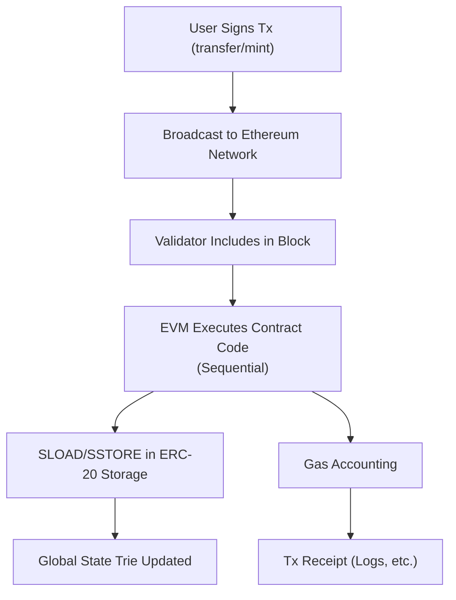
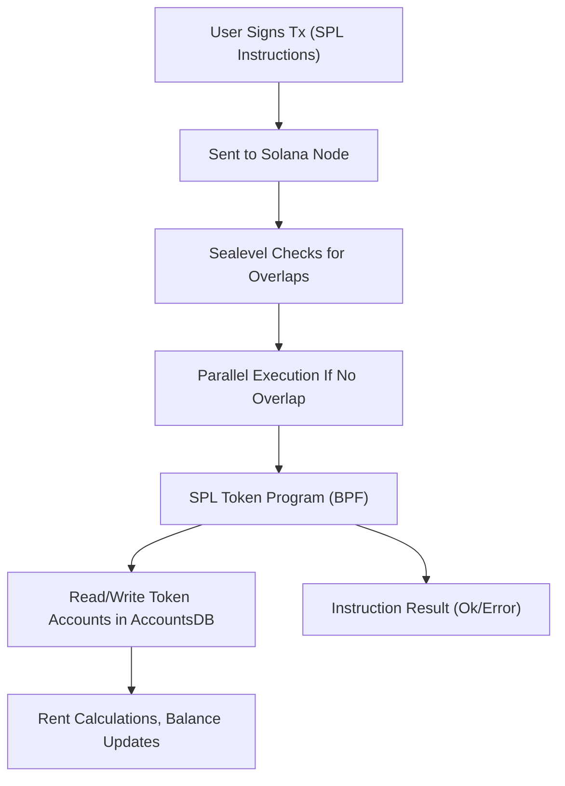

# Overview

Fungible tokens form the backbone of modern blockchain ecosystems—fueling decentralized finance (DeFi), stablecoins, NFTs, gaming, and more. Yet how a chain handles the separation of state and code can have profound impacts on state growth, data management, and scalability. Two major token standards—Ethereum’s ERC-20 and Solana’s SPL—embody diverging philosophies in this regard.

ERC-20 contracts store balances and code together on a per-token basis, while SPL tokens rely on a single, shared program with many smaller, standalone “account” data structures. This article offers a deep exploration of *why* these two approaches differ and *how* those differences affect transaction throughput, on-chain storage, developer experience, and most importantly the ever-growing blockchain state. Along the way, we’ll examine code duplication, rent-based pruning, concurrency, and real-world pressures—providing a technical lens on how each ecosystem’s design decisions shape the future of tokenization.

---

# **Two Divergent Philosophies**

## **ERC-20: Contract-Centric**

On Ethereum, each token is its own smart contract. A developer typically deploys a Solidity (or Vyper) contract implementing the ERC-20 interface, with functions like balanceOf, transfer, approve, and so on. These contracts maintain an internal ledger—for instance, mapping(address \=\> uint256)—to store user balances.


```solidity
// Simplified ERC-20 Interface (Illustrative)
interface IERC20 {
    function totalSupply() external view returns (uint256);
    function balanceOf(address account) external view returns (uint256);
    function transfer(address recipient, uint256 amount) external returns (bool);
    // etc.
}
```

Because each ERC-20 token uses its own code and state, developers can introduce features such as pausable transfers, blacklisting, or deflationary burns. However, duplicating code across hundreds of thousands of contracts can inflate Ethereum’s global state and lead to high deployment costs.

## **SPL: A Universal Program**

Solana’s SPL tokens follow a starkly different approach. Rather than deploying code for each token, Solana hosts a single, on-chain Token Program that handles standard token logic. Creating a new token is simply a matter of initializing a Mint account that represents a unique token on the network and stores global metadata such as total supply—a small data structure with fields like total supply, decimals, and authority. Each user’s balance resides in a separate Token Account (owned by that user’s keypair), rather than a contract-based mapping that tracks individual ownership of tokens for a specific mint account.


*Solana Token Program*


*Solana Mint Account*


*Solana Associated Token Account*


*Solana Account Relationship*


*Solana Accounts Relationship*


```rust
// Pseudocode: Creating an SPL mint account
let mint_account = create_account_for_rent_exemption(...);
initialize_mint(
    &token_program_id,
    &mint_account,
    &mint_authority,
    &freeze_authority,
    decimals,
);
```


**Token Program:** Every token on Solana is ultimately managed by the Token Program. This on-chain program contains all the instructions (e.g. *InitializeMint, MintTo, Transfer*) that allow users to create and manipulate token data. It owns the relevant token accounts and mint accounts, enforcing their logic and rules.

**Mint Account:** A Mint Account is a small piece of on-chain data that stores global metadata about a particular token: its total supply, decimal precision, and the authorities that can mint or freeze it. Only the Token Program can modify a Mint account, ensuring that rules like maximum supply or mint authority are properly enforced

**Token Account:** A Token Account tracks how many units of a specific Mint the owner has. Instead of one big mapping in a single contract, Solana uses standalone accounts: each Token Account references a single Mint and an owner (your wallet). Balances are stored in that Token Account’s data (the *amount* field).

**Associated Token Account:** The Associated Token Account is simply a Token Account whose address is derived deterministically from the user’s wallet address and the token’s Mint address. Because it uses a Program Derived Address (PDA), it can be recreated or looked up without extra on-chain storage.

**Program Derived Address (PDA):** A Program Derived Address is an address created by a Solana program using certain inputs (like the user’s wallet key, the Mint key, and a seed). PDAs cannot be signed for by a standard private key; they are “owned” programmatically. For the Associated Token Program, a PDA-based address is used to ensure each (wallet, mint) pair has a unique, discoverable token account.

Essentially, the Token Program is the universal codebase for handling tokens, Mint Accounts define each distinct token, Token Accounts hold user balances, an Associated Token Account is a special Token Account with a predictable address derived via a PDA, and the System Program is responsible for normal wallet addresses (like your main SOL balance). Together, they form the building blocks for fungible and non-fungible token ecosystems on Solana.

Because there’s no contract deployment, mint creation typically costs just a fraction of a cent, although each new Token Account for holders requires a small rent-exemption deposit (\~0.002 SOL).

**Key Architectural Difference:**

* ERC-20: Deploy a new smart contract for each token → code-centric  
* SPL: Reuse one universal program; new tokens are just data “accounts” → data-centric

These underlying models of “each token \= new contract” vs. “one shared program with many small accounts” yield radically different patterns of state growth, scalability, and execution cost.

---

# **State & Data: Contract vs. Account Models**

## **Ethereum: Contract Storage in a Global Trie**

In Ethereum, every ERC-20 contract typically maintains a *mapping(address \=\> uint256)* that maps user addresses to balances. Each new holder costs 32 bytes of storage. Over time, as tokens proliferate, these mappings constitute a significant fraction of Ethereum’s global state. Analyses indicate that ERC-20 and ERC-721 tokens together occupy about 50% of Ethereum’s state, with ERC-20 alone at \~27% (source: Paradigm, 2024). Because there is no rent mechanism, these storage slots persist indefinitely unless explicitly cleared to zero—something most tokens do not do often.

During the 2021 NFT boom, Ethereum’s state ballooned at about 6 GB/month, cooling to \~2.6 GB/month by early 2024 (Paradigm, 2024). While Ethereum prunes historical block data, every full node must store the entire *latest* state trie. A notable example of the impact of sequential execution and contract-centric design was the CryptoKitties craze in 2017, which congested the network and drove gas fees upward.

### **Storage Refund Mechanics**

On Ethereum, there is a partial gas refund if you set a storage slot from a nonzero value to zero (the maximum refund can’t exceed half the transaction’s gas usage). This mechanism can slightly mitigate state bloat—for instance, if a user’s balance is set to zero, the contract can free the 32-byte slot—but in practice, large-scale state cleanup rarely happens unless a project explicitly codes for it. There is also the possibility of contract *SELFDESTRUCT*, but it’s seldom used in ERC-20 tokens because it removes the token logic entirely.

## **Solana: Account-Based and Rent Economics**

Solana structures its on-chain data into many accounts. For SPL tokens, each token has a Mint account (\~82 bytes) plus a Token Account (165 bytes) per holder. Although 165 bytes is more than Ethereum’s 32-byte slot, no code duplication is necessary—there is only one Token Program for all SPL tokens.

A rent mechanism encourages users to keep accounts active only while needed. It currently requires about 0.002 SOL (refundable) to make a Token Account rent-exempt (Solana Stack Exchange, 2023). If the user abandons an account or fails to keep enough SOL in it, that account might eventually be purged, removing it from the global state. However, in practice, many accounts remain open and rent-exempt for indefinite periods.

### **Rent Cost Breakdown**

Solana’s protocol determines rent by factors such as account size (in bytes), rent rate per epoch, and a coefficient for how many epochs deposit covers. Typically, depositing enough SOL to cover two years of rent (or more) makes the account “exempt,” ensuring it stays on-chain indefinitely unless the user explicitly closes it. Users can reclaim their SOL deposit by closing the account, effectively freeing that portion of the global state. While straightforward, the reality of many airdrops and memecoins leads to tens of millions of small, never-closed Token Accounts.

Despite aggressive pruning of historical ledger data—so that nodes often store only recent slots—Solana’s live account state can still grow large. This growth is exacerbated by near-zero transaction fees, which make it trivial to mint 35,000–40,000 new tokens per day (DuneAnalytics) or conduct massive airdrops.

---

## **Token Creation & Holder Counts: A Quantitative Snapshot**

| Metric | Ethereum (ERC-20) | Solana (SPL) |
| :---- | :---- | :---- |
| **Total Tokens** | \~1.48 million ERC-20 contracts (Feb 2025\) \[[Etherscan](https://etherscan.io/tokens)\] | \~29 million SPL tokens (Feb-2025) \[DuneAnalytics\], with spikes of 20k/day creation |
| **Creation Cost** | High gas fees to deploy new contract (hundreds of dollars in congested times) | Negligible cost: init a Mint account (\~$0.001–0.01) but each holder needs rent deposit |
| **Storage per Holder** | 32 bytes in contract storage (persist until cleared) | 165-byte Token Account, rent-exempt deposit \~0.002 SOL (refundable) |
| **Holder Addresses** | Tens of millions of ERC-20 holders (some addresses hold multiple tokens) | Tens of millions of token accounts, many with negligible balances |
| **Spam vs. Quality** | High gas costs limit spam; fewer frivolous tokens but higher barrier to entry | Minimal cost fosters many experimental/spam tokens, large overhead in small accounts |

By mid-2024, Solana had already matched Ethereum’s ERC-20 token count in roughly half the time. As of Feb 2025, Solana has over 29 million unique SPL tokens (DuneAnalytics). While Ethereum’s gas fees deter some spamming, Solana’s near-zero fees invite huge token surges—sometimes ephemeral or purely for speculation.

---

# **Minting & Low-Level Mechanics**

## **Ethereum: Deploying a Smart Contract**

Launching an ERC-20 token means writing (or reusing) a Solidity implementation, customizing functions (mint, burn, pause, etc.), and paying gas to store that code on-chain. Once deployed, each transfer or mint operation involves *SLOAD / SSTORE* opcodes to read/write the contract’s storage trie. Large-scale airdrops or distributing tokens to thousands of new holders can be prohibitively expensive, since each new storage slot costs substantial gas.

## **Solana: Initializing Accounts under the Token Program**

On Solana, you do not deploy code for each token. Instead, you call the existing Token Program to initialize a Mint account. The supply and metadata are stored in that small Mint account, while each user’s balance is in a separate Token Account. Token creation is therefore extremely cheap, but each new holder must fund or be funded for rent-exemption.

---

# **Transaction Execution: Sequential vs. Parallel**

## **Ethereum’s EVM**

Ethereum processes transactions sequentially within each block. A popular ERC-20 token contract can easily become a bottleneck if many users interact with it simultaneously; only one transaction can modify the contract’s storage at a time. This often leads to gas fee spikes. Below is a Mermaid diagram showcasing a typical ERC-20 transfer:

*The diagram illustrates how each transaction is broadcast, included in a block, and executed in order—ultimately performing SSTORE to update a single contract’s storage.*



## **Solana’s Sealevel Runtime**

Solana’s execution model, known as Sealevel, attempts to parallelize transactions that do not access overlapping accounts. Token transfers typically touch only the sender and recipient Token Accounts, so if two transfers involve different sets of accounts, they can run in parallel:

*Here’s a diagram illustrating the parallel execution of SPL Mint or Transfer instructions, as long as accounts do not overlap.*



If many transactions target the same account (e.g., a single Mint supply), those must queue. In general, though, this concurrency drives higher throughput for token operations and lowers the cost of spamming or airdropping.

---

# **Real-World Example: DeFi Frenzies & Memecoin Airdrops**

Two distinct episodes showcase how each chain’s architecture responds under stress:

1. Ethereum’s DeFi Summer (2020): With protocols like Uniswap and Compound gaining traction, users constantly interacted with various ERC-20 tokens. Gas fees soared into tens of dollars—and occasionally above $100—during peak activity, as sequential transaction processing and limited block capacity forced a bidding war for block space.  
2. Solana’s Airdrop & Memecoin Season (2023–2024): Tokens like BONK were airdropped to tens of thousands of addresses in a short period. While Solana’s parallel model handled the sheer volume of transfers, millions of new Token Accounts appeared, ballooning the chain’s live state and pushing node operators to upgrade hardware. Many accounts went unused afterward but remained rent-exempt—only reclaimable if the user explicitly closed them.

Both events underscore that scalability constraints remain a reality, whether it’s gas cost on Ethereum or account sprawl on Solana.

---

# **Historical Trends & Optimizations**

## **Ethereum**

* 2017 ICO Boom: Thousands of ERC-20 tokens emerged, fueling a wave of new decentralized apps.  
* DeFi & NFT Era (2020–2021): Liquidity mining and NFT mania drastically increased on-chain activity, at times pushing state growth to \~6 GB/month.  
* State Management Debates: Proposals for state rent or data expiry have circulated, but no major protocol changes are in place as of 2024\.  
* Layer-2 Shift: Many projects deploy tokens on rollups (Optimistic, ZK), reducing L1 gas fees and state usage on mainnet.

## **Solana**

* Early Adoption (2020–2021): SPL tokens used by Serum, Raydium, and an emerging NFT scene.  
* Memecoin & Airdrop Frenzies (2022–2024): Ultra-low fees led to 15,000–20,000 tokens minted/day at peak, pushing the number of Token Accounts into the tens of millions.  
* State Compression & Rent: Solana introduced compression for NFTs (storing Merkle trees) and might extend similar ideas to fungible tokens. Rent exists but is often circumvented by making each account rent-exempt.  
* High-Performance Hardware: The chain depends on frequent hardware upgrades, supporting parallel execution but requiring robust validator resources.

---

# **Key Takeaways**

## **Contrasting Approaches, Common Challenges**

Ethereum’s sequential, contract-based token model grants deep customization and well-established DeFi liquidity, but can suffer from high gas fees and indefinite state growth. Solana’s parallel, program-based design enables lightning-fast transfers and cheap token creation, yet struggles with account bloat and a large volume of trivial tokens.

## **Potential Future Directions**

* Ethereum’s L2 Expansion: As rollups grow, more ERC-20 token activity may migrate off the main chain, reducing L1 congestion and state load. There is ongoing discussion about imposing a form of state rent or “statelessness” in the future, though no definitive plan has emerged.  
* Solana’s Rent & Compression: Rent mechanisms could become stricter, forcing truly inactive Token Accounts to vanish. Compression techniques, initially for NFTs, might extend to fungible tokens. A modest fee increase might deter the creation of tens of thousands of ephemeral tokens.  
* Convergence?: We may see each ecosystem borrowing from the other—for example, Ethereum adopting more universal token logic on L2 solutions, or Solana raising minimal fees to curb spam.

## **Closing Thoughts**

Choosing where to deploy a token depends on factors like user base, fee tolerance, liquidity needs, and desired throughput. ERC-20 remains an industry standard, backed by Ethereum’s robust DeFi and developer ecosystem. SPL unlocks near-instant, low-cost transfers with a more unified code footprint. Both face the ongoing challenge of managing state while preserving accessibility.

Ultimately, both standards illuminate the complexity of designing sustainable, user-friendly blockchains. By appreciating the trade-offs in how tokens are created, stored, and transferred, we gain a deeper understanding of the forces that will shape the next generation of on-chain assets and applications.

---

# **References**

1. [**Paradigm (2024)**: *How to Raise the Gas Limit, Part 1: State Growth* – detailed analysis of Ethereum’s state explosion and token share.](https://www.paradigm.xyz/2024/03/how-to-raise-the-gas-limit-1)  
2. **Solana Cookbook**: [Guides on using the Token Program](https://solanacookbook.com/guides/get-program-accounts.html).  
3. **Solana Stack Exchange (2023)**: [Rent Exempt details](https://solana.stackexchange.com/questions/8722/transfer-token-with-rent-exempt-on-solana-network).  
4. **Etherscan Token Tracker**: [ERC-20 token stats](https://etherscan.io/tokens).  
5. [**DuneAnalytics**](https://dune.com/queries/4303251/7229047): Reporting **\>40,000 new tokens/day** minted on Solana at peak.  
6. **Measuring Ethereum-based ERC20 Token Networks (FC19)**: 2019 study showing 19.45 million ERC-20 addresses.  
7. [**Cointelegraph**: *Solana Has 100M Active Wallets, But Most Are Empty* – coverage of SPL token-only addresses.](https://cointelegraph.com/news/solana-has-100-m-active-wallets-but-most-are-empty)  
8. [A Complete Guide to Solana Development for Ethereum Developers](https://solana.com/developers/evm-to-svm/complete-guide)  
9. [Tokens on Solana](https://solana.com/ru/docs/core/tokens)

