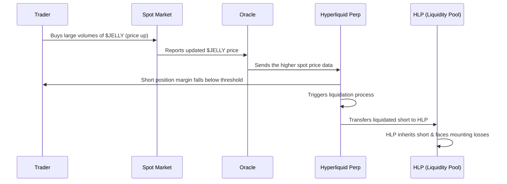

# Introduction

What happens when a single trader’s “galaxy-brain” exploit targets a decentralized exchange? Yesterday, March 26, 2025, Hyperliquid found out the hard way. A manipulated short position on the JELLY token forced its \$230M liquidity pool (HLP) into a \$12M paper loss—nearly destabilizing the entire platform. This two-part deep dive explains exactly how the HLP became the unwilling holder of a toxic short (Part A) and explores the math and critical protocol upgrades needed to prevent such “financial warfare” in the future (Part B).

---

# Part A: Why the HLP Inherited a Toxic JELLY Short and Faced a 12Million dollars Paper Loss

_Figure: Hyperliquid JELLY liquidation summary, Source: [@gauthamzzz](https://x.com/gauthamzzz/status/1904932663716438165)_

## How Perp Liquidations Work (and Why the HLP Ends Up Holding the Bag)

On many centralized exchanges, a liquidated position is market-closed or absorbed by an insurance fund. Hyperliquid, however, employs a different model: the protocol pools liquidity in a large pot (the HLP), which acts as a universal “backstop.” When a position is liquidated and cannot be safely closed on the open market, that position is automatically transferred into the HLP.

While this approach prevents immediate market cascades (i.e., a forced dump on thin order books), it also concentrates the risk of unmanaged liquidations directly onto the pool’s liquidity providers. If the transferred position continues to lose value, the HLP itself incurs those losses.

Formally, a short position is liquidated if:

$$
\frac{\text{Collateral} + \text{Unrealized PnL}}{\text{Notional Position Size}} \;<\; \text{Maintenance Margin Requirement}.
$$

> When a short’s unrealized losses grow too large relative to its collateral, the protocol forces it closed.

Once that trigger is hit on Hyperliquid, the protocol effectively says, “HLP, you hold this now.”

Key Takeaways:  
- HLP as Backstop: Hyperliquid avoids dumping liquidated positions onto the market by shifting them into the HLP.  
- Inherent Vulnerability: This design can expose the pool to large, sudden losses if the asset’s price continues to move against the newly inherited position.

---

## Why a 6Million dollars Short Became a 12+Million dollars Paper Loss

In this case, the attacker deliberately pumped JELLY’s spot price by above 400% in under an hour. The short position lost value faster than its collateral could support, causing a forced liquidation. Once the HLP inherited that short, further price increases in JELLY magnified the unrealized losses. Observers estimated these losses to be around \$12M at one point, with the potential to grow higher if the price continued to climb.

Moreover, funding rates—which typically turn positive (meaning shorts pay longs) in a bullish or overbought market—added ongoing costs to the HLP’s position. Because the spot price had spiked and market sentiment was extremely bullish, the HLP, now short, had to pay these recurring funding fees.

**Key Takeaways:**
- Mark-to-Market Losses: Once the HLP held the short, every price increase in JELLY amplified unrealized losses.  
- Positive Funding: A rapidly rising spot price often leads to high funding rates that shorts must pay, further eroding the HLP’s position.

---

## Liquidation Flow Diagram

Below is a Mermaid diagram illustrating the simplified sequence of events:

---

# Part B: Deeper Mechanics + A Protocol Redesign

## The Mathematics Behind Perpetual Futures Prices Tracking Spot

Perpetual futures aim to track an asset’s spot price using two core mechanisms:

1. Oracles that feed in the current spot price ($S_t$).  
2. Funding Rates that incentivize traders to keep the perp price in line with the spot price.

### Oracle Updates

Let $S_t$ be the spot price at time $t$, as reported by the oracle. If an asset (like JELLY) experiences a big buy on external markets, the price feed captures that higher price and relays it to the perp exchange. Low liquidity in the spot market can make these price moves large and abrupt.

### Funding Rate Formulas

Funding rates periodically transfer value between longs and shorts to correct any divergence from spot. A simplified formula is:

$$
F_t = \Bigl(\frac{M_t - S_t}{S_t}\Bigr) \times (\text{adjustment}) + (\text{base rate}),
$$

where $M_t$ is the perp’s mark price and $S_t$ is the oracle’s spot price. If $M_t$ is above $S_t$, longs pay shorts; if $M_t$ is below $S_t$, shorts pay longs. In a fast‑rising market, shorts typically pay—increasing their losses.

---

## Preventing Similar Exploits: Recommended Protocol Changes

Below are four proposed changes to the protocol that reduce the likelihood of a repeat scenario:

### Impose Strict OI (Open Interest) & Leverage Caps for Low‑Cap Assets

A \$6M short on a \$20M token is disproportionately large. Limiting total open interest (OI) and maximum leverage based on liquidity or market cap ensures that a single position can’t jeopardize the entire system.

**For example:**

- If a token has less than \$X million in market cap or \$Y in daily volume, the maximum total open interest allowed on the platform is limited, and the maximum leverage is severely restricted. You can have a heuristic like "total OI can’t exceed, say, 10–20% of that token’s circulating market cap."

Hence no one can open a $6M short on a \$20M cap coin.

### Add Circuit Breakers

When prices move more than a set percentage within a short window or when the funding rate spikes above a threshold, automatically pausing new trades/liquidations can prevent runaway liquidations. This “cool-off” period allows oracles and markets to confirm whether the price action is legitimate or manipulated.

**For example:**

- Price Breaker: If the token moves 50% in under 15 minutes, freeze new trades/liquidations for a short cooling‑off period (e.g., 10 minutes).
- Funding‑Rate Breaker: If the funding rate tries to exceed 1% per hour, pause so the market can rebalance.

This ensures the protocol has time to verify if the new price is real—especially critical in low‑cap tokens.

### Upgrade Oracle Protections

Relying on a single or thinly traded market feed is risky. Multi‑feed oracles (Chainlink, Pyth, volume‑weighted averages) with outlier detection or time smoothing help mitigate sudden, suspicious price jumps.

**For example:**

- Multi‑feed oracles (Chainlink, Pyth, plus your own volume‑weighted average from major DEXes/CEXes).
- Outlier detection: If one source shows \$0.50 for JELLY but the remaining others are around \$0.01, then ignore the outlier, \$0.50.
- Time smoothing: Use an EMA (exponential moving average) so price cannot instantly jump from \$0.01 to \$0.50 inside the protocol, giving room for detection or a circuit breaker to engage.

### Manage Liquidations More Dynamically

Instead of forcing every large liquidated position onto the HLP, the protocol can liquidate in smaller chunks or use an auction mechanism to distribute risk among multiple bidders. This approach limits the potential impact on any single pool.

**For example:**

- Allow partial liquidation in smaller chunks, pushing them onto the order book (if any).
- Or let other traders bid on taking over the position—i.e., an auction mechanism.
- This spreads the risk instead of instantly saddling the HLP with an enormous short.

---

## A Three‑Layered Safety Net

In practice, we should consider a hybrid approach for better safety net. For example, we can design a hybrid mechanism with below properties:

1. Adaptive OI Caps & Leverage  
   Example: “No single position may exceed 5% of the token’s circulating market cap.”  For $JELLY with a $20M cap, this alone stops a $6M short.
2. Circuit Breakers  
   Freeze trading when price or funding-rate volatility becomes abnormally high.  
3. Robust Multi‑Oracle + Smoothing  
   Implement volume weighting, outlier detection, and time-based smoothing so the market isn’t instantly re-priced by a single extreme trade.

---

# Conclusion

Hyperliquid’s forced takeover of the JELLY short position demonstrates how a thinly traded asset combined with automatic HLP inheritance can lead to massive, sudden losses for a protocol. By understanding:

- Why the HLP became the “bagholder” (inherited liquidation mechanic),  
- How unrealized losses ballooned (rapid price spike plus positive funding rates),  
- The role of oracles and funding in perp markets,  
- And which fixes are necessary (position-size caps, circuit breakers, oracle safeguards, and improved liquidation processes),

it becomes clear that targeted design changes can mitigate these risks.

---

## Final Action Items
- Caps & Leverage  
  Impose dynamic OI limits and reduced leverage for low-liquidity tokens.  
- Circuit Breakers  
  Halt trading if price or funding changes exceed designated thresholds, preventing instant protocol-wide meltdowns.  
- Oracle Security  
  Aggregate multiple feeds, detect outliers, and apply smoothing to avoid reliance on a single extreme price point.  
- Better Liquidation Mechanics  
  Use partial liquidation or auctions instead of automatically dumping all risk onto the HLP.

With these measures in place, protocols can significantly reduce their vulnerability to “financial warfare” tactics targeting small-cap tokens—and protect their liquidity pools and users from catastrophic losses.

References:
- [hyperliquid-docs](https://hyperliquid.gitbook.io/hyperliquid-docs) 
- [@gauthamzzz](https://x.com/gauthamzzz/status/1904932663716438165) 
