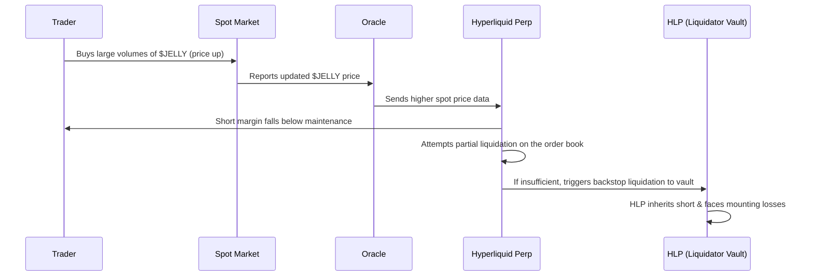

# Introduction

What happens when a single trader’s “galaxy-brain” exploit targets a decentralized exchange? On March 27, 2025, Hyperliquid found out the hard way. A manipulated short position on the JELLY token forced its USD 230 Million liquidity pool (HLP) into a USD 12 Million paper loss—nearly destabilizing the entire platform. This two-part deep dive explains exactly how the HLP became the unwilling holder of a toxic short (Part A) and explores the math and critical protocol upgrades needed to prevent such “financial warfare” in the future (Part B).

>Note on Terminology: [Hyperliquid’s docs](https://hyperliquid.gitbook.io/hyperliquid-docs) sometimes refer to the “liquidator vault” as part of the HLP strategy. In effect, if standard liquidation attempts fail, the position is backstop-liquidated and ultimately inherited by the vault (and hence, the HLP).

---

# Part A: Why the HLP Inherited a Toxic JELLY Short and Faced a USD 12 Million Paper Loss

_Figure: Hyperliquid JELLY liquidation summary, Source: [@gauthamzzz](https://x.com/gauthamzzz/status/1904932663716438165)_

## How Perp Liquidations Work (and Why the HLP Ends Up Holding the Bag)

On many centralized exchanges, a liquidated position is market-closed or absorbed by an insurance fund. Hyperliquid, however, employs a multi‑step approach:

1. Initial Liquidation via Order Book
   - When an account’s equity falls below its maintenance margin, Hyperliquid sends market orders to attempt closing the entire position (or a partial chunk, if it’s above certain thresholds).
   - Partial Liquidation Threshold: For positions >100k USDC notional, only 20% of the position is liquidated in the first block, followed by a 30‑second cooldown. If this partial liquidation is enough to restore margin requirements, the trader remains in control of any leftover collateral/position.
2. Backstop Liquidation (Liquidator Vault)
   - If the account’s equity falls below two-thirds of maintenance margin (meaning the first attempt couldn’t close enough size on the order book), Hyperliquid forcibly transfers the remaining position to the liquidator vault, which is effectively part of the HLP strategy.
   - At this point, the user no longer retains that margin or position. In cross margin, all cross positions transfer; in isolated margin, only that isolated position transfers.

While this layered system (partial liquidation + backstop liquidation) is designed to save as much collateral for the user as possible, any leftover toxic position ultimately goes to the HLP if the market cannot absorb it without slippage. This ensures the protocol doesn’t cause a cascading market dump but concentrates risk onto the pool.

Formally, a short position is liquidated if:

$$
\frac{\text{Collateral} + \text{Unrealized PnL}}{\text{Notional Position Size}} \;<\; \text{Maintenance Margin Requirement}.
$$

> If losses exceed the collateral such that margin requirements are not met, the protocol triggers liquidation attempts. If those attempts fail (or only partially succeed), the HLP/liquidator vault absorbs what remains.

Once that trigger is hit on Hyperliquid, the protocol effectively says, “HLP, you hold this now.”

Key Takeaways:  

- Multi-Step Liquidation: Hyperliquid tries to close positions on the order book first (potentially partial liquidation).
- Backstop Inheritance: If liquidation via the book doesn’t restore margin, the liquidator vault (part of HLP) ends up holding the leftover position.
- Concentrated Risk: While this design avoids market crashes, it places final responsibility for bad positions on the HLP.

---

## Why a USD 6 Million Short Became a USD 12+ Million  Paper Loss

In this case, the attacker deliberately pumped JELLY’s spot price by above 400% in under an hour. The short position lost value faster than its collateral could support, causing a forced liquidation. Even if the protocol partially liquidated a portion on the order book, the position was large enough that the account ultimately fell below two-thirds of the required maintenance margin.

At that point, the short was forcibly transferred to the liquidator vault, i.e. the HLP, which now effectively held that short. As JELLY’s price continued to climb, so did the mark-to-market losses. Observers noted USD 12 Million in unrealized losses at one point, with the potential for further damage had the price kept rising.

Funding rates—which typically turn positive (meaning shorts pay longs) when a perp price is above spot or the market is significantly bullish—added another layer of cost to the HLP. Hyperliquid’s funding cap is 4% per hour, which is “less aggressive” than some CEXs but can still be substantial if the price and sentiment remain elevated.

Key Takeaways:
- Mark-to-Market Losses: Once the HLP held the short, every price increase in JELLY amplified unrealized losses.  
- Positive Funding: A rapidly rising spot price often leads to high funding rates that shorts must pay, further eroding the HLP’s position.

---

## Liquidation Flow Diagram

Below is a sequence diagram illustrating the simplified sequence of events:

---

# Part B: Deeper Mechanics + A Protocol Redesign

## The Mathematics Behind Perpetual Futures Prices Tracking Spot

Perpetual futures aim to track an asset’s spot price using two core mechanisms:

1. Oracles that feed in the current spot price ($S_t$).  
2. Funding Rates that incentivize traders to keep the perp price in line with the spot price.

### Oracle Updates

Let $S_t$ be the spot price at time $t$, as reported by the oracle. If an asset (like JELLY) experiences a big buy on external markets, the price feed captures that higher price and relays it to the perp exchange. Low liquidity in the spot market can make these price moves large and abrupt.

Hyperliquid’s documentation notes it computes each oracle price by taking the weighted median of multiple CEX spot prices, weighting by exchange liquidity. Since JELLY was relatively small, any large buy on a single venue could shift that median if volume was light.

### Funding Rate Formulas

Funding rates periodically transfer value between longs and shorts to correct any divergence from spot. A simplified formula is:

$$
F_t = \Bigl(\frac{M_t - S_t}{S_t}\Bigr) \times (\text{adjustment}) + (\text{base rate}),
$$

where $M_t$ is the perp’s mark price and $S_t$ is the oracle’s spot price. If $M_t$ is above $S_t$, longs pay shorts; if $M_t$ is below $S_t$, shorts pay longs. In a fast‑rising market, shorts typically pay—increasing their losses.

### Hyperliquid’s Funding Rate

Hyperliquid’s funding rate formula, computed every 8 hours but paid hourly at one‑eighth of the calculated rate, is:

$$
F \;=\; \text{Average Premium Index (}P\text{)} \;+\; \text{clamp}\Bigl(\text{interest rate} - P,\,-0.0005,\,0.0005\Bigr),
$$

where:

- Premium Index ($P$): Measures how much higher (or lower) the perp’s impact price is relative to the spot oracle price.  
- Interest Rate: ~0.01% every 8 hours (i.e., ~0.00125% every hour, representing the cost of borrowing USD vs. holding crypto).  
- Clamp: Limits the “Interest Rate – Premium” term to ±0.05% (±0.0005 in decimal) in the 8h context (±0.0000625 per hour if broken down further), preventing it from swinging too wildly.  
- Hourly Funding: After calculating the 8h rate, it’s divided by eight for each hourly payment. A separate 4%/hour overall cap ensures the rate never exceeds that figure within a single hour.

> If the perp trades significantly above spot, the premium index is positive, longs end up paying. If it’s below, shorts pay. In this JELLY case, spot soared rapidly, so the perp likely spiked as well, forcing the short side to pay.

Let’s walk through an example to calculate the funding rate:

- Spot Price ($S_t$) = USD 2,000  
- Impact Bid Price = USD 2,080 (the average execution price to sell a certain notional into the bid side)  
- Premium Rate  
   $$
   \text{Premium Index} \;=\; \frac{\text{Impact Bid Price}}{\text{Spot Price}} - 1 
   = \frac{2{,}080}{2{,}000} - 1 
   = 0.04 \quad (\text{or }4\%).
   $$
- Interest Rate = 0.01% every 8 hours.  
   - Hourly that’s 0.00125% (0.0000125 in decimal).
5. Compute (Interest Rate – Premium)  
   $$
   0.00125\% - 4\% = -3.99875\%.
   $$
   Since –3.99875% is less than the -0.05% clamp threshold for the 8h timescale, we clamp it at –0.05% (or –0.0005 in decimal) for an 8-hour block. Dividing by 8 for the hourly rate yields –0.0005 / 8 = –0.0000625 (–0.00625%) per hour; but to keep consistent with the doc’s simpler approach, we’ll do the direct 8h calculation and then note the final hour rate:

   - Clamped Difference = –0.05% (for 8h).
- Compute 8h Funding Rate  
   $$
   F_{8h} \;=\; 4\% \;+\; (-0.05\%) \;=\; 3.95\%.
   $$
   Hourly funding is therefore roughly $3.95\% / 8 \approx 0.494\%$ per hour—below Hyperliquid’s 4%/hour cap, so no further clamp is needed.
- Calculate the Payment  
   - Assume you hold a long position of 20 contracts, each representing 1 ETH.  
   - Position Size = 20 ETH, each priced at USD 2,000 (oracle).  
   - Notional = 20 × USD 2,000 = USD 40,000.  
   - At the end of the hour, funding = notional × (hourly rate).  
   - Hourly Rate ≈ 0.494% → 0.00494 in decimal.  
   - Funding Payment ≈ USD 40,000 × 0.00494 = USD 198 in that hour.

> Interpretation: Because the perp is trading well above spot (4% premium), longs pay. Over the hour, you’d owe roughly USD 198 to the short side. If the premium stayed consistently high over 8 hours, you might pay around USD 1,584 total. However, if new short sellers enter (or if longs close), that premium may shrink, reducing future funding rates.

---

## Preventing Similar Exploits: Recommended Protocol Changes

Below are four proposed changes to the protocol that reduce the likelihood of a repeat scenario:

### Impose Strict OI (Open Interest) & Leverage Caps for Low‑Cap Assets

A USD 6M short on a USD 20M token is disproportionately large. Limiting total open interest (OI) and maximum leverage based on liquidity or market cap ensures that a single position can’t jeopardize the entire system.

For example:

- If a token has less than USD X million in market cap or USD Y in daily volume, the maximum total open interest allowed on the platform is limited, and the maximum leverage is severely restricted. You can have a heuristic like "total OI can’t exceed, say, 10–20% of that token’s circulating market cap."

Hence no one can open a 6M short on a USD 20M cap coin.

### Add Circuit Breakers

When prices move more than a set percentage within a short window or when the funding rate spikes above a threshold, automatically pausing new trades/liquidations can prevent runaway liquidations. This “cool-off” period allows oracles and markets to confirm whether the price action is legitimate or manipulated.

For example:

- Price Breaker: If the token moves 50% in under 15 minutes, freeze new trades/liquidations for a short cooling‑off period (e.g., 10 minutes).
- Funding‑Rate Breaker: If the funding rate tries to exceed 1% per hour, pause so the market can rebalance.

This ensures the protocol has time to verify if the new price is real—especially critical in low‑cap tokens.

### Strengthen Oracle Protections

Weighted medians are good, but outlier detection or time-smoothing can reduce the impact of abrupt moves on illiquid tokens.  

For example:

- Outlier detection: If one source shows USD 0.50 for JELLY but the remaining others are around USD 0.01, then ignore the outlier, USD 0.50.
- Time smoothing: Use an EMA (exponential moving average) so price cannot instantly jump from USD 0.01 to USD 0.50 inside the protocol, giving room for detection or a circuit breaker to engage.

### Refine Backstop Liquidation Mechanics

Auction-based liquidation or more granular partial liquidation can distribute the risk before the HLP forcibly inherits a large toxic position.

For example:

- Allow partial liquidation in smaller chunks, pushing them onto the order book (if any).
- Or let other traders bid on taking over the position—i.e., an auction mechanism.
- This spreads the risk instead of instantly saddling the HLP with an enormous short.

---

## A Three‑Layered Safety Net

In practice, we should consider a hybrid approach for better safety net. For example, we can design a hybrid mechanism with below properties:

1. Adaptive OI Caps & Leverage  
   Example: “No single position may exceed 5% of the token’s circulating market cap.”  For JELLY with a 20M cap, this alone stops a 6M short.
2. Circuit Breakers  
   Freeze trading when price or funding-rate volatility becomes abnormally high.  
3. Oracle & Liquidation Logic Upgrades
   Integrate time-smoothing, multi-round liquidation, or an auction approach to prevent one-time hits on the HLP.

---

# Conclusion

Hyperliquid’s forced takeover of a massive JELLY short demonstrates how thin liquidity, large positions, and backstop liquidations can produce systemic risk for a liquidity pool. By understanding:

- Why the HLP ended up holding the short (the leftover after partial/book liquidations failed),  
- How losses escalated (a sharp price pump + high funding fees amplified the short’s downside),  
- The math behind oracles and funding (ensuring the perp follows spot, but also exposing shorts to big ongoing costs),  
- And what design refinements (OI caps, circuit breakers, better oracle smoothing, advanced liquidation) can mitigate these dangers,

we see a clear blueprint for preventing “financial warfare” exploits on low-liquidity tokens in the future.

---

## Final Action Items
- Caps & Leverage: Tie open interest / leverage limits directly to token liquidity or market cap.  
- Circuit Breakers: Automatically pause trading on extreme price or funding moves, allowing time for re-evaluation.  
- Oracle Security: Incorporate outlier detection, time-smoothing, and possibly on-chain data to resist manipulation.  
- Enhanced Liquidation Mechanics: Extend partial liquidation or use an auction-based approach to avoid a single catastrophic transfer to the HLP.

By adopting these measures, Hyperliquid (and other perp DEXs) can strike a balance between capital efficiency and robust risk management—ensuring that one orchestrated pump doesn’t translate into multi-million-dollar losses for the protocol’s liquidity providers.

References:
- [hyperliquid-docs](https://hyperliquid.gitbook.io/hyperliquid-docs) 
- [@gauthamzzz](https://x.com/gauthamzzz/status/1904932663716438165) 
