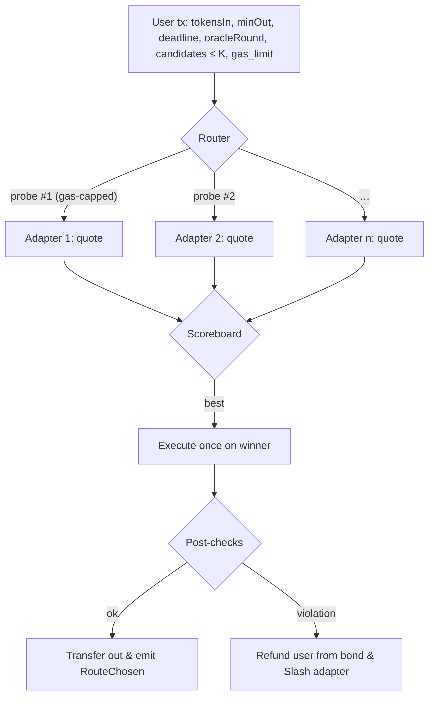
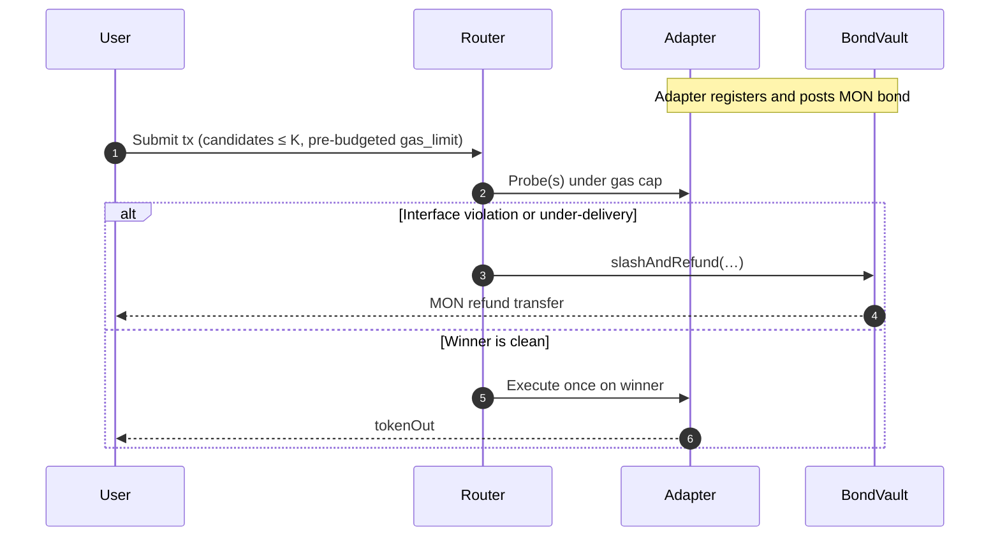

# Introduction

In my [previous article](https://thogiti.github.io/2025/07/17/game-theoretic-vulnerabilities-shmonad-bandwidth-allocation.html) on game-theoretic vulnerabilities in shMONAD bandwidth allocation, I showed how bandwidth staking can create a high-stakes, non-cooperative congestion game where strategic timing (e.g., flash-commit bursts) distorts access to RPC throughput. This follow-up blog on Monad looks at a different chokepoint—price discovery and routing. Instead of bandwidth, we design a taker-side primitive: an execution-time router for dark/prop AMMs on Monad that achieves atomic best-execution and incentive alignment under Monad’s unique gas and latency model.

# Why Monad fits: EVM semantics, parallel execution, sub-second finality

## EVM semantics for in-tx best-of-N probing

[Dark AMMs—also called **proprietary (“prop”) AMMs**](https://x.com/ThogardPvP/article/1963379267871613138)—move their pricing logic on-chain so makers quote **at execution** rather than at an earlier simulation step. That shrinks inventory risk for market makers and tightens spreads—but you only realize the full benefit when takers can also choose the **best** AMM *during the transaction itself*. The idea is simple: the user submits one transaction that **probes several AMMs inside the EVM**, ignores failures or inferior options, and **settles exactly once** on the winner. This fits EVM semantics: external calls may revert while the caller continues, and [Solidity’s `try/catch`]([https://docs.soliditylang.org/en/latest/control-structures.html) lets the router handle those failures and keep going[^1]. 

## Parallel/optimistic execution with serial-equivalent results

Monad, [as explained here by Alex](https://x.com/ThogardPvP/article/1963379267871613138), is an especially good home for this “best-of-N in one tx” pattern. It preserves full EVM compatibility while achieving high throughput via **parallel, optimistic execution** with re-execution on conflicts, yet block outcomes remain identical to a serial chain (same linear order, same results). The [parallelism](https://docs.monad.xyz/monad-arch/execution/parallel-execution) is an implementation detail that increases throughput without changing app semantics[^4]. 

## Finality & latency profile
Latency is where the UX win is obvious: the [official docs](https://docs.monad.xyz/developer-essentials/summary) describe **\~400–500 ms block frequency** and **Finalized at two blocks (\~800–1000 ms)**, with a “Voted” (speculative) stage one block earlier and a “Verified” (state-root) phase shortly after for apps that want extra certainty[^3]. [Monad’s blog](https://blog.monad.xyz/) also frames **\~1-second finality** as a design target for market-microstructure-heavy apps[^7]. 

# High-level router design (best-of-N in one transaction)

## Gas model constraint: charged by limit (not usage)

There is one Monad-specific twist you must design around: users are charged by **gas limit** rather than **gas used**. The [docs](https://docs.monad.xyz/developer-essentials/gas-on-monad) state it plainly: the amount deducted is `value + gas_price * gas_limit`. They also note a **150 M** block gas limit and **30 M** per-transaction limit, with default **priority-gas-auction** ordering. That pricing defends the async/parallel pipeline from DoS, but it means your SDK must **pre-budget** gas tightly and set an explicit limit—wallet estimation can overshoot when it encounters intentional reverts during probing[^2].

## In-transaction probing & settlement flow

With those ground rules, the execution-time router is clean engineering. The user submits tokens in/out, amount, a `minOut`, a deadline, a small list of candidate AMMs, and a parameter that **locks everyone to the same oracle round**. Inside the EVM, the router iterates through candidates under a small **per-probe gas cap**, using either a cheap `staticcall` to a read-only quote or a **revert-quote** variant where the AMM runs the actual swap path but reverts with ABI-encoded quote data when `simulate=true`. The router catches failures or undecodable payloads, scores successful quotes, selects the winner, and performs one real swap while enforcing the user’s `minOut`. Because it all happens **inside one transaction**, there’s no race between simulation-time choices and execution-time reality. \[Solidity Docs]\[S1]



# Oracle round-locking (what & why)

## Round-locking overview

Two details keep this robust and permissionless. First, **oracle round-locking**: the SDK fetches a `roundId` from an on-chain oracle (Monad testnet supports [providers](https://docs.monad.xyz/tooling-and-infra/oracles) such as Blocksense, Chainlink, Chronicle, Pyth, etc.) and passes it to every adapter; adapters compute and *echo* that round (and feed identity) in their metadata. The router rejects mismatches and can penalize under-delivery against the locked round. That removes the advantage of quoting on fresher private ticks during probing[^5]. 

## Multi-provider sync, fallback, and latency

**Oracle round-locking, multi-provider sync, and latency.** In practice, round-locking should key off a *(provider, feed, roundId, updatedAt)* tuple rather than a naked integer, because different providers number rounds differently. The router can pick an **anchor** (e.g., Chainlink’s round for a feed) and require each adapter to quote against the **most recent round whose `updatedAt` ≤ anchor.updatedAt** for its own provider; adapters must echo provider ID and `updatedAt` so the router can verify cross-provider alignment. If the anchor has a gap or no data for that window, use a **deterministic cascade** (next priority provider → last accepted round within a max-staleness window → revert). This preserves liveness without silent drift. Finally, oracle **update latency** bounds your practical refresh rate: Monad’s \~400–500 ms blocks and \~1 s finality settle quickly *once* a round exists, but if a feed updates, say, every few seconds, round-locked best-execution still moves at the oracle’s cadence; set tight `maxStaleness` and consider TWAPs if you need smoother behavior between updates[^3][^5]. 

## Bonding, refunds, and penalties (BondVault)

Second, **gas refunds and penalties** rely on an **opt-in bond**, not protocol magic. On EVMs, you can’t force callees to pay your gas. Instead, each adapter posts a MON bond to a **BondVault**, and **the router contract is the sole on-chain authority** that can debit that bond. The vault exposes a restricted `slashAndRefund(...)` callable **only by the router**; the router address is immutable (or timelock-governed), and every slash emits evidence events (adapter, calldata hash, reason code). When the router sees an interface violation (malformed payloads, exceeding the per-probe cap via delegate chains) or the adapter **wins** and then fails to deliver the quoted amount under the same parameters and oracle round, it calls the vault to **refund the user** (offsetting their prepaid fee under Monad’s gas-limit model) and **slash the adapter**. This keeps registration permissionless while giving adapters skin in the game.



## Gas budgeting on Monad (SDK guidance)

Because Monad charges by **limit**, the SDK should treat gas as an optimization problem, not a guess. In practice you budget: a conservative per-probe cap (smaller for `staticcall`, larger for revert-quote), a worst-case `G_swap` for the winning path, router overhead, and a small safety margin—then **set** that limit explicitly. That turns a variable, estimation-sensitive fee into a **predictable** one under Monad’s model[^2]. 

```mermaid
gantt
  title Gas Budget Timeline (single transaction on Monad)
  dateFormat  X
  axisFormat %L
  section Probes
  Probe 1       :0, 1
  Probe 2       :1, 1
  …             :2, 1
  Probe K       :3, 1
  section Execute
  Winner Swap   :4, 2
  section Overhead
  Bookkeeping   :5, 1
```



## Practical notes: timestamps, finality windows, JIT

A few Monad niceties matter in practice. The `TIMESTAMP` opcode has **one-second granularity**; with \~400–500 ms blocks, two or three consecutive blocks can share the same timestamp, so don’t hinge fairness or penalties on per-block time. For exact tie-breaks, use consensus randomness or a VRF rather than wall-clock time. If your downstream system has heavy off-chain obligations, consider waiting for **Verified** state-root finality even though most UX can safely update at **Voted** or **Finalized**. And remember Monad’s client includes a **native-code JIT** for hot contracts—keep adapter codepaths lean and predictable to benefit from it while preserving exact EVM semantics[^3][^6]. 

---

# From router to mechanism: why truthfulness is the equilibrium

## Scoring rule & selection

Each trade is a tiny **mechanism**. Adapters submit a *report*—their quoted `amountOut` for the user’s inputs and locked oracle round—and the router selects exactly one adapter to execute. Unlike an RFQ desk, the “payment” here is the **right to clear the swap** at your terms. To make the selection rule robust, **lying must be costly**. Round-locked quotes, strict ABI hygiene, and **bond-backed penalties** create a **proper-scoring** flavor: the best response is to report what you will actually deliver.

Formally, for input $x=(\text{tokenIn},\text{tokenOut},\text{amountIn},\text{deadline},\text{oracle round } r)$, adapter $i$ has a realizable outcome $R_i(x)$ and reports a quote $Q_i(x)$. The router computes

$$
S_i(x)=Q_i(x)-\alpha\,\widehat{g}_i,
$$

where $\widehat{g}_i$ is observed probe gas (bounded by the cap). It chooses $i^\star\in\arg\max_i S_i(x)$ and executes once. 

## Penalty function & truthful reporting

The BondVault enforces a penalty on the **chosen** adapter

$$
\Pi_i(Q_i,R_i)=\lambda\,(Q_i-R_i)_+ \;+\; \mu\,\mathbf{1}\{\text{malformed payload or round mismatch}\},
$$

so realized utility is

$$
U_i = \text{maker margin} \;-\; \Pi_i(Q_i,R_i)\;-\;c_i.
$$

As soon as $\lambda$ exceeds the maximum incremental margin from exaggerating, the optimal policy is **truthful** reporting $Q_i=R_i$. (Operational notes on **multi-provider round synchronization, fallbacks, and latency** are in the round-locking section above.)

## Choosing $\alpha$: efficiency vs. probe discipline

A practical nuance: the **$\alpha$** parameter trades off *efficiency* and *probe discipline*. Set $\alpha$ too **high** and you may under-select adapters whose quotes are superior but costlier to compute; set it too **low** and you remove any incentive to keep probe paths lean. In practice $\alpha$ should be small (a tie-breaker), and you can supplement it with **hard gas caps** and **scoreboard pruning** so selection remains about user value, not probe theatrics.

## Maker-side model & effect of round-locking

On the maker side, delivered amount can be viewed as

$$
R_i(x)=f\!\big(p_r,\;\theta_i,\;\ell_i(b_i)\big),
$$

where $p_r$ is the oracle price at round $r$, $\theta_i$ are AMM parameters, $b_i$ are on-chain balances, and $\ell_i$ is the inventory-skew (“lean”) function nudging you toward target inventory. On-chain solving means $\ell_i$ uses **actual** balances at execution, not guesses at simulation. Round-locking removes the wedge of quoting on a fresher tick and executing on an older one: if $p_r$ is the common reference, any over-statement $Q_i>R_i$ has positive probability of penalty $\Pi_i>0$ without compensating margin.

## Gas economics as chance-constrained optimization

Monad’s gas model also changes how you think about fees. Because the fee is essentially $p\cdot L$ (base fee + tip times the **limit**), not $p\cdot G$ (times realized usage), the SDK should set $L$ by **chance-constrained budgeting**:

$$
\min_{L}\; pL \quad \text{s.t.}\quad \mathbb{P}(G>L)\le \delta,
$$

with $G$ the total probe-plus-execute gas and $\delta$ a tiny tolerance. Empirically fit a 99th percentile for the winning swap path, add $K$ times a conservative probe cap and an overhead term, then multiply by a small safety factor. That’s why the design **prefers `staticcall`** for quotes: it tightens the tail of $G$, which lets you set a **smaller** $L$ and keep user costs predictable under Monad’s “charged-by-limit” rule. \[Gas on Monad]\[M1]

## Learning & selection: safe bandits

Across trades, your scoreboard is just **safe learning**. Define realized per-trade advantage

$$
A_{i,t}=R_{i,t}-\alpha\,\widehat{g}_{i,t}
$$

and maintain a posterior mean $\hat A_{i,t}$ with confidence bounds. Off-chain you pre-rank adapters by $\hat A_{i,t}$ (plus a confidence term) and hand the top $K$ to the on-chain loop. If the learner is wrong, safety doesn’t break: round-locking and bond penalties still enforce truthfulness. Learning improves **who** you ask, not **how safely** you ask them.

## Adversarial strategies & mitigations

The usual attacks all close locally. **Gas griefing** is neutralized by per-probe gas caps; burning the full cap lowers your score and can trigger “excess gas” penalties, but it doesn’t raise the user’s fee (that’s set by the limit at submit). **Payload griefing** is blocked by strict ABI decoding—fixed selectors and compact encodings only; long strings don’t enter scoring. **Over-quote then under-deliver** is deterred by the shortfall penalty $\lambda(Q_i-R_i)_+$. **Collusion** is made uneconomical by transparency (events log quotes and chosen routes with the round) and by deterministic selection (randomness only for exact ties, sourced from consensus randomness or VRF).

## Equilibrium characterization & pragmatic tweaks

A compact equilibrium picture helps: given $x,r$, each adapter chooses $Q_i$ knowing (i) selection is by $Q_i-\alpha\widehat{g}_i$ and (ii) any positive shortfall incurs $\lambda(Q_i-R_i)_+$. Let $\Delta_i$ be the marginal maker surplus if chosen truthfully. If $\lambda \ge \overline{\Delta}_i$ (the supremum surplus from any feasible misreport at $x$), the best response is $Q_i=R_i$. With everyone truthful, selection reduces to $\arg\max_i\{R_i-\alpha\widehat{g}_i\}$, i.e., the user-welfare maximizer given the probe budget. Two small tweaks keep the equilibrium tight: an **epsilon-tolerance** $(Q_i-R_i-\varepsilon)_+$ to avoid penalizing dust/FO-T fees, and optional **gas declarations** $\tilde g_i$ inside metadata (penalize if realized swap gas exceeds $\tilde g_i+\tau$) to discourage “cheap-to-probe, expensive-to-execute” paths.

## Engineering primitives implementing the mechanism

All the incentive scaffolding is implemented with the same pieces you already saw: `staticcall` probing (to keep the user’s gas limit tight under Monad’s model), revert-quote where exact path parity is required, low-level `call{gas:cap}` with strict ABI decoding for probes, a deterministic score with a small $\alpha$, a bond vault with policy constants $(\lambda,\mu,\varepsilon,\tau)$, and event logs for auditability. The diagrams don’t change; what changes is the interpretation—each trade is a small, fully on-chain contest with **truthful reporting as equilibrium** and **best execution as outcome**.

```mermaid
flowchart TD
  A[User tx (round r, K candidates, tight gas_limit)]
  A --> B{Probe loop (staticcall preferred)}
  B --> C[Decode & validate ABI, round r]
  C --> D[Score by amountOut - α·gas]
  D --> E[Execute once on argmax]
  E --> F[Compare fill vs quote; apply ε-tolerance]
  F --> G{Violation?}
  G -->|No| H[Emit RouteChosen; update scoreboard]
  G -->|Yes| I[Refund from bond; Slash; log evidence]
```

---

# Conclusion

This is not “a router that tries a bunch of things.” It’s a **mechanism-sound** primitive whose equilibrium is honest quotes and competitive prices, whose economics match Monad’s **charged-by-limit** gas model, and whose safety doesn’t depend on whitelists or curation. It’s feasible on Monad because the chain gives you (i) EVM semantics for in-tx probing, (ii) **parallel/optimistic execution** with serial results, (iii) **sub-second finality**, and (iv) a **JIT/native compiler** for hot paths—all while retaining familiar tooling and RPCs. 

---

# References

[^1]: **Solidity language** — external calls, revert behavior, `try/catch`. \[S1]: [https://docs.soliditylang.org/en/latest/control-structures.html](https://docs.soliditylang.org/en/latest/control-structures.html)
[^2]: **Monad: Gas model** — charged by **gas limit**; 150 M block / 30 M tx; PGA ordering. \[M1]: [https://docs.monad.xyz/developer-essentials/gas-on-monad](https://docs.monad.xyz/developer-essentials/gas-on-monad)
[^3]: **Monad: Deployment summary** — \~400–500 ms blocks; Finalized at two blocks; timestamp granularity notes; finality stages. \[M2]: [https://docs.monad.xyz/developer-essentials/summary](https://docs.monad.xyz/developer-essentials/summary)
[^4]: **Monad: Parallel execution** — optimistic parallelism with re-execution, serial-equivalent results. \[M3]: [https://docs.monad.xyz/monad-arch/execution/parallel-execution](https://docs.monad.xyz/monad-arch/execution/parallel-execution)
[^5]: **Monad: Oracles** — providers on Monad testnet (Blocksense, Chainlink, Chronicle, Pyth, etc.). \[M4]: [https://docs.monad.xyz/tooling-and-infra/oracles](https://docs.monad.xyz/tooling-and-infra/oracles)
[^6]: **Monad: JIT/native compilation** (architecture notes). \[M5]: [https://docs.monad.xyz/monad-arch/](https://docs.monad.xyz/monad-arch/)
[^7]: [Monad's blog](https://blog.monad.xyz/)
