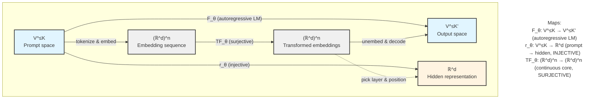

When a Transformer controls a $100M DeFi vault, can it be jailbroken into draining funds? When an AI oracle publishes "anonymized" embeddings on-chain, can adversaries recover the private data? These aren't hypothetical questions, they're architectural constraints imposed by two recent theorems about the functional properties of deep neural networks and AI models.

This two-part series explains why these properties matter for AI-driven crypto protocols, and how to build systems that remain secure despite them. Part I establishes the mathematical foundations. Part II (coming soon) provides concrete mechanisms, attack scenarios, and defenses.

## Overview 
A modern Transformer is a function
$$
f_\theta: \mathcal{X} \to \mathcal{Y}
$$
parametrized by $\theta$, usually trained with stochastic gradient descent. For years we analyzed these models statistically: perplexity, calibration, loss landscapes. Two papers in 2025 shifted the focus to functional structure instead:

* Jiang & Haghtalab prove that widely used neural blocks, pre-LayerNorm Transformer layers, diffusion backbones, and robotics controllers, are **surjective** as continuous maps[^1].
* Nikolaou et al. prove that GPT-style language models are **injective** from discrete prompts to hidden states, and they provide an operational inversion algorithm[^2].

At first glance the combination resembles a paradox:

> “The model can reach every output”
> and
> “The model never maps two prompts to the same representation.”

Are LLMs bijective? Are these results inconsistent? Neither. The two theorems concern **different maps** inside the LLM model, and once we unpack them, they reveal a coherent picture with immediate implications for safety, privacy, and AI-driven crypto systems.

This first part reconstructs the math from first principles. Part II will apply these insights to concrete AI+DeFi systems, vault managers, governance delegates, AI oracles, and show how surjectivity and injectivity change their threat models and security implications.

---

## 1. Three Functional Properties, with Geometry Behind Them


_Source: Figure 1: The Transformer - model architecture, https://arxiv.org/abs/1706.03762._

Let $f: \mathcal{X} \to \mathcal{Y}$. Three properties describe how input space and output space relate in a [Transformer model](https://arxiv.org/html/1706.03762v7).

### 1.1 Surjectivity (“onto”)

A function is **surjective** if
$$
\forall y \in \mathcal{Y},~\exists x \in \mathcal{X} \text{ such that } f(x) = y.
$$

Every output can be produced by some input. Geometrically, imagine a grid on the input plane. A surjective transformation may fold and self-intersect the grid, but it covers the entire output plane. No region is unreachable.

### 1.2 Injectivity (“one-to-one”)

A function is **injective** if
$$
x \neq x' \Rightarrow f(x) \neq f(x').
$$

No pair of inputs collide at the same output. Geometrically, the grid lines may warp, but they never cross; distinct points remain distinct.

### 1.3 Bijectivity

A function that is both injective and surjective is **bijective**, and admits a true inverse
$$
f^{-1}: \mathcal{Y} \to \mathcal{X}.
$$

Even when a function is injective (unique inverse exists in principle), computing that inverse may still be infeasible. The papers we examine address:

* surjectivity, but without an algorithm for inversion, and
* injectivity, and also a constructive inversion method.

---

## 2. A Transformer Contains Several Distinct Functions




“Is a Transformer surjective?” or “Is an LLM injective?” is ambiguous because the model contains several structurally different maps.

The three that matter are explained below.

### 2.1 Continuous core

$$
\mathrm{TF}_\theta : (\mathbb{R}^d)^n \to (\mathbb{R}^d)^n
$$

This is the multi-layer block structure operating purely on embeddings (attention + MLP). Jiang & Haghtalab analyze this map in their paper[^1].

### 2.2 Prompt-to-representation map

Let $\mathcal{V}$ be a finite vocabulary and $K$ a context bound. A decoder-only LM defines
$$
r_\theta: \mathcal{V}^{\le K} \to \mathbb{R}^d,
$$
for example “prompt $\mapsto$ final hidden state at the last position of some layer.” This is the map shown to be injective by Nikolaou, et. al[^2].

### 2.3 Full autoregressive LM

The user-facing model defines
$$
F_\theta: \mathcal{V}^{\le K} \to \mathcal{V}^{\le K'},
$$
which includes embedding, TF blocks, logit projection, sampling or argmax, and iteration until EOS. This is neither injective nor surjective.

Most confusion in public discourse arises from silently substituting one map for another. The surjectivity paper concerns 2.1; the injectivity paper concerns 2.2; people often talk as if both applied to 2.3.

---

## 3. Surjectivity in Deep Neural Networks: Any Embedding-Space Output Is Reachable

Paper: *On Surjectivity of Neural Networks: Can you elicit any behavior from your model?* (Haozhe Jiang, Nika Haghtalab, 2025)[^1].

[Modern Transformer](https://arxiv.org/abs/1706.03762) blocks (pre-LayerNorm + residual) have the form
$$
g(x) = f(\mathrm{LN}(x)) + x,
$$
where $f$ is continuous and $\mathrm{LN}$ normalizes the input onto a bounded set.

The key result is:

> **For any continuous $f$, the map $g$ is surjective on $\mathbb{R}^d$.**

This extends to sequence-wise maps and stacks of such blocks, giving surjectivity for realistic pre-LN Transformer cores.

### 3.1 Sketch of the argument

Surjectivity is shown using fixed-point theory.

1. LayerNorm ensures $\mathrm{LN}(x)$ lies in a compact set, so there exists $M$ with
   $$
   |f(\mathrm{LN}(x))| \le M \quad \text{for all } x.
   $$

2. Given a target $y \in \mathbb{R}^d$, define
   $$
   F_y(x) = y - f(\mathrm{LN}(x)).
   $$

3. Choose $R$ large enough that the ball $B_R = {x : \|x\| \le R}$ satisfies $F_y(B_R) \subseteq B_R$. Intuitively, $F_y(x)$ cannot push you outside a sufficiently large ball because $f(\mathrm{LN}(x))$ is bounded.

4. By Brouwer’s fixed-point theorem, there exists $x^* \in B_R$ such that
   $$
   F_y(x^*) = x^*.
   $$

5. Rearranging gives
   $$
   y = f(\mathrm{LN}(x^*)) + x^* = g(x^*),
   $$
   so $g$ is onto.

The [Haozhe Jiang's paper](https://arxiv.org/abs/2508.19445) extends this with degree theory to sequence inputs $(\mathbb{R}^d)^n$ and layer stacks, covering realistic Transformer architectures.

### 3.2 What this means in practice

Surjectivity is a **structural** property; it holds regardless of initialization or training or hyper parameters. It means:

> If a behavior corresponds to some embedding-space output, then some input exists that produces it.

The proof is existential; it does not yield an efficient method to find that input. But from a safety standpoint, mere existence already matters.

### 3.3 For AI+Crypto practitioners

Safety in systems with economic or physical consequences is defined by **“can this output ever occur?”** Surjectivity answers “yes” for the continuous core: if the action space contains a catastrophic action, the architecture does not rule it out.

When an AI agent controls:

* a transaction vector,
* a governance vote,
* a risk parameter update, or
* an actuator command in a robot that influences on-chain systems,

the surjectivity result says there is no architectural guarantee that the model “cannot do X.” Whether X is likely under typical training data is a different, statistical question.

---

## 4. Injectivity of Language Models: Hidden States as Lossless Encodings

Paper: *Language Models are Injective and Hence Invertible* (Nikolaou et al., 2025)[^2].

Consider a decoder-only Transformer with vocabulary $\mathcal{V}$, maximum context length $K$, and a chosen layer/position where we read the hidden state. For a prompt
$$
s = (s_1,\dots,s_T) \in \mathcal{V}^{\le K},
$$
define
$$
r_\theta(s) \in \mathbb{R}^d
$$
to be that hidden state.

The main theorem:

> **With probability 1 over reasonable initializations (and preserved under gradient descent), the map $r_\theta$ is injective.**
> In other words,
> $$
> s \neq s' ;\Rightarrow; r_\theta(s) \neq r_\theta(s').
> $$

So different prompts almost surely never collide in representation space.

### 4.1 Intuitive picture: a lossless fingerprint

An injective map is a no-collision encoder, which means:

* every different input prompt yields a unique hidden vector;
* no two prompts share the same internal state;
* the hidden state contains enough information to uniquely identify the input.

Informally:

> The hidden state is a reversible fingerprint of the entire prompt.

If we know $r_\theta$ and have access to the model, the representation essentially determines the prompt.

### 4.2 Why this implies a privacy risk

If an observer sees $r_\theta(s)$, and they can use the model as an oracle, then:

1. They know it corresponds to one, and only one, prompt $s$.
2. They can, in principle, search for that $s$ by probing the model.
3. If the search procedure is efficient, they can reconstruct the exact input.

In mechanism-design language: if types (private information) are mapped to signals via an injective function, then observing the signal **pins down the type** in the model’s world. There is no many-to-one compression; the signal is a full-information encoding.

This is the opposite of the usual assumption that “internal embeddings anonymize user data.”

### 4.3 SipIt: turning injectivity into an actual inverse

The paper does not stop at existence[^2]. It introduces **SipIt** (Sequential Inverse Prompt via Iterative Updates), which:

* uses causality: the hidden state at position $t$ depends only on the prefix $(s_1,\dots,s_t)$;
* for a fixed prefix, varies the next token $s_t$ and observes the resulting hidden state;
* finds the token whose induced state matches the stored one.

For a length-$T$ prompt, they show SipIt can recover $s$ using at most
$$
O(T \cdot |\mathcal{V}|)
$$
model queries. Experiments on GPT-2-like models show exact or near-exact reconstruction for nontrivial prompts.

The consequence is clear:

> Hidden states are not anonymized aggregates; they are reversible encodings of the original text.

Storing or transmitting them is effectively equivalent to storing or transmitting the prompts.

### 4.4 What injectivity does *not* say

Injectivity applies to
$$
\text{prompt} \longmapsto \text{hidden state}\quad(r_\theta),
$$
not to
$$
\text{prompt} \longmapsto \text{generated text}\quad(F_\theta).
$$

The autoregressive LM $F_\theta$ is:

* not injective: many prompts yield the same completion;
* not surjective: most possible token sequences are never produced.

So these results do **not** imply that chat transcripts uniquely identify prompts. They do imply that, if you log internal activations, you are logging something close to the original input.

---

## 5. Reconciling the Results: No Bijectivity, No Paradox

Putting the two theorems side by side:

* Surjectivity concerns $\mathrm{TF}_\theta: (\mathbb{R}^d)^n \to (\mathbb{R}^d)^n$.
* Injectivity concerns $r_\theta: \mathcal{V}^{\le K} \to \mathbb{R}^d$.
* The full LM map is $F_\theta: \mathcal{V}^{\le K} \to \mathcal{V}^{\le K'}$.

Only if *both* properties applied to the same function would we obtain bijectivity. They do not. The model contains a **surjective** continuous core and an **injective** discrete-to-continuous front-end, but the user-facing map is neither.

There is no contradiction. The “LLMs are bijective” meme is a mis-assignment of theorems to the wrong function.

---

## 6. The Asymmetry: Surjectivity Threatens Safety, Injectivity Threatens Privacy

The two properties have different security flavors.

### 6.1 Surjectivity → safety risk via reachability

If the action space $\mathcal{A}$ of an AI policy contains a harmful action $a_{\text{harm}}$, surjectivity implies

$$
\exists z \in \mathcal{Z}: \pi_\theta(z) = a_{\text{harm}}.
$$

Safety is defined existentially: **if a harmful output is reachable, the system must assume it can occur**. The difficulty of finding the corresponding input is a secondary consideration.

For AI agents that:

* sign transactions,
* adjust protocol parameters,
* execute governance votes,
* or drive robots whose failure modes touch on-chain systems,

surjectivity says: as long as the contract’s action space permits a catastrophic move, there exist conditions under which the neural policy will produce it. Architecture alone cannot certify that “the agent would never do this.”

### 6.2 Injectivity → privacy risk via recoverability

Injectivity of $r_\theta$ means

$$
r_\theta(s) = r_\theta(s') \Rightarrow s = s'.
$$

Internal representations are one-to-one fingerprints of prompts. When combined with an effective inversion algorithm like SipIt, this yields a privacy risk:

* logging hidden states is equivalent to logging prompts,
* sharing embeddings can leak proprietary data,
* publishing activations on-chain exposes user text to anyone who can emulate the model.

In mechanism-design terms, $r_\theta$ turns private types into fully revealing signals. Any protocol that uses these signals must treat them as containing the full type information.

---

## 7. Implications for AI + Crypto: Surjectivity and Injectivity as Design Constraints

Once a Transformer sits inside a crypto-economic system—as a vault manager, oracle, or governance agent—it is no longer “just a model.” It becomes one component of a **mechanism** that maps on-chain and off-chain state to economically consequential actions.

Formally, you can think of a mechanism as a tuple
$$
(\mathcal{Z}, \mathcal{A}, \pi, \text{rules}),
$$
where $\mathcal{Z}$ is the information available to the agent, $\mathcal{A}$ is the action space (transactions, parameter updates, votes), $\pi$ is the policy implemented by the model, and “rules” are the on-chain contracts and off-chain procedures that interpret those actions.

Surjectivity and injectivity constrain what kinds of arguments you can make about such a system:

* Surjectivity of the continuous core says: for any $a \in \mathcal{A}$ that the wallet/contract is willing to execute, there exists some $z \in \mathcal{Z}$ with $\pi_\theta(z) = a$. You do **not** have a structural guarantee that “the agent will never output $a$.”
* Injectivity of the prompt→representation map says: if you expose internal representations derived from private inputs, then those representations are essentially equivalent to the inputs themselves, at least to any party that can approximate the inverse.

The right question is therefore not “how do we train the model to be safe and private,” but:

> How do we build mechanisms where these two facts are *still true*, but cannot hurt us?

### 7.1 Safety: surjectivity and the shape of admissible actions

Surjectivity of the continuous core
$$
\mathrm{TF}_\theta : (\mathbb{R}^d)^n \to (\mathbb{R}^d)^n
$$
says that every output vector in embedding space has at least one preimage. This is a property of the architecture, not of training or finetuning. The map from embeddings to embeddings is an onto map between two full-dimensional continuous spaces.

When such a model sits inside a crypto-economic system (vault controller, strategy module, governance “delegate,” routing component), this matters for how we talk about safety. To make the implications precise, it is helpful to separate three levels of safety reasoning.

#### Level 1: basic safety — is a harmful action reachable at all?

At the most elementary level, designers often ask questions of the form:

* “Would the controller ever propose a transfer that drains the vault?”
* “Would the oracle ever output a value far outside a plausible range?”
* “Would the governance module ever vote in favor of a catastrophic change?”

Usually the informal answer is: “no, because we did not train it to do that.”

Surjectivity, combined with the usual decoding layer, undercuts this style of argument. If the policy can represent an action in its output space (for example, by producing a logit configuration that decodes to that action), then by surjectivity there exists some input embedding sequence that leads to that configuration. Training may make that input unusual or hard to find, but the architecture does not rule it out.

If the contract’s action set is $\mathcal{A}*\text{allowed}$, and the model induces a map


$$
\pi*\theta : \mathcal{Z} \to \mathcal{A}*\text{allowed},
$$


then the safe default is to treat every $a \in \mathcal{A}*\text{allowed}$ as reachable from some $z \in \mathcal{Z}$. For Level-1 safety, the conclusion is simple:

* if a contract permits an action syntactically, then one should behave as if there is some observation under which the model emits it.

Safety therefore has to be enforced by the contract (and any on-chain logic that filters actions), not by assumptions about what the model “would never do.”

In practice, that means:

* constraining the action space in the contract (caps, rate limits, allowlists),
* writing invariants that hold for every element of $\mathcal{A}_\text{allowed}$,
* and treating training-time safety work (RLHF, fine-tuning) as shaping typical behavior, not as a guarantee against extreme actions.

#### Level 2: intermediate safety — what kind of environment can elicit the bad behavior?

Once “is it possible at all?” is answered in the affirmative, the next question is: under what conditions can the model actually be driven to a harmful action?

In a crypto setting, many inputs to the model are at least partially adversarial or manipulable: oracle feeds, mempool contents, on-chain texts, proposal descriptions, off-chain news, and so on. An attacker who can influence parts of $\mathcal{Z}$ is not restricted to “natural” prompts. They can attempt to search the observation space for points that push $\pi_\theta$ into regions of $\mathcal{A}_\text{allowed}$ that they care about.

Surjectivity does not give a complexity bound for finding such inputs, but it does change the burden of proof: you cannot argue that certain actions are safe because “no realistic input would ever produce them”, unless you have an independent argument about how $\mathcal{Z}$ is restricted.

For intermediate safety, this has three concrete consequences:

1. **Observation interfaces must be hardened.**
   Not every external signal should be fed to the model raw. Price feeds, pool states, and proposal metadata should be range-checked, bucketed, discretized, and rate-limited before they become part of the model’s input. This reduces the effective size of $\mathcal{Z}$ that an adversary can explore.

2. **Mechanism-level sensitivity must be controlled.**
   The contract side can implement monotonicity or bounded-sensitivity conditions. If $a = \pi_\theta(z)$ and $z$ changes by a small amount in some controlled sense, then the change in the action $a$ that is actually executed should be bounded at the contract layer. Conceptually, one wants to bound an effective $\partial a / \partial z$ for the closed-loop system via contract logic, instead of trusting internal smoothness of the network.

3. **Threat models should be worst-case over inputs.**
   For safety, it is cleaner to treat $\mathcal{Z}$ as adversarially chosen within whatever syntactic limits the protocol enforces. Surjectivity plus adversarial control over $\mathcal{Z}$ means that harmful actions should be assumed reachable, so safety arguments must rely on what happens *after* $\pi_\theta$ proposes an action.

#### Level 3: expert safety — system-level invariants under worst-case actions

At the highest level, the question is not whether a particular bad transaction can appear, but whether the overall system can be driven into catastrophic states, even if the AI-controlled module behaves in the worst way consistent with its interface.

This is where the connection to mechanism design and control theory becomes central. Suppose we view $\pi_\theta$ simply as an arbitrary function from $\mathcal{Z}$ to $\mathcal{A}*\text{allowed}$. The contract and surrounding mechanism define the state evolution
$$
x*{t+1} = F(x_t, a_t),
\qquad a_t \in \mathcal{A}_\text{allowed}.
$$

Surjectivity says there is no architectural barrier to $\pi_\theta$ touching any admissible $a_t$. For system-level safety we then need:

* incentive-compatibility regions where every admissible $a_t$ preserves the desired economic properties (for example, all possible rebalancings satisfy solvency and concentration bounds),
* and state invariants that remain true for all sequences of admissible actions, not just for “typical” trajectories.

In control-theoretic terms, the stability analysis has to consider the entire admissible action set, not only the subset that the training data happened to explore. Any Lyapunov-type guarantee, or bounded-drift argument, must be enforced at the contract level. The model is treated as an uncontrolled component inside the admissible action space.

A compact way to summarize the situation is:

* the safety level of an AI-controlled module is determined by the invariants of the surrounding mechanism and the size of $\mathcal{A}_\text{allowed}$, not by any informal belief about what the model “has learned not to do.”

A small table summary can be useful here as a mental checklist:

| Safety level | Informal expectation                           | What surjectivity suggests instead                                 |
| ------------ | ---------------------------------------------- | ------------------------------------------------------------------ |
| Basic        | Model will not output obviously bad actions. | Any syntactically allowed action should be treated as reachable.   |
| Intermediate | Bad actions require extreme prompts.         | Adversaries can search inputs; treat $\mathcal{Z}$ as adversarial. |
| Expert       | Training and alignment give global safety.   | Only contract-level invariants constrain worst-case behavior.      |

---

### 7.2 Privacy: injectivity and what internal states reveal

Injectivity of the map
$$
r_\theta : \mathcal{V}^{\le K} \to \mathbb{R}^d
$$
means that each hidden state $h$ uniquely identifies a prompt $s$, under the assumptions of the injectivity theorem. Together with explicit inversion procedures such as SipIt, this turns internal representations into reversible encodings of the input. When those representations are logged, shared, or passed to other systems, this has direct implications for privacy.

Again, it helps to distinguish three levels: whether any privacy is present, what *kind* of privacy is being claimed, and which formal privacy properties one might hope to enforce.

#### Level 1: basic privacy — does the system hide user data at all?

At this level, the question is binary: does the system keep user inputs hidden from other parties?

In many ML architectures, one can argue that storing embeddings instead of raw inputs gives at least some basic privacy, because multiple inputs might map to similar internal states. For an injective $r_\theta$ this is no longer true. If $h = r_\theta(s)$ and $r_\theta$ is injective on the relevant domain, then revealing $h$ is equivalent, in principle, to revealing $s$ to anyone who can approximate $r_\theta^{-1}$.

In an AI+DeFi setting, this affects:

* logging of hidden states or KV caches for debugging or analytics,
* sharing embeddings between protocols “for interoperability,”
* caching internal states on-chain for transparency.

Under injectivity, these practices amount to publishing an invertible image of the user’s prompts and any other information that was fed through the model front-end. Basic privacy at this level is only present if internal states never leave a trust boundary where $r_\theta$ is accessible.

#### Level 2: intermediate privacy — which aspects of privacy are at stake?

Intermediate privacy questions distinguish between different notions:

* whether the raw input text is hidden (input privacy),
* whether downstream inferences (risk scores, trading signals) reveal too much (inference privacy),
* whether different interactions can be linked to the same user (linkage privacy),
* and whether only the minimum necessary information leaves the local environment (data minimization).

Injectivity pushes these notions together.

If internal states are injective images of prompts, then:

1. Input privacy is lost whenever hidden states or close surrogates are exposed. Any protocol that publishes $h$ or a linear projection that remains injective on the relevant set effectively publishes the underlying $s$.

2. Inference privacy is not separable from input privacy. In a typical pipeline, one might compute a risk score from $h$ and reveal the score but not the input. If $h$ has leaked, then the score reveals little additional information; the sensitive content is already determined by $h$.

3. Linkage privacy is fragile. Deterministic injective maps produce the same $h$ for the same $s$, and nearby $h$ for similar $s$. That makes it easy to link repeated interactions or cluster users by the structure of their prompts, even if identifiers are stripped.

4. Data minimization is hard to argue if the exported object is invertible. A small vector that is a deterministic function of $h$ can still retain enough structure to reconstruct $s$, unless that function is deliberately information-destroying.

For intermediate privacy claims to hold, the architecture must ensure that whatever leaves the local environment is a genuinely non-invertible transformation of the input, or a statistic that discards most of the information contained in $s$.

#### Level 3: expert privacy — which formal privacy properties are compatible with injectivity?

At an expert level, one might ask for more formal guarantees: bounds on how much observing outputs changes beliefs about sensitive attributes, notions related to differential privacy, or provable statements about which features of the input are unrecoverable.

Deterministic, injective maps from input to representation create difficulties for each of these:

* If $h$ determines $s$ uniquely, any sensitive attribute that is a function of $s$ is also a function of $h$. Observing $h$ is equivalent to observing all such attributes.

* Differential privacy usually requires that small changes in the data produce small, noisy changes in outputs, so that individual contributions cannot be singled out. A deterministic injective transform has a strict separation between distinct inputs, so its sensitivity with respect to changing a single input is unbounded in the relevant sense. Differential privacy has to be enforced by noise or randomization before or instead of such a transform, not afterwards.

* Feature privacy, where some components of the input are meant to be provably unrecoverable, is incompatible with a mapping that encodes the entire input one-to-one, unless there is a separate obfuscation step before injectivity.

These observations do not say that expert privacy is impossible in systems that use Transformers; they say that any plausible guarantee must come from components outside the injective front-end. Examples include local preprocessing that destroys information, randomized encoders that are not injective, or strictly local execution where internal states never leave a controlled domain.

#### Zero-knowledge proofs in this picture

Zero-knowledge proofs are often presented as a generic privacy tool for blockchains. Injectivity clarifies where they help and where they do not.

If witnesses are assembled and held on the user’s device, and only short commitments or proof objects are sent to the chain or to verifiers, then a proof can certify a property (“my score is above a threshold,” “this order respects risk limits”) without exposing the underlying data.

However, if a system ships raw prompts or internal representations to a remote proving service, injectivity implies that the prover sees essentially the full input. In that case, the proof may hide data from the chain, but it does not hide data from the prover. For AI+DeFi designs where the LM runs remotely and witnesses are built there, zero-knowledge protocols do not address the main privacy risk introduced by injective representations.

#### Consequences for architecture

Taken together, injectivity leads to some clear design constraints for privacy-critical AI+Crypto systems:

* Internal states and embeddings should not be shared across protocol boundaries or published on-chain.
* Logging of hidden states should be restricted to environments that are already entitled to see the raw inputs.
* Witnesses for proofs should be assembled in the same trust domain as the LM, and only the minimal derived statements should cross that boundary.
* If some form of representation must be transmitted, it should be the output of a non-invertible map that is designed with information loss in mind (for example, coarse binning, clipping, or randomized projections), and it should encode only what the mechanism actually needs.

These are not policy recommendations; they are direct consequences of treating $r_\theta$ as the injective map that the theorems say it is.


### 7.3 Combining reachability and reversibility

When surjectivity and injectivity coexist inside the same policy $\pi_\theta$, the overall system inherits both reachable actions and reversible inputs. This combination is more constraining than either property alone.

A few observations follow directly.

#### Input shaping and output prediction become mutually reinforcing.

If adversaries can influence observations, they can search $\mathcal{Z}$ for sequences that drive $\pi_\theta$ toward specific actions. If adversaries can recover (or approximate) $r_\theta^{-1}$, they can observe what the agent has seen, anticipate likely actions, and optimize their own strategies accordingly.

#### Safety and privacy cannot be isolated.

A mechanism that relies on confidential signals can lose its intended incentive properties if those signals leak through internal representations. Likewise, safety assumptions fail if an adversary can steer the agent using crafted inputs whose structure is inferred from observing partial leaks of its state.

#### System-level robustness must be formulated at the mechanism boundary.

From the mechanism’s point of view, the agent is effectively an arbitrary function inside the admissible input and action sets. The correctness conditions must be properties of the contract and oracle pathways, not assumptions about internal network invariants.

This leads naturally to the architectural principles of Part II.

#### Concrete Example: AI Vault Manager Under Combined Threats

To see how these properties interact, consider an AI-controlled DeFi vault with the following architecture:

**System components:**
$$
\text{Market data } z \xrightarrow{\text{tokenize}} s \xrightarrow{r_\theta} h \xrightarrow{\text{TF}_\theta} h' \xrightarrow{\text{decode}} a \xrightarrow{\text{contract}} \text{execution}
$$

where $s$ is the prompt, $h$ is the hidden state, $h'$ is the transformed embedding, and $a$ is the proposed action.

**Threat 1: Surjectivity enables action reachability**

The vault contract permits actions $\mathcal{A}_{\text{allowed}} = \{\text{rebalance}, \text{hedge}, \text{withdraw}\}$. Each action $a$ corresponds to some output embedding region. By surjectivity of $\text{TF}_\theta$, for any $a \in \mathcal{A}_{\text{allowed}}$, there exists some input embedding that produces it.

This means: if "withdraw 100% to external address" is syntactically valid, some market condition $z$ (possibly adversarially crafted) will trigger it.

**Threat 2: Injectivity enables input recovery**

Suppose the vault logs hidden states $h$ for monitoring:

```solidity
event VaultDecision(uint256 timestamp, int256[768] hiddenState, Action action);
```

By injectivity of $r_\theta$, each $h$ uniquely identifies the prompt $s$, which encodes:
- Current vault positions
- Detected market conditions
- Risk assessment
- Planned next actions

An adversary who compromises the logs can invert $h \mapsto s$ and learn the vault's complete internal state and strategy.

**Combined threat: Strategic manipulation with perfect information**

Now combine both properties:

1. Adversary observes logged $h_t$ at time $t$
2. Adversary inverts to recover $s_t$, learning vault's current beliefs and planned actions
3. Adversary manipulates market data $z_{t+1}$ to craft input that exploits this knowledge
4. By surjectivity, adversary can search for $z_{t+1}$ that drives the vault toward a profitable-to-exploit action $a_{\text{target}}$

The combination creates a **closed-loop attack**:
$$
h_t \xrightarrow{\text{invert}} s_t \xrightarrow{\text{learn strategy}} \text{craft } z_{t+1} \xrightarrow{\text{surjectivity}} a_{\text{target}}
$$

**The architectural implication:**

Neither property alone fully determines the threat. Surjectivity without observability (no logged $h$) means adversaries search blindly. Injectivity without surjectivity means leaked information might not be exploitable. Together, they create a qualitatively worse threat model.

This is why the security framework in Part II (coming soon) enforces constraints at *both* boundaries:
- **Contract-level** (limiting $\mathcal{A}_{\text{allowed}}$) addresses surjectivity
- **Privacy boundaries** (never exposing $h$) addresses injectivity
  

### 7.4 Toward a stable design discipline

Under the functional results established earlier, the “trust boundary’’ cannot lie inside the model. It must lie in the contract logic, the observation filters, and the cryptographic wrappers around the AI component.

Concretely:

* The contract defines and enforces the admissible action set $\mathcal{A}_\text{allowed}$.
* Observation pathways constrain the admissible input set $\mathcal{Z}_\text{trusted}$.
* Any statistic that must remain private should be computed before any value is exposed outside the trust boundary.
* The AI model itself is treated as a general function $\pi_\theta$ compatible with surjectivity in its continuous core and injectivity in its representations.

This viewpoint matches how mechanism designers handle arbitrary agent behavior: constraints are placed on the environment, not on internal computations that cannot be verified.

---

## Next: Part II

The functional properties established here are architectural facts, not training artifacts. Part II translates these constraints into concrete mechanisms: how to design AI+DeFi systems where surjectivity and injectivity cannot hurt you, even though they cannot be avoided.


**Acknowledgments**

Thanks to Haozhe Jiang, Giorgos Nikolaou and the authors of [^1] and [^2] for their foundational work on functional properties of deep neural networks.

## References
[^1]: [On Surjectivity of Neural Networks: Can you elicit any behavior from your model?](https://arxiv.org/abs/2508.19445)


[^2]: [Language Models are Injective and Hence Invertible](https://arxiv.org/abs/2510.15511)

[^3]: [Can Transformers Do Everything, and Undo It Too?](https://astro-eric.github.io/blogs/surjective/)


