You know the feeling. You quote both sides. The spread is one tick. Fills arrive often enough to feel productive.

Then the market corrects you, quietly.

A sell hits your bid. Then another. Then a short burst. You’re long now, but it still looks fine: the bid queue is thick and the book looks “supported.”

And then the bid disappears.

Not as a metaphor. As a mechanism. The best bid is gone, the mid prints one tick lower, then one more, and your tidy “spread capture” gets steamrolled by mark-to-mid inventory loss.

That’s the day you learn what the spread is really paying you for.

> The spread is not a gift. It’s compensation for standing in front of a race.

We’ll walk through that race as it unfolds, from first principles: what moves the mid, why fills are conditional, why depth is a behavior, and why markout is the lie detector.

---

## A small vocabulary

At time $t$, the best bid is $B_t$, the best ask is $A_t$. The spread is $s_t = A_t - B_t$. The mid is $M_t = (A_t + B_t)/2$. The top-of-book queues are $Q_t^b$ at the best bid and $Q_t^a$ at the best ask. Your inventory is $q_t$ (positive means long, negative means short).

One more word shows up later: **markout**. It’s what happens to the mid after your fill. You measure it by sampling the mid at fixed horizons after the trade: 100ms, 500ms, 2s, 10s, depending on the venue and latency regime.

---

## 1) The mid moves when the best quotes change

At the top of the book you have two buckets:

```mermaid
flowchart TB
  subgraph OrderBook["Top of Book (Best Quotes)"]
    direction TB

    A["Ask (sell queue)<br>[ size at best ask: Qᵃₜ ]<br>Price: Aₜ"]
    line["spread sₜ = Aₜ − Bₜ "]
    B["Bid (buy queue)<br>[ size at best bid: Qᵇₜ ]<br>Price: Bₜ"]
  end

  MB["Market buys<br>consume ask queue"] --> A
  MS["Market sells<br>consume bid queue"] --> B
```



> Key insight: The mid moves only when best quotes vanish or improve. In liquid markets, vanishing queues dominate.


*Quick check:* What has to happen for the mid to change?

*Answer:* Either $A_t$ changes or $B_t$ changes.

That happens in two common ways. The best level gets removed (traded through or canceled), revealing the next level. Or someone improves the quote inside the spread and becomes the new best bid or ask.

When spreads are tight and the market is busy, “best level disappears” is the dominant event. That’s the race: which side’s best quote is more likely to vanish next?


## 2) A fill is a conditional event, not a random timestamp

The burst hits your bid and you’re getting filled repeatedly. The tempting story is “great, I’m buying cheap.”

*Quick check:* Why does a maker get filled at all?

*Answer:* Because someone chose to cross the spread and trade against that quote. Conditioning on “I got filled now” changes the distribution of what happens next.

This is where the word **selection** earns its place. Selection means: the market tends to take your liquidity at moments when the next move is more likely to go against you. It doesn’t require a conspiracy. It’s a statistical fact about conditional events.

The market doesn’t need to know your name to select you. It only needs to find you offering the best price at the wrong moment.

---

## 3) The race has two ingredients: depth and pressure

Depth is the visible part: $Q_t^b$ and $Q_t^a$. Pressure is the movie: how fast each bucket is draining net of replenishment.

A queue shrinks because takers consume it and because makers cancel it. It grows because makers add to it. The key asymmetry is speed: the drain (aggressive takers plus cancels) can widen instantly; replenishment is usually slower and more cautious in exactly the moments you’d like it to be heroic.

A useful mental model is “leaky buckets.” The leak can suddenly double; the faucet rarely doubles at the same moment.

*Quick check:* Why distinguish “eaten” from “pulled” if both reduce size?

*Answer:* Because “pulled” is often a regime signal. Consumption can be routine. A cancellation wave is the crowd leaving the theater.

If you compute anything in this post, compute this intuition: pressure per unit depth. When the drain rate grows relative to $Q_t$, the quote becomes fragile even if the snapshot looks fat.

---

## 4) The book looks fine until it doesn’t

Before the burst: one-tick spread, bid looks thick, ask looks normal.

During the burst you notice three things at once: sells consume the bid, other makers cancel bids, and replenishment lags. Displayed depth was a photograph. The photograph is now outdated.

*Quick check:* What does “thick bid queue” mean if everyone starts canceling?

*Answer:* “Thick” was never the property. The property was: how much depth survives under attack.

This is where spread-capture intuition breaks. It treats the book like a stable buffer. The book is a collection of decisions that can reverse in milliseconds.

---

## 5) The maker’s identity: spread capture is not expected profit

Here is the identity that keeps market making honest.

Define the mid change over horizon $\tau$ as:

$$
\Delta M(\tau) := M_{t+\tau} - M_t.
$$

If you buy at the bid $B_t = M_t - s_t/2$ and later mark to mid, your mark-to-mid P&L is:

$$
\Pi_{\text{buy}}(\tau) = M_{t+\tau} - B_t = \Delta M(\tau) + \frac{s_t}{2}.
$$

If you sell at the ask $A_t = M_t + s_t/2$:

$$
\Pi_{\text{sell}}(\tau) = A_t - M_{t+\tau} = \frac{s_t}{2} - \Delta M(\tau).
$$

Fees and rebates are omitted here. Add them back as per-fill constants.

Read those equations in plain English:

* You “earn” $\frac{s_t}{2}$ for providing liquidity.
* Then the mid moves.
* The mid move can be your real profit or your real loss.

That second term is the whole game. If fills are followed by adverse mid moves, the half-spread is hazard pay, not edge.

*Quick check:* So why do makers lose money even when they “capture spread”?
*Answer:* Because $\mathbb{E}[\Delta M(\tau)\mid \text{fill}]$ is generally not zero. The conditional drift after fills can eat the half-spread.

This is the market-making version of the **winner’s curse**. In auctions, “winning” can mean you overpaid relative to the true value. In liquidity provision, “winning the trade” can mean you were the best price available right before the mid moved against you.

### What a markout curve looks like when things are going wrong

A markout curve is just $\mathbb{E}[\Pi(\tau)]$ plotted against $\tau$.


A “toxic” curve drops immediately after fills and stays negative, you were paid to be the exit liquidity for informed flow.

```mermaid
graph LR  
  A[Fill at t=0] --> B{Markout at τ=100ms: -0.4 ticks}  
  A --> C{Markout at τ=1s: -0.7 ticks}  
  B & C --> D[(Systemic Loss)]  
```



>Note: A healthy curve dips but recovers, you were paid for absorbing noise in a mean-reverting regime.


A healthier curve can dip (you got hit) and then recover (you were paid for supplying liquidity in a noisy, mean-reverting micro regime).

You don’t need the picture to be pretty. You need it to be honest.

This markout identity also explains what comes next: once you understand that fills can be toxic, the first job is to control *which* fills you accept.

---

## 6) Control starts when you refuse the wrong fills

In the burst you’re being filled on the bid. If your state says “down move risk is high,” bid fills are dangerous.

The control actions all express the same idea: demand more compensation or take less exposure. Widen the bid; size it down; pull it temporarily. Keep the ask competitive so you can unload inventory if you’re already long.

*Quick check:* Is micro alpha mainly prediction?

*Answer:* Prediction matters because it decides when you should trade and when you should stop trading. The edge is realized through control: where you quote, how wide, and how much you show.

---

## 7) Queue position matters even when you’re at the best price

Even if you quote at the best bid, you are not “at” the bid in a magical sense. You are somewhere in line.

Two traders can quote the same price and get totally different outcomes because their queue positions differ. Your fill probability depends on how much volume must trade to reach you, how much cancels ahead of you, and whether the best quote moves away before you get hit.

*Quick check:* Why isn’t tracking $Q_t^b$ enough?

*Answer:* $Q_t^b$ is the total line length. Your risk depends on where you stand in that line. Any serious maker model needs at least a proxy for queue position under the venue’s priority rules.

This is one of the cleanest reasons micro backtests fail: they assume fills at the best price without modeling the line.

---

## 8) Inventory makes quoting a feedback system

Now you’re long. Even if the burst ends, inventory doesn’t disappear.

Many explanations quietly cheat here by treating fills as independent. In live trading, fills couple through inventory. Inventory is the state variable that turns quoting into feedback.

When you’re long, you should become more eager to sell and less eager to buy. When you’re short, the reverse. When volatility rises, holding inventory becomes more expensive, so you skew more aggressively.

*Quick check:* Why does volatility show up as $\sigma^2$, not $\sigma$?

*Answer:* Because the risk penalty is variance-like. Holding inventory exposes you to price variance, and variance scales with $\sigma^2$ over time.

---

## 9) Latency: being right can still lose

You detect the state shift and send cancels. Cancellation takes time.

A common failure mode in micro strategies is not “the model was wrong.” The model reacted in time, and the order did not.

Latency doesn’t merely shave your edge. It changes what regime you effectively trade in. The moments with the highest adverse-selection hazard are the moments when takers are fastest and other makers are canceling hardest. Those are exactly the moments where late cancels still get hit.

On-chain the word “latency” includes more than network delay. Time is discrete (blocks). “Fast” often means “included early” or “ordered favorably,” not “low ping.” This introduces a “last look” dynamic: block builders (or sequencers) see your cancel and taker orders in the same mempool batch. They can choose to execute your stale quote before your cancel lands, effectively front-running your own risk management.


That brings us to the midday twist: even if you can react fast, the book itself may not be what it looks like.

---

## 10) The midday twist: the book lies

Later in the day, the opposite phenomenon happens. The ask queue looks thin, buyers consume it, but it never seems to die. Size refills again and again at the same level.

This is the iceberg paradox: the visible depth is often the tip of liquidity that vanishes on contact, or the shadow of hidden supply that magically refills. What matters isn’t the snapshot, it’s how depth behaves when attacked.

Sometimes depth is bigger than it looks (hidden liquidity, rapid replenishment, just-in-time liquidity). Sometimes it is smaller than it looks (spoofing, vanishing liquidity). Some venues have formal iceberg order types; many don’t. The broader point still holds:

> Effective depth is latent. You learn it from behavior under attack.

*Quick check:* What should you measure if displayed depth is unreliable?

*Answer:* Response, not pose: refill rates after consumption, cancel-before-touch rates, and order lifetime distributions near the top.

That’s why naive imbalance features can look fantastic in toy backtests and degrade live. The book is adversarial.

---

## 11) Why bursts happen: OFI is the symptom; Hawkes is one model of the cause

If you watch in event time, trading arrives in storms. Buys often trigger more buys (via momentum or liquidity depletion), just as sells cascade into sells. This self-excitation is why volatility clusters.


**Order Flow Imbalance (OFI)** measures current net pressure: whether bids are being consumed faster than asks (or vice versa), often with cancels and adds folded in depending on the definition.

OFI tells you what pressure is doing right now. It doesn’t, by itself, explain why pressure persists.

A Hawkes process is one way to model persistence: past events raise the short-term intensity of future events, and that influence decays over time.

*Quick check:* What is the “branching ratio” in plain language?

*Answer:* The average number of child events triggered by one parent event. If it’s greater than 1, the process is supercritical: it tends to cascade. In stable regimes it stays below 1, but it can approach 1 during stress, which is why storms feel like storms.

You don’t need to become a Hawkes specialist to use the lesson. If flow is self-exciting, pressure tends to persist for a while. Reversion is not immediate.

---

## 12) Backtests: queue realism and markout realism

A micro strategy backtest fails most often because it tests the wrong world.

If a backtest assumes you can trade at the mid, get filled at the best price whenever you like, and cancel instantly, it tests a story.

The strongest backtests model queue priority, partial fills, cancel/replace latency, fees, and markout after fills. Reduced-form approximations can work too, but they need calibration and validation against real fills and real markout.

*Quick check:* Is mid-price tradable?

*Answer:* In CLOBs, often no. Mid is a convenient reference for markout, but you can’t assume you can execute there, especially in wide spreads or gappy books. Mid is a measurement tool, not a fill price.

DeFi nuance: AMMs can let you trade “near” an oracle in calm conditions, but you pay in slippage and MEV risk. In CLOB-style venues, the mid is still a ghost. You trade around it.

*Quick check:* If you could keep one diagnostic from a micro backtest, what would it be?

*Answer:* Markout conditional on fills. If fills systematically have negative markout, the strategy is mostly a donation mechanism.

---

## 13) A decoder ring for signals

Most microstructure signals are trying to estimate one of a few underlying objects:

| Concept     | What it means in the queue race                 | Common signal families                                        | What it estimates        |
| ----------- | ----------------------------------------------- | ------------------------------------------------------------- | ------------------------ |
| Geometry    | How much depth sits at the top                  | OBI (order book imbalance), top-level imbalance, depth ratios | Relative queue sizes     |
| Pressure    | How fast each side is being drained vs refilled | OFI, signed flow, cancel/add deltas                           | Net depletion pressure   |
| Fragility   | Whether depth will stay or vanish under stress  | cancellation ratio 📊, mempool pull rates ⛓️                  | Impact amplification     |
| Persistence | Whether pressure will continue                  | Hawkes / self-excitation features                             | Future intensity of flow |
| Toxicity    | Whether fills imply bad drift after fill        | markout curves 📊, MEV-adjusted returns ⛓️                    | Adverse selection        |
| Control     | How you respond under inventory and risk        | skew, widen, size control                                     | Quoting policy           |

<small>*Icons: ⛓️ = DeFi/on-chain signal (mempool dynamics, MEV, block ordering); 📊 = CLOB-native signal (queue priority, time-in-force). Most concepts apply to both-implementation differs.*</small>


If you keep one mental move: signals estimate geometry, pressure, and fragility. Your job is to turn those estimates into control decisions.

---

## Closing

The spread never became free. You were always being paid to stand in front of a race.

What changes, with experience, is that you stop treating the book as a picture and start treating it as a process. Depth is what survives under attack. Flow has memory. Fills are conditional. Micro alpha is a control discipline.

A practical ending, if you build:

> Don’t start by coding a strategy. Start by coding a logger. Record top-of-book updates, your fills, and the mid at $1\text{s}$, $5\text{s}$, and $10\text{s}$ later. Plot markout. If you can’t measure toxicity, you can’t trade the spread.


```python
# Pseudocode for the survival logger  
log_fill(timestamp, price, side, inventory)  
for τ in [0.1, 0.5, 1, 2, 5, 10]:  # seconds  
    markout[τ] = current_mid - fill_price  
plot(markout.mean(axis=0), label="Avg markout after fills")  
```

If the curve slopes down, you’re not making markets, you’re donating to takers.


---

# Math appendix

## A) Pressure you can compute

Fix a short window $[t, t+\Delta]$. Measure volumes at (or near) the top level. On the bid:

* $V^{b}_{\text{trade}}$: market sells that execute at the bid
* $V^{b}_{\text{cancel}}$: canceled bid volume
* $V^{b}_{\text{add}}$: new bid volume added

Define net depletion pressure as a rate:

$$
d^b(t) := \frac{1}{\Delta}\Big(V^{b}*{\text{trade}} + V^{b}*{\text{cancel}} - V^{b}_{\text{add}}\Big).
$$

On the ask:

$$
d^a(t) := \frac{1}{\Delta}\Big(V^{a}*{\text{trade}} + V^{a}*{\text{cancel}} - V^{a}_{\text{add}}\Big),
$$

where $V^{a}_{\text{trade}}$ is market buys that execute at the ask.

---

## B) A race model via competing hazards (useful approximation)

Define the positive part $(x)_+ := \max(x,0)$. A simple hazard proxy for quote changes driven by depletion or pull is:

$$
h_\uparrow \propto \frac{(d^a(t))_+}{Q_t^a},
\qquad
h*\downarrow \propto \frac{(d^b(t))_+}{Q_t^b}.
$$

If you model depletion times as independent exponential clocks with hazards $h_\uparrow$ and $h_\downarrow$, then:

$$
p_\uparrow(t) \approx \mathbb{P}(T_\uparrow<T_\downarrow)
= \frac{h_\uparrow}{h_\uparrow + h_\downarrow}.
$$

This gives:

$$
p_\uparrow(t)\approx
\frac{\frac{(d^a)_+}{Q^a}}{\frac{(d^a)_+}{Q^a}+\frac{(d^b)_+}{Q^b}}.
$$

Treat this as a first-order functional form: pressure per unit depth. The exponential assumption is a modeling convenience, not a claim about nature.

---

## C) From $p_\uparrow$ to expected one-tick drift

In a toy model where the next move is one tick up or down:

$$
\Delta M \in {+1,-1},\qquad \mathbb{P}(\Delta M=+1)=p_\uparrow,
$$

so:

$$
\mathbb{E}[\Delta M] = (+1)p_\uparrow + (-1)(1-p_\uparrow)=2p_\uparrow-1.
$$

---

## D) Maker P&L identity (why half-spread isn’t profit)

With $B_t = M_t - s_t/2$ and $A_t = M_t + s_t/2$:

$$
\Pi_{\text{buy}}(\tau)=\Delta M(\tau)+\frac{s_t}{2},
\qquad
\Pi_{\text{sell}}(\tau)=\frac{s_t}{2}-\Delta M(\tau).
$$

The adverse-selection statement is:

$$
\mathbb{E}\big[\Delta M(\tau)\mid \text{fill}\big]\neq 0.
$$

---

## E) Inventory risk: why the time horizon matters linearly

Carry inventory $q$ over horizon $\Delta$. If $\sigma^2$ is the per-unit-time variance of mid moves, then:

$$
\mathrm{Var}(\Delta M)\approx \sigma^2\Delta
\quad\Rightarrow\quad
\mathrm{Var}(q,\Delta M)\approx q^2\sigma^2\Delta.
$$

Variance scales linearly with $\Delta$ in this model. That’s why longer reaction times and slower cancels make inventory more expensive, even if your quoting logic stays the same.

A quadratic risk penalty leads to an objective like:

$$
\max \ \mathbb{E}[\text{edge}] - \frac{\gamma}{2}q^2\sigma^2\Delta,
$$

which pushes optimal quoting to become more conservative as $|q|$, $\sigma^2$, or $\Delta$ grow.

---

## F) Why the factor $1/2$ keeps appearing

Because the mid is the average:

$$
M_t=\frac{A_t+B_t}{2}
\quad\Rightarrow\quad
A_t-M_t=\frac{s_t}{2},
\qquad
M_t-B_t=\frac{s_t}{2}.
$$

Half-spread is just the distance from mid to either top quote.
